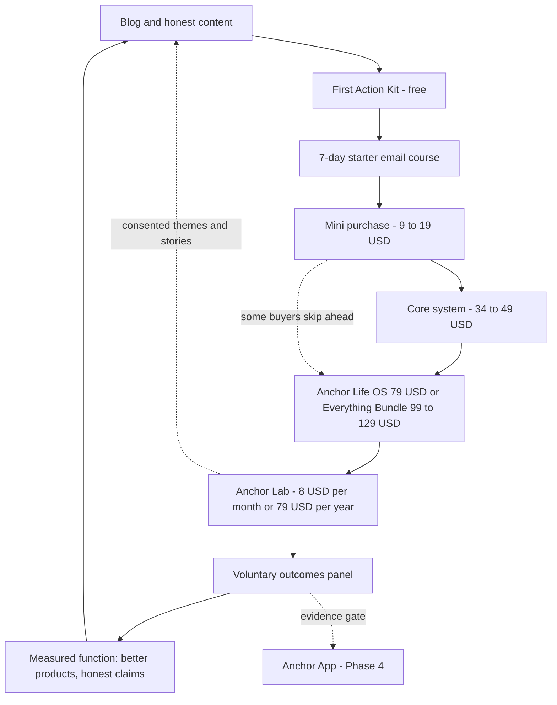

# 02 — Product Ecosystem

> **Status:** Canonical ecosystem map. Product names per 00 §8 (verbatim); ladder and pricing per the lead's canonical decisions; every claim traces to 00 §4 keys; medium limitations stated per 00 §5.

**Executive summary.** The Anchor ecosystem is one philosophy shipped at every price and format a solo creator business can honestly deliver: free (First Action Kit), minis at $9–19, core systems at $34–49, the Anchor Life OS flagship at $79, the Everything Bundle at $99–129, the Anchor Lab membership at $8/mo or $79/yr, and — gated on our own evidence work — the future Anchor App. Every component hosts the same tested ingredients (structure, decomposition, capture, review ritual, forgiveness) and every component has the same disclosed weakness: printables and spreadsheets are static and Notion is only semi-active, so none of them can cue or automate — the exact gap the evidence identifies in baseline tools, and the reason Laws 5 and 8 are only fully deliverable by the future app. This document maps each component's role, states plainly what each medium can and cannot do, draws the flywheel that connects them, and phases the rollout so that nothing ships ahead of validation.

---

## 1. Ecosystem map

Fifteen components, one system. The ladder logic: every rung is a complete, honest tool on its own; every upgrade is an expansion of a workflow the user already runs, never a repurchase of the same promise.

How to read the map: **Role** is the job the component does; **Supports the others** is its flywheel wiring (§3); **Evidence caveat** is the honesty constraint that governs its copy; the closing block is the 00 §9 decision record. The format components (1.2–1.6) determine how much of the Ten Laws each product can physically deliver — §2 is their governing table, and no listing may promise past it.

| # | Component | Position | Role in one line |
|---|---|---|---|
| 1.1 | Etsy digital products | Channel | Discovery marketplace where the audience already searches |
| 1.2 | Notion templates | Format | Semi-active medium for core and flagship systems |
| 1.3 | Spreadsheet products | Format | Google Sheets edition of the Anchor Money System |
| 1.4 | Printable products | Format | Companions and starters; ritual artifacts for desk and fridge |
| 1.5 | Mobile-first versions | Usage mode | Capture and cue surface (the phone in the pocket) |
| 1.6 | Desktop versions | Usage mode | Planning, money, and Weekly Reset surface |
| 1.7 | Email products | Channel + product | Starter course, onboarding, newsletter — our only push channel before the app |
| 1.8 | Landing pages | Channel | One product, one page, one decision; full Evidence Notes |
| 1.9 | Blog / content | Channel | Honest research explainers and workflow walkthroughs |
| 1.10 | Community | Relationship | The human layer inside Anchor Lab |
| 1.11 | Lead magnet | Free tier | First Action Kit |
| 1.12 | Mini products | $9–19 | One workflow, one problem, one small commitment |
| 1.13 | Premium products | $34–129 | Anchor Money System, Anchor Planner, Anchor Life OS, Everything Bundle |
| 1.14 | Membership | $8/mo or $79/yr | Anchor Lab: follow-up, co-working, outcomes panel |
| 1.15 | Future SaaS | Subscription (future) | Anchor App — the only tier where Laws 5 and 8 fully apply |

The ladder at a glance:

| Rung | Offer | Price | The honest promise of the rung |
|---|---|---|---|
| Free | First Action Kit | $0 + email opt-in | One capture, one Daily Board day, one tiny ritual seed |
| Mini | Weekly Reset Kit · Daily Board Lite · Anchor Routines · Anchor Home Base | $9–19 | One working workflow |
| Core | Anchor Money System · Anchor Planner | $34–49 | A complete system for one life domain |
| Flagship | Anchor Life OS | $79 | Every system, one home, fewer seams |
| Bundle | Everything Bundle | $99–129 | Everything, every format, updates included |
| Membership | Anchor Lab | $8/mo or $79/yr | Follow-up, humans at a scheduled time, and the outcomes panel |
| Future | Anchor App | TBD (gated) | The cues and automation that templates cannot deliver |

### 1.1 Etsy digital products

**Role.** The discovery storefront. Hosts the minis, both core systems, the printable pack, and the Everything Bundle where buyers already search for planners and budget templates. **Supports the others.** Every download includes a First Action Kit insert (buyer → email list); marketplace reviews become social proof for landing pages; search-demand data tells us which workflow to productize next. **Evidence caveat.** Marketplace culture rewards exactly the hype 00 §10 bans. We accept a ranking penalty rather than write "clinically proven ADHD planner"; every listing carries a plain-language Evidence Notes excerpt instead.

> **Evidence:** No direct evidence — channel choice is business rationale; listing content inherits its products' tiers · **Confidence:** Moderate · **Rationale:** lowest-friction discovery for template buyers, no ad spend required. · **Expected outcome:** steady cold discovery and first purchases. · **Downside:** honest listings may underrank against louder competitors; platform dependency. · **Difficulty:** Low · **Priority:** High

### 1.2 Notion templates

**Role.** The primary digital medium: Anchor Planner, Anchor Life OS, the Notion editions of the Anchor Money System and the minis. Semi-active — filtered views, checklists, pre-built databases, partial recurring automation. **Supports the others.** Shares one vocabulary with the printables (the same Anchor Daily Board structure on screen and on paper); upgrades from mini → core → Anchor Life OS preserve the user's data and habits; Anchor Lab sessions demonstrate workflows live. **Evidence caveat.** The workflows hosted are T1-derived (calendar/task-list core [Safren-2010]; review ritual [Solanto-2010]) — Notion as a medium has no trials, and it cannot push reliably, so every Notion product ships a five-minute cue-pairing step that binds phone reminders to pre-decided actions (Law 5). Recurring automation is partial, so Law 8 is only partly satisfiable here.

> **Evidence:** T1 for hosted workflows ([Safren-2010], [Solanto-2010], [Matsumoto-2024]); T3 for any "Notion is better" implication (00 §5: no comparative trials) · **Confidence:** Moderate for content, Low for medium superiority · **Rationale:** pre-built databases let us pre-decide structure (Law 3) while the user keeps ownership. · **Expected outcome:** scattered notes and apps collapse into one home. · **Downside:** Notion invites tinkering — the exact failure mode of persona Maya; mitigated with locked-down defaults and "don't customize yet" onboarding. · **Difficulty:** Medium · **Priority:** High

### 1.3 Spreadsheet products

**Role.** The Google Sheets edition of the Anchor Money System, for people who live in spreadsheets or refuse new tools. Formulas do the arithmetic — totals, paycheck allocation math, bill status — automatically. **Supports the others.** It is our public act of respect for 00 §5: the spreadsheet is the unbeaten baseline, so we structure it rather than trash-talk it; Sheets buyers are prime Anchor Lab and future Anchor App candidates because they have already self-selected for money work. **Evidence caveat.** Fully static between sessions: no cueing, clumsy on mobile (we say so — capture goes to paper or phone reminders), and the 00 §4D ruling applies in full: no savings, debt, or bill-payment outcome claims, ever, until Part 14 data exists.

> **Evidence:** T1 for the stepwise workflow ingredients ([Safren-2010] task breakdown; [Solanto-2010] planning); problem evidence [Bangma-2019], [Barkley-2008], [Swedish-Registry]; outcome claims prohibited (00 §4D) · **Confidence:** Moderate · **Rationale:** meet users inside a tool they already trust; formulas remove arithmetic decisions (Law 3, partial Law 8). · **Expected outcome:** the paycheck/bill workflow gets executed more consistently than in a blank sheet. · **Downside:** requires opening the file — useless without the paired cue ritual; we must say that on the listing. · **Difficulty:** Low · **Priority:** High

### 1.4 Printable products

**Role.** The one-page Daily Board printable (in the First Action Kit), the Weekly Reset sheet, Anchor Routines cards, and the printable pack in the Everything Bundle. Physical, ambient, zero-login. **Supports the others.** The starter medium for the email course; the fridge and desk keep the ritual visible in the environment; the zero-tech fallback that keeps the system alive during digital lapses — a printable cannot be abandoned by an unopened app. **Evidence caveat.** Fully static: no cueing, no adaptation, no tracking, no updates. Section 2 governs the positioning — companion and starter, never "the system."

> **Evidence:** T1 for the routines they script (calendars, checklists, structured review taught in [Solanto-2010], [Safren-2010], [LGO]); ambient-visibility benefit is design rationale only — no adult trial isolates it · **Confidence:** Moderate for content, Low for the medium · **Rationale:** no login, no battery, no feed — the lowest-friction venue for a practiced ritual. · **Expected outcome:** the Weekly Reset survives phone-free and lapse periods. · **Downside:** paper cannot remind; clutter and reprint friction are real. · **Difficulty:** Low · **Priority:** Medium

### 1.5 Mobile-first versions

**Role.** The phone is where capture and cues live. Every Notion product includes a trimmed mobile layout — Anchor Daily Board plus The Inbox, capture in two taps — and the cue-pairing instructions target the phone's native reminders and alarms. **Supports the others.** Law 4 capture on the go feeds desktop planning; Law 5 cues fire on the device that is actually in the pocket; the precedent that smartphones can serve as a structuring prosthetic is real but coached [LivingSMART-2015]. **Evidence caveat.** Mobile-first layout itself is untested (T3); the Sheets edition is deliberately not mobile-first, and we say so rather than pretend.

> **Evidence:** T1/T2 for offloading and smartphone structuring ([Offloading-2025] — greatest for prospective memory; [LivingSMART-2015], coached; [Selaskowski-2022] mobile homework transfer); layout choices T3 · **Confidence:** Moderate · **Rationale:** prospective memory fails away from the desk, so capture must live where thoughts happen. · **Expected outcome:** fewer lost intentions; The Inbox actually used. · **Downside:** the phone is also the distraction machine — flows must be in-and-out in seconds. · **Difficulty:** Medium · **Priority:** High

### 1.6 Desktop versions

**Role.** The seated, scheduled surface: The Weekly Reset checklist, money sessions, and calendar planning on a big screen. **Supports the others.** Gives the ritual a stable home (Law 6); dashboards stay legible; pairs with the calendar where plans meet time (Law 9 workflow). **Evidence caveat.** Screen-size ergonomics are design rationale only; the tested ingredient is the ritual the desktop hosts, not the desktop.

> **Evidence:** T1 for hosted rituals ([Solanto-2010], [NICE-NG87] regular structure); the desktop framing itself — no direct evidence, design rationale only · **Confidence:** Low · **Rationale:** rituals benefit from a consistent context; weekly planning is a sit-down act. · **Expected outcome:** higher Weekly Reset completion (metric 5). · **Downside:** dashboard-building temptation — Law 3 audits apply to us too. · **Difficulty:** Low · **Priority:** Medium

### 1.7 Email products

**Role.** The 7-day starter course (First Action Kit), per-product onboarding sequences, and the ongoing newsletter. Until the Anchor App exists, email is our only push channel. **Supports the others.** It is the training-and-follow-up wrapper that the original trials had and templates lack ([NICE-NG87] recommends regular follow-up); it converts readers into practicers and buyers into set-up, active users. **Evidence caveat.** Reminder blasts alone accomplish nothing — a trial of SMS reminders inside a self-guided ADHD intervention found no overall effect on completion or practice [Nordby-2022]. Therefore every email cues exactly one small pre-decided action (Law 5), forgiveness copy is standard ("skipped three days? open today's — the others can stay unread"), and open rates are explicitly a non-goal (Law 10).

> **Evidence:** T2 for cue → pre-decided action ([Gollwitzer-2006] d = 0.65) under T1-derived constraints ([Nordby-2022], [FOCUS-2023]); follow-up principle [NICE-NG87]; two-way beats one-way messaging in non-ADHD adherence work [SMS-Meta-2023] · **Confidence:** Moderate · **Rationale:** the deliverable ingredient templates lack most is follow-up; email is its cheapest honest carrier. · **Expected outcome:** higher setup completion; the Weekly Reset habit seeded within the first month. · **Downside:** inbox fatigue; every send must survive the "is this a nag?" test. · **Difficulty:** Medium · **Priority:** High

### 1.8 Landing pages

**Role.** Own-domain sales pages: one product, one page, one call to action, written in plain language with the full Evidence Notes block that marketplace listings can only excerpt. **Supports the others.** Independence from marketplace ranking; the email list's home; the place where the honesty positioning is fully legible before purchase. **Evidence caveat.** Conversion lore is general-population; we apply choice reduction (T2 indirect) and refuse urgency theater, fake scarcity, and shame hooks outright (00 §10).

> **Evidence:** T2 indirect for one-decision pages ([IyengarLepper-2000] 30% vs 3%; [Jachimowicz-2019] defaults d = 0.68); the rest is business rationale · **Confidence:** Moderate · **Rationale:** the first touchpoint should behave the way the product does — one next action. · **Expected outcome:** buyers arrive pre-aligned; refunds and mismatched purchases drop. · **Downside:** leaving standard upsell tactics on the table, deliberately. · **Difficulty:** Low · **Priority:** High

### 1.9 Blog / content

**Role.** The research explained plainly (what the evidence does and does not show), workflow walkthroughs, and problem-naming essays on money, time blindness, and abandonment. The SEO engine; every article resolves to the First Action Kit. **Supports the others.** Builds the trust the positioning promises; demonstrates the Weekly Reset and Daily Board publicly; supplies the top of the flywheel; editorial calendar uses the 00 §9 compact tags. **Evidence caveat.** We hold the humility the data demands: education alone barely changes behavior — financial education explains about 0.1% of variance and decays [Fernandes-2014]; even friendlier estimates stay small unless action-linked [KaiserMenkhoff-2020]. Content is honest marketing and method demonstration. It is never claimed as the intervention.

> **Evidence:** Humility anchors [Fernandes-2014], [KaiserMenkhoff-2020]; each article's taught concept carries its own registry tier · **Confidence:** Moderate · **Rationale:** this audience researches hard before trusting; be the vendor whose articles say "here is what is actually proven." · **Expected outcome:** qualified organic traffic; the brand becomes "the ones who read the studies." · **Downside:** slow channel; honesty caps clickbait reach. · **Difficulty:** Medium · **Priority:** High

### 1.10 Community (the human layer of Anchor Lab)

**Role.** Monthly live co-working sessions — labeled T3 body doubling, in those words — plus Q&A and peer presence, inside the Anchor Lab membership. **Supports the others.** Approximates the ingredient no template can ship: other people at a scheduled time. The trial precedents for structure delivered with human support are group formats and coached programs ([Solanto-2010] group MCT; [LivingSMART-2015] coach support) — indirect but directionally consistent. Feeds the outcomes panel and, with consent, anonymized themes feed content. **Evidence caveat.** Body doubling itself is community-endorsed with plausible mechanisms and no RCTs [BodyDoubling-HCI]; the product copy says exactly that. Community is peer support, not group therapy, and moderation carries a duty of care (crisis signposting per 01 §3.2).

> **Evidence:** T3 body doubling [BodyDoubling-HCI], labeled; T1-adjacent follow-up rationale [NICE-NG87]; group/coached precedent indirect ([Solanto-2010], [LivingSMART-2015]) · **Confidence:** Low to Moderate · **Rationale:** scheduled human presence is the strongest untapped ingredient available before the app. · **Expected outcome:** members' retention and Comeback Rate exceed non-member baseline — measured, not assumed. · **Downside:** small communities die quietly; monthly hosting is a forever-commitment. · **Difficulty:** Medium · **Priority:** Medium (Phase 3)

### 1.11 Lead magnet: First Action Kit

**Role.** Free, for an email address: the 2-minute brain dump (The Inbox on paper — Law 4), the one-page Daily Board printable (Law 2), and the 7-day starter email course (a seed of Law 6). **Supports the others.** The top of the ladder and the proof of philosophy: a stranger experiences capture, one next action, and a tiny ritual within ten minutes, free. Every channel points here. **Evidence caveat.** A 7-day course must not imply 7-day transformation: habits take a median 66 days (range 18–254) [Lally-2010], typically two to five months [Singh-2024] — day 7 says this out loud and hands off to the Weekly Reset Kit.

> **Evidence:** T1/T2 for components (capture offloading [Offloading-2025]; one-next-action decomposition [Safren-2010]; brief mobile-delivered psychoeducation [Selaskowski-2022], single study) · **Confidence:** Moderate · **Rationale:** give the honest first win away; trust before transaction. · **Expected outcome:** subscribers who have already done one capture and one Daily Board day — primed for the minis. · **Downside:** freebie collectors; we cannot see printable usage, so course-completion proxies must carry the signal. · **Difficulty:** Low · **Priority:** High

### 1.12 Mini products ($9–19)

**Role.** Four minis, one workflow each: **Weekly Reset Kit** (printable + Notion — the protected ritual, Law 6), **Daily Board Lite** (Now / Next / Later with one next action, Law 2), **Anchor Routines** (miss-tolerant momentum metrics — weekly frequency, never streaks, Law 7), **Anchor Home Base** (shared household checklists and recurring chores). **Supports the others.** A $9–19 commitment matches Law 2 at the business-model level; each mini is a full-quality slice of the corresponding core/flagship workflow, so upgrading feels like expansion, not repurchase; mini sales are our per-workflow demand signal. **Evidence caveat.** Slicing must never orphan the ritual — the Weekly Reset Kit leads the mini lineup because home-practice completion correlated with improvement [Solanto-2010]. Habit framing in Anchor Routines uses general-population evidence (T2) and says so.

> **Evidence:** T1 per hosted workflow ([Solanto-2010] review ritual; [Safren-2010] task list and decomposition); habits T2 general-population ([Lally-2010], [Singh-2024]); anti-streak stance [KimCastelli-2021] · **Confidence:** Moderate · **Rationale:** one small purchase, one working workflow, one honest win. · **Expected outcome:** first-purchase conversion and clean demand signals per workflow. · **Downside:** catalog sprawl — the mini lineup is capped at these four. · **Difficulty:** Low · **Priority:** High

### 1.13 Premium products ($34–129)

**Role.** The revenue core. **Anchor Money System** ($34–49; Notion + Google Sheets editions): stepwise paycheck/bill workflow plus financial dashboard. **Anchor Planner** ($34–49): Anchor Daily Board + The Inbox + The Weekly Reset + Calendar — the calendar/task-list module set from structured CBT [Safren-2010], in template form. **Anchor Life OS** ($79, flagship): all systems integrated in one Notion home. **Everything Bundle** ($99–129): Anchor Life OS + standalone editions + printable pack + updates. **Supports the others.** Minis upgrade into these; these upgrade into Anchor Lab; the bundle serves "just give me everything" buyers — with a default recommendation to start with one workflow, because a bundle at checkout is a choice-overload hazard (Law 3). **Evidence caveat.** Integration is design rationale: no trial has tested an all-in-one OS against separates, and an integrated OS risks the very complexity we preach against — mitigated by a Start Here layer, progressive disclosure, and locked defaults. Money products carry the 00 §4D ruling verbatim: no savings, debt, or bill-payment claims.

> **Evidence:** T1 ingredients ([Safren-2010], [Solanto-2010], [Matsumoto-2024] organizational strategies OR 2.03); integration claim T3 / design rationale; financial outcome claims prohibited (00 §4D) · **Confidence:** Moderate · **Rationale:** complete systems with pre-made decisions are Laws 1–3 in product form. · **Expected outcome:** movement on metrics 1–5 in panel data — the whole point. · **Downside:** flagship price raises expectations our evidence honesty must then manage; complexity creep is the standing threat. · **Difficulty:** Medium · **Priority:** High

### 1.14 Membership: Anchor Lab ($8/mo or $79/yr)

**Role.** Monthly co-working (labeled T3 body doubling), continuous product updates, Q&A, early access, and the voluntary outcomes panel. **Supports the others.** Converts one-time buyers into an ongoing relationship; delivers the follow-up structure guidelines call for [NICE-NG87]; funds maintenance; and hosts the panel that becomes Part 14's evidence engine — the mechanism by which every other product earns better claims or honest corrections. **Evidence caveat.** Everything in 1.10 applies; additionally, membership never gates core function — purchased tools keep working forever without a subscription. That is an ethical line, not a growth lever.

> **Evidence:** Follow-up principle [NICE-NG87]; T3 body doubling [BodyDoubling-HCI]; coached-structure precedent [LivingSMART-2015] (indirect) · **Confidence:** Low to Moderate · **Rationale:** recurring human structure plus recurring measurement is what a template alone can never be. · **Expected outcome:** member retention and Comeback Rate above non-member baseline; a living panel n. · **Downside:** visible churn; small-n community dynamics; monthly delivery obligations. · **Difficulty:** Medium · **Priority:** Medium (Phase 3)

### 1.15 Future SaaS: Anchor App

**Role.** The only tier where Law 5 (cue → pre-decided action) and Law 8 (automation) can be fully delivered. Detailed in §5; gated by Phase 4 entry criteria in §4. **Supports the others.** The ecosystem's endgame — but only if the outcomes panel shows the cueing/automation gap is what is actually holding users back. **Evidence caveat.** Currently vaporware, and this blueprint treats it that way: nothing in Phases 1–3 depends on it.

> **Evidence:** See §5 per feature; the gating decision itself rests on Part 14 measurement, per Law 10 · **Confidence:** Low (appropriately — it does not exist) · **Rationale:** build the expensive thing only when our own data says the cheap things have hit their medium ceiling. · **Expected outcome:** a defensible SaaS if and only if the evidence work justifies it. · **Downside:** competitors ship apps faster by skipping the evidence step; we accept that. · **Difficulty:** High · **Priority:** Low now, High at Phase 4 gate

**What is deliberately absent from this map.** Three plausible products do not appear, on purpose: a **video course** (education alone barely moves behavior — [Fernandes-2014], [KaiserMenkhoff-2020] — so teaching without a tool would violate Law 1); **1:1 coaching** (evidence is plausible but methodologically weak as a standalone service [PrevattYelland-2015], and the duty of care does not scale to a creator business — Anchor Lab's scheduled group structure is the honest ceiling of what we can host responsibly); and **any child or teen edition** (out of scope entirely, per 01 §3.1). Absence here is a decision, not an oversight — additions to this map require a new ruling against 00 §6, not just a revenue case.

---

## 2. What each medium can and cannot deliver (read this before writing any listing)

This is the section a hype-driven competitor would delete. The evidence's central complaint about baseline tools — spreadsheets, paper planners — is that they are inert: they cannot cue action at the moment of need and they cannot automate anything (Laws 5 and 8). **Most of what we sell is made of exactly those media.** Here is the honest map:

| Medium | Can honestly deliver | Cannot deliver | Honest positioning |
|---|---|---|---|
| Printables | Structure on a page; decomposition prompts; ritual scripts; ambient visibility on fridge or desk; zero login, zero battery, total privacy | Cueing at the moment of need; automation; adaptation; tracking; updates | Companion and starter. The ritual is the product; paper is its venue |
| Spreadsheets | Structure plus arithmetic automation (totals, allocations, bill status compute themselves); pre-filled defaults; history; user ownership | Push cues; friction-free mobile capture; anything behavior-triggered | The respected, unbeaten baseline (00 §5) — structured. We add the stepwise workflow and the ritual script, not magic |
| Notion templates | Structured databases; filtered one-next-action views; checklists; partial recurring automation; phone capture; one home for everything | Reliable programmable push; true money automation; lapse detection | Semi-active. Ships with a cue-pairing setup step (phone reminders bound to pre-decided actions, Law 5) because a template cannot tap you on the shoulder |
| Email | Scheduled push at near-zero cost; teaching plus follow-up cadence | Context-aware timing; action inside the medium; reaching the unopened | Follow-up layer. Every send cues one pre-decided act; generic blasts are banned — they demonstrably do nothing [Nordby-2022] |
| App (future) | Law 5 cues bound to pre-decided actions; Law 8 automation including bank feeds; Comeback Mode automation; consented measurement | Outcomes we have not measured; motivation itself | The only tier that can close the cueing/automation gap — which is why it waits for evidence (§4, Phase 4) |

**Say the uncomfortable part plainly.** The trials that justify our designs tested structured *programs* — training, homework, follow-up, often a human in the loop ([Solanto-2010], [Safren-2010], [attexis-2026], [LivingSMART-2015]). The active ingredient is **structure plus practiced ritual — not paper, not Notion blocks, not our color palette.** Our static goods carry the artifacts and scripts of those tested routines: this is real value, since the T1 programs literally taught people to run calendars, task lists, and checklists ([Safren-2010]; [LGO]). But a printable cannot cue you at 8pm, a spreadsheet cannot notice you have been gone two weeks, and Notion cannot move money. Static and semi-active media reproduce the precise weakness the evidence attributes to baseline tools. So: printables are positioned as companions and starters (the Weekly Reset sheet on the fridge, next to the ritual it serves); Notion is positioned as semi-active and is always paired with phone reminders per Law 5; and full Law 5 / Law 8 delivery is reserved for the future Anchor App. Every listing's Evidence Notes states this asymmetry, and the email course and Anchor Lab exist to partially restore the training-and-follow-up wrapper the trials had.

What the static media give back is also real, and we say that too: no notification fatigue, no engagement traps (adverse-effect signals in the digital-ADHD literature concentrate in compulsive-engagement formats [LopezCampos-2025]), no subscription hostage-taking, full data ownership, and total privacy. Inert is a limitation and a kindness at once.

**The Evidence Notes contract (every listing, every format).** Each product's Evidence Notes must state, in plain language:

1. The tier of the workflow it hosts — for example, "the weekly review is drawn from programs tested in randomized trials with adults with ADHD."
2. The tier of the medium — "no planner or budget tool, including this one, has been trial-tested against a plain spreadsheet."
3. The medium limitation line — "this is a printable: it cannot remind you. Here is the pairing ritual that can."
4. The cue-pairing instruction (the Law 5 setup step, below), where the format supports one.
5. The standing disclosure: a self-help organization tool, not a medical device or therapy; it does not replace diagnosis, medication, or professional care.
6. What we measure instead of promising: the 00 §11 metrics and the open invitation to the voluntary outcomes panel.

**The cue-pairing pattern (ships with every Notion and spreadsheet product).** A five-minute setup step binds the phone's native reminders to pre-decided actions in implementation-intention form ("if situation X, then action Y" — [Gollwitzer-2006] d = 0.65), under the hard constraint that generic reminders demonstrably fail [Nordby-2022]. Shipped examples:

- "If it is 8:00pm on Tuesday, I open the Anchor Money System and pay one bill."
- "If it is Sunday at 4:00pm, I start The Weekly Reset — 15-minute timer, checklist from the top."
- "If it is 9:00am on a workday, I pick today's three on the Anchor Daily Board — then stop picking."

Three cues maximum at setup. A wall of notifications is how cue blindness starts; users can add more later, one at a time, each bound to one action.

**Format ceilings, law by law.** The same honesty, compressed: what each format can deliver per Design Law (✓ = deliverable as designed; partial = deliverable with the shipped workaround; — = not deliverable in this medium, and disclosed).

| Law (00 §7) | Printables | Spreadsheets | Notion | Email | Anchor App (future) |
|---|---|---|---|---|---|
| 1 Externalize, don't educate | ✓ | ✓ | ✓ | partial | ✓ |
| 2 One next action | ✓ | ✓ | ✓ | ✓ (one act per send) | ✓ |
| 3 Reduce decisions | ✓ (pre-printed) | ✓ (pre-filled) | ✓ (locked defaults) | ✓ | ✓ |
| 4 Capture first | partial (pocket card) | — (clumsy on mobile) | ✓ (two-tap mobile Inbox) | — | ✓ |
| 5 Cue → pre-decided action | — (needs pairing) | — (needs pairing) | partial (paired phone reminders) | partial (scheduled sends) | ✓ |
| 6 Practice loops and rituals | ✓ (ritual scripts) | ✓ | ✓ (guided checklist) | ✓ (cadence) | ✓ (auto-prepared) |
| 7 Forgiveness by design | ✓ (nothing to reset) | ✓ | partial (manual Comeback Mode) | ✓ (comeback copy) | ✓ (automated) |
| 8 Automate the automatable | — | partial (formulas) | partial (recurring templates) | — | ✓ |
| 9 Time made visible | ✓ (planning on the page) | partial | ✓ (calendar workflows) | — | ✓ |
| 10 Measure function | — (self-log) | partial (self-log in place) | partial (self-log) | — | ✓ (consented) |

No cell in this table may be contradicted by marketing copy. When a listing and this table disagree, the listing is wrong.

> **Evidence:** Medium limitations per 00 §5 (no head-to-head trials; no isolated-feature evidence); reminder-alone null [Nordby-2022]; engagement-harm signals [LopezCampos-2025]; active-ingredient framing from the T1 package trials ([Solanto-2010], [Safren-2010]) · **Confidence:** High that this is the honest description · **Rationale:** selling structure while disclosing that structure-plus-ritual, not the artifact, is the active ingredient is the only position consistent with 00 §10. · **Expected outcome:** buyers with calibrated expectations; reviews that survive scrutiny; a claims ladder we can climb with Part 14 data. · **Downside:** the disclosure hands skeptics a quote and competitors a contrast; conversion may suffer against "clinically proven" liars. · **Difficulty:** Low to write, High to sustain under revenue pressure · **Priority:** High

---

## 3. The flywheel

One loop, honestly instrumented. Content earns trust; the First Action Kit converts trust into a first practiced win; email carries follow-up; the ladder converts practiced wins into purchases; Anchor Lab converts buyers into a relationship; the outcomes panel converts the relationship into evidence; evidence makes the products and the claims better — which makes the content stronger. Around again.

The nine stages, and why each handoff is plausible:

1. **Content → First Action Kit.** An article that demonstrates a workflow earns the right to offer its printable; the ask is an email address, not money.
2. **First Action Kit → course.** The kit's brain dump and Daily Board give the course something concrete to coach; each day cues one small act (Law 5), never "reflect on your journey."
3. **Course → mini.** Day 7 tells the truth — habits take months, not a week ([Lally-2010] median 66 days; [Singh-2024] two to five months) — and hands the reader the tool built for months: the Weekly Reset Kit.
4. **Mini → core.** A working Weekly Reset creates natural demand for the system it reviews (Anchor Planner) or for the domain that hurts most (Anchor Money System).
5. **Core → flagship / bundle.** Only integration-seekers should climb here, and the sales page says exactly who should not.
6. **Flagship → Anchor Lab.** Owners who want follow-up and humans get both, plus early access and updates.
7. **Lab → outcomes panel.** Members opt in under Part 14's consent design; membership never requires participation.
8. **Panel → better products.** Findings ship as product changes and as public reports — the only rung that can upgrade our claims.
9. **Better products → content.** Outcome reports and honest changelogs are the most credible content we can publish; the loop closes.

Three honesty rules govern the flywheel:

1. **No invented benchmarks.** We do not know our opt-in, course-completion, or upgrade rates, and no trustworthy external benchmark exists for this exact audience and posture. Cycle one's numbers become the baseline; targets come after baselines (same logic as 01 §6).
2. **The loop respects Law 7 at the business level.** A subscriber who goes quiet gets a Comeback-style re-entry email ("start at today's, skip the rest"), never a guilt sequence; a lapsed member can rejoin without losing anything.
3. **The panel is the only rung that upgrades our claims.** Marketing language stays at its 00 §10 ceiling until measured function (00 §11 metrics) says otherwise — in either direction. The flywheel's last arrow is the one competitors skip; it is also the only one that compounds.

Instrumentation per handoff (voluntary, consented, minimal):

| Handoff | Instrument |
|---|---|
| Content → First Action Kit | Opt-in rate |
| Kit → course | Course-completion proxy: final-email open or click — a proxy, named as one |
| Course → mini | Conversion within 60 days |
| Mini → core | Upgrade rate |
| Core → flagship / bundle | Attach rate |
| Flagship → Anchor Lab | Join rate |
| Lab → panel | Volunteer rate |
| Panel → products | Shipped changes traceable to findings; the 00 §11 functional metrics inside the panel |

> **Evidence:** No direct evidence — funnel architecture is business rationale; its constraints inherit from [Nordby-2022] (email rules), [Lally-2010]/[Kenter-2023] (comeback framing), Law 10 (panel over engagement) · **Confidence:** Moderate · **Rationale:** each stage asks for a slightly larger commitment only after a slightly larger delivered win. · **Expected outcome:** compounding trust and an evidence asset no competitor in [Pasarelu-2020]'s 109 has built. · **Downside:** slow by design; the loop's engine (content + panel) is unpaid work for months. · **Difficulty:** Medium · **Priority:** High

---

## 4. Phased rollout

Numeric thresholds are business judgments — stated so we can be held to them, not evidence. Each phase has entry criteria (do not start early) and exit criteria (do not scale early).

**Operating principles across all phases.**

- One-builder WIP limit: nothing new ships while a shipped product's onboarding is broken.
- Every phase re-runs the Part 13 claims audit on all live copy; claim drift is treated as a bug class, not a marketing style.
- Once "updates included" is sold (Everything Bundle, Anchor Lab), updates ship on a stated cadence — a promise with a calendar, not a vibe.
- Comeback framing applies to the business too: a missed phase target triggers review and re-planning, not heroics.
- No phase may borrow the next phase's promises to close this phase's sales — no "app coming soon" on template listings.

### Phase 1 — Validate (First Action Kit + two minis + Anchor Money System)

**Ships:** First Action Kit; Weekly Reset Kit; Daily Board Lite; Anchor Money System (Notion + Google Sheets editions); Etsy store; landing pages; onboarding emails; blog at a sustainable cadence.
**Why these two minis first:** they instantiate the two most protected workflows — the ritual (Law 6, [Solanto-2010]) and one-next-action (Law 2, [Safren-2010]) — and they are the two workflows every later product contains, so their demand signal de-risks everything above them.
**Entry criteria:** documents 00–02 approved; Part 13 claims checklist applied to every listing and page; Evidence Notes written per product; crisis signposting live in all money-product onboarding (01 §3.2).
**Exit criteria (all):** ≥100 paid customers across Phase-1 products; refund rate <5%; ≥30 structured feedback responses; ≥20 outcomes-panel volunteers; course-completion proxy ≥25%; support load sustainable at <5 hours/week.
**Kill / pivot trigger:** <30 total sales in the first 90 days with the honest funnel fully live → stop building, re-examine audience and positioning. Low sales with high course completion means fix the offer; high sales with silent users means fix onboarding.
**Primary risk:** four products at once dilutes onboarding quality — the WIP limit above exists for this phase most of all.

> **Evidence:** Product contents T1-derived as mapped in §1; validation gating is business rationale · **Confidence:** Moderate · **Rationale:** validate the ritual products (Weekly Reset, Daily Board) and the money system — the highest-need, highest-evidence-tension offer — before building the expensive integrated tiers. · **Expected outcome:** demand proof per workflow plus a seeded panel. · **Downside:** four products at once is already a lot for one creator; anything more is scope failure. · **Difficulty:** Medium · **Priority:** High

### Phase 2 — Deepen (Anchor Planner + Anchor Life OS + Everything Bundle)

**Ships:** Anchor Planner; Anchor Life OS; Everything Bundle; upgrade paths (prior purchases credited or discounted — buyers must never feel punished for buying early, Law 7 as pricing policy); expanded onboarding sequences.
**Entry criteria:** Phase 1 exit met; one full product-update cycle shipped (proves maintenance is real before selling "updates included").
**Exit criteria:** ≥150 combined Anchor Life OS + Everything Bundle sales; bundle attach ≥20% among flagship-intent buyers; refund rate still <5% at the higher prices; week-12 voluntary check-in shows >40% of panel buyers still using any core workflow (the 00 §11 target).
**Primary risk:** Anchor Life OS complexity creep — the flagship is where Law 3 goes to die unless the Start Here layer is defended in every update.

> **Evidence:** Integration rationale T3 (§1.13); the week-12 gate operationalizes 00 §11 against the field's decay benchmarks ([Kenter-2023] 29%; [FOCUS-2023] month-3 decline) · **Confidence:** Moderate · **Rationale:** sell the integrated promise only after the parts have proven themselves separately. · **Expected outcome:** a flagship whose buyers were mostly warmed by working minis. · **Downside:** Life OS build and maintenance is the largest fixed cost in the template business. · **Difficulty:** High · **Priority:** High

### Phase 3 — Relationship (Anchor Lab + outcomes panel)

**Ships:** Anchor Lab membership ($8/mo or $79/yr); monthly co-working sessions labeled T3 body doubling; formalized outcomes panel with consent and privacy design per Part 14; first public outcomes report.
**Entry criteria:** ≥500 customers or ≥1,500 engaged email subscribers (community needs density to survive); hosting and moderation capacity honestly budgeted; panel instrumentation and consent flow built.
**Exit criteria:** panel n ≥ 100; member 3-month retention ≥60% (target, ours); first Comeback Rate and Weekly Reset completion figures published — whatever they say. Publishing an unflattering number is a pass, not a fail; hiding it is the only fail.
**Primary risk:** a community that dies quietly damages trust more than never launching one — entry density thresholds are not optional.

> **Evidence:** Follow-up structure [NICE-NG87]; body doubling T3 [BodyDoubling-HCI], labeled; panel design per Part 14; retention benchmarks to beat: [Kenter-2023], [FOCUS-2023] · **Confidence:** Low to Moderate · **Rationale:** recurring human structure plus measurement is the bridge between template business and evidence-generating product company. · **Expected outcome:** a living panel and the first real numbers behind the 00 §11 metrics. · **Downside:** memberships create forever-obligations; a dead community damages the brand more than no community. · **Difficulty:** Medium · **Priority:** Medium

### Phase 4 — Anchor App (gated on Part 14 evidence work)

**Ships:** nothing until the gate opens. **Entry gate (all required):**
1. Panel data indicates cueing/automation is the binding constraint — for example, users who complete the Law 5 cue-pairing setup outperform those who do not on metrics 1–5 (correlational, and we will say it is correlational — but decision-relevant).
2. Panel infrastructure can measure the 00 §11 metrics in-app with consent, so the app launches with its scoreboard installed.
3. Security, privacy, and support capacity for bank-feed data exists — this is a different liability class than templates.
4. The wellness/organization regulatory line (§5) is confirmed with counsel.
**Exit criteria:** owned by Part 14 — a beta cohort with functional outcomes before any public launch.
**Primary risk:** SaaS envy — building the app because competitors have one, rather than because the gate opened. The gate is the defense.

> **Evidence:** Gate logic per Law 10 and 00 §11; the constraint being tested derives from [Nordby-2022]/[Gollwitzer-2006] (cues work only bound to pre-decided actions) and [Jachimowicz-2019]/[ThalerBenartzi-2004] (automation rationale, with the causal caveat) · **Confidence:** Low until the data exists — that is the point · **Rationale:** the app is the most expensive way to be wrong; the panel makes being wrong cheap first. · **Expected outcome:** a build/no-build decision made on our own users' function, not on SaaS envy. · **Downside:** the gate may stay closed for years; that outcome must remain acceptable. · **Difficulty:** High · **Priority:** Low now

---

## 5. Future SaaS roadmap sketch: Anchor App

The Anchor App is the only tier where the two medium-limited laws — Law 5 (cue → pre-decided action) and Law 8 (automate everything automatable) — can be fully delivered. It is a roadmap sketch, not a commitment; Phase 4's gate governs.

**What the app adds (each promise carries its tier on its face):**

- **Bank-feed automation (T2, indirect).** Auto-import and auto-categorization of transactions; paycheck-day allocation prompts; bill-status without manual entry. Mechanism: defaults and automation carry behavior when initiation fails ([Jachimowicz-2019] d = 0.68; [ThalerBenartzi-2004] 3.5% → 13.6% savings, with its acknowledged causal caveat). No ADHD trial exists for any of it; the in-app Evidence Notes will say exactly that.
- **Push cues per Law 5 (T2 with T1-derived constraints).** Every cue is bound at creation to one small pre-decided action — "8pm: pay one bill" — implementing implementation intentions ([Gollwitzer-2006] d = 0.65) under the hard constraint the ADHD trials impose: reminders alone move nothing ([Nordby-2022]; [FOCUS-2023]). User-set caps, quiet hours, and a one-tap off switch are launch requirements, not settings debt.
- **Comeback Mode automation (T2 rationale).** The app notices a ≥7-day lapse and offers one button: resume today, backlog auto-archived, zero guilt copy. One missed occasion does not undo habit formation [Lally-2010]; the app's job is to make that fact the user's lived experience. This automates our signature metric's numerator (Comeback Rate, 00 §11).
- **Auto-prepared Weekly Reset (T1 workflow, automated prep).** The ritual stays 15 minutes because the agenda assembles itself: Inbox count, upcoming bills, last week's three commitments (Laws 3, 6, 8; ritual evidence [Solanto-2010]).
- **Consented measurement.** The 00 §11 metrics as a first-class, opt-in feature — including time-in-tool reported as a number we want to go down (Law 10).

**What the app will NOT add (and why, by tier):**

- **Brain training or cognitive games — T4.** Computerized cognitive training shows no real-world transfer in adults with ADHD ([Stern-2016]; [Elbe-2023] — overall effect barely significant, no outcome-level wins).
- **Neurofeedback features or claims — T4.** No better than sham [NimmoSmith-2020].
- **Punitive streaks, loss-framed gamification, leaderboards — T4 as durable drivers.** Gamification effects collapse from d = 1.57 in week one to 0.30 by twenty weeks and go negative over years [KimCastelli-2021]; streak-breaking is shame mechanics aimed at the population least served by shame (Law 7).
- **Engagement-maximizing mechanics — governance refusal.** Feeds, variable rewards, and compulsion loops are where the umbrella review's adverse-effect signals concentrate [LopezCampos-2025]; our success metric is function per minute, not minutes (Law 10).
- **A chatbot sold as the active ingredient — T3 ceiling.** Chatbot delivery showed no superiority over a conventional app [Selaskowski-2023]; findings elsewhere are mixed and preliminary [Jang-2021]. At most, an optional T3-labeled interface layer — never a headline.

**Likely build order (sketch, not commitment).**

- **v0.1 — Cues and the board.** Anchor Daily Board + The Inbox + the Law 5 cue engine + Comeback Mode automation: the smallest build that delivers what templates cannot.
- **v0.2 — The ritual.** Auto-prepared Weekly Reset; the consented 00 §11 measurement view (the user's own scoreboard, not ours).
- **v0.3 — Money, deliberately last.** Bank feeds and allocation prompts arrive only after the Phase 4 security, privacy, and support bar is met. The highest-value surface is also the highest-risk one; it ships when trust infrastructure exists, not first.

**What would make us not build it (also a sketch, also binding in spirit).**

- Panel data shows cue-pairing users do no better on metrics 1–5 — the constraint hypothesis fails, and the app loses its reason to exist.
- Phase 3 economics cannot fund sustained maintenance without engagement-style monetization we refuse (Law 10).
- The security and privacy bar for bank data proves unmeetable at our size — then v0.3 dies even if v0.1 lives.

**Open questions handed to Part 14.**

- Which single 00 §11 metric moves first for cue-paired template users? That metric anchors the app's v0.1 scope.
- Can Comeback Rate be measured in templates well enough to establish the pre-app baseline the app must beat?
- What consent design lets panel and app data stay separate without doubling participant burden?

**The regulatory and ethical line.** The Anchor App remains a general wellness / self-help organization product: no diagnosis, no screening that implies diagnosis, no treatment or symptom-reduction claims, no medication features — the full 00 §10 discipline at app-store scale. If we ever want outcome claims, there is exactly one path: the Part 14 clinical-validation route, pre-registered, published whatever the result. Bank data handling: read-only scopes, minimum necessary access, delete-everything on demand, and no monetization of financial data, ever. Harm monitoring ships at launch (adverse-effect check-ins, notification-load review) because the field's own literature warns us [LopezCampos-2025]. And the wall stands: the voluntary outcomes panel and app telemetry stay separate, each under its own consent.

> **Evidence:** Additions: [Jachimowicz-2019], [ThalerBenartzi-2004] (caveated), [Gollwitzer-2006] under [Nordby-2022]/[FOCUS-2023] constraints, [Lally-2010], [Solanto-2010]; refusals: [Stern-2016], [Elbe-2023], [NimmoSmith-2020], [KimCastelli-2021], [LopezCampos-2025], [Selaskowski-2023] · **Confidence:** Moderate for the design logic; Low for any outcome until Part 14 measures it · **Rationale:** the app exists to deliver the two laws templates cannot, and to refuse the features the evidence has already buried. · **Expected outcome:** the first tool in this category that can show its scoreboard. · **Downside:** slower and more expensive than hype-driven competitors; bank-feed liability is real and permanent. · **Difficulty:** High · **Priority:** Gated (Phase 4)

---

**Ecosystem invariants (carried into every later part).** Wherever later documents elaborate a component, four things may not change without a ruling at the 00 §6 level:

1. Every product is complete at its own rung; no rung sells incompleteness.
2. Every listing carries Evidence Notes, and no copy may contradict the format-ceilings table in §2.
3. Membership never gates purchased function; bought tools work forever without a subscription.
4. Claims move up only through measured 00 §11 outcomes — never through better adjectives.

---

*Previous: [01 — Product Vision](01-product-vision.md) · Next: 03 — forthcoming · Full index in [README](README.md).*
