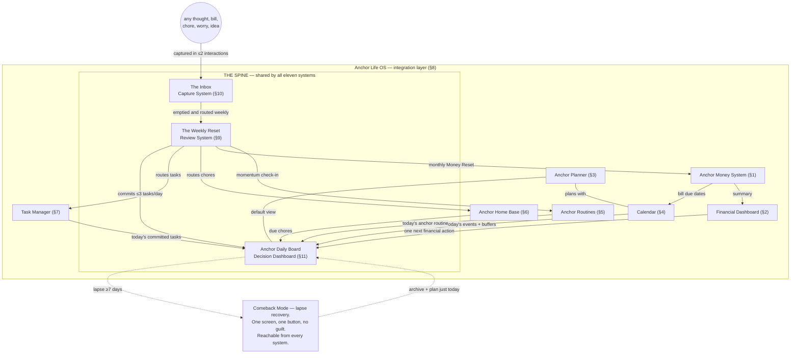

# 03 — Evidence-Based Product Architecture

> **Status:** Derived. Every claim below traces to [00 — Evidence Foundation](00-evidence-foundation.md): tiers per §3, citation keys per §4 (no other sources permitted), conflict rulings per §6, Design Laws per §7, product vocabulary per §8 (used verbatim), metadata blocks per §9, success metrics per §11.
> **Scope:** The eleven systems of the Anchor ecosystem — what each is, why it exists, what the evidence actually supports, how a real person uses it (including the lapse path), and what we refuse to build. Ends with the capability matrix: what each medium (printable, spreadsheet, Notion, future Anchor App) can honestly deliver.

---

## Executive summary

This document specifies eleven systems that together form one executive-function prosthetic — not eleven apps, and not a feature list. The unit of proof in the ADHD literature is the multi-component package, not the isolated feature (foundation §3; [Cochrane-2018], [Knouse-2017], [attexis-2026]), so the architecture ships its components pre-assembled around a shared spine: everything enters through **The Inbox**, every day resolves on the **Anchor Daily Board**, and every week reconciles at **The Weekly Reset**, with **Comeback Mode** as the always-available recovery path (Law 7). Three of the eleven systems *are* that spine; the other eight plug into it rather than growing their own capture, their own today-view, or their own review. Every system below carries its evidence tier honestly — T1 where randomized trials with adults with ADHD support the strategy class, T3 "design rationale only" where we are the ones extrapolating — and every shipped edition carries **Evidence Notes**, the plain-language tier label users see. Two structural truths govern everything here: no ADHD-specific tool has ever been tested head-to-head against a spreadsheet or paper planner (foundation §5), and for money specifically, the evidence proves the problem, not any tool (foundation §4D). These are self-help organization tools, not treatment.

---

## Cross-system integration overview

The four source reviews converge on one finding: what worked in trials was never a widget — it was a *workflow package* (calendar + task list + decomposition + review, taught and practiced; [Safren-2010], [Solanto-2010], [attexis-2026]). The architecture therefore optimizes for one thing: that the user runs the whole loop with as little executive effort as possible.

The spine enforces three invariants:

1. **One entry point.** Nothing requires filing at the moment of capture; The Inbox absorbs everything in two interactions or fewer (Law 4; [Offloading-2025]).
2. **One daily surface.** The Anchor Daily Board is the default view of every edition; it shows Now / Next / Later and resolves to one next action (Law 2; [Safren-2010], [Solanto-2010]).
3. **One weekly reconciliation.** The Weekly Reset is where processing, sweeping, committing, and self-logged measurement happen — the single most protected workflow in the ecosystem (Law 6; [Solanto-2010], [NICE-NG87]).

Comeback Mode is the fourth, silent invariant: from any system, at any level of lapse, there is a one-screen, one-button, no-guilt path back (Law 7; [Lally-2010], abandonment evidence in [Kenter-2023] and [FOCUS-2023]).

**Why integration, in evidence terms.** Foundation §3 is blunt: component-level certainty is always lower than package-level certainty. The trials that moved outcomes delivered calendar management, task decomposition, distraction capture, and review together, with practice between sessions ([Safren-2010], [Solanto-2010], [attexis-2026], [Kenter-2023]). Selling the components à la carte is a commercial necessity (Etsy printables, spreadsheets, Notion templates); architecting them as one spine is the evidence-fidelity necessity. Every standalone product is a partial view of the same loop, so a customer who starts with one printable and later buys the Anchor Life OS never has to relearn anything — same vocabulary, same spine, same Reset.

**A note on media honesty, up front.** A printable cannot cue anyone. A spreadsheet computes only when opened. Notion can semi-automate recurrence and date reminders but cannot watch a bank account. Only the future Anchor App can deliver Law 5 (cue → pre-decided action) and Law 8 (automate everything automatable) in full. The capability matrix at the end of this document makes those boundaries explicit, and marketing copy must never imply otherwise (foundation §10).

---

## §1. ADHD Budget System — the Anchor Money System core

**Purpose**
A stepwise money workflow — not a ledger. The Anchor Money System core turns the two recurring financial events that most punish executive dysfunction (payday and bills) into short, pre-decided, externally sequenced rituals, so that managing money stops depending on working memory, mental math, and spontaneous initiative.

> **Evidence:** T1 for the CBT/MCT workflow class [Safren-2010] [Solanto-2010] [Matsumoto-2024]; T2 for implementation-intention and default mechanics [Gollwitzer-2006] [ThalerBenartzi-2004] [Jachimowicz-2019]; T3 for the financial application itself; problem evidence [Bangma-2019] [Swedish-Registry] [Barkley-2008] · **Confidence:** Moderate (workflow class) / Low (financial outcomes) · **Rationale:** externalizing the payday-and-bills sequence removes the prospective-memory and sequencing load that produces late fees and unpaid bills · **Expected outcome:** more on-time bills, fewer late fees, executed savings transfers (§11 metrics 1–3) · **Downside:** no budgeting tool has ever been validated against financial outcomes in adults with ADHD — including this one, until we measure it · **Difficulty:** Medium · **Priority:** High

**Research basis**
- [Safren-2010] — T1: calendar/task-list use and task breakdown are named modules of a CBT package with d = 0.60 on ADHD ratings; we apply the same structure to money dates and money tasks.
- [Solanto-2010] — T1: metacognitive time-management/organization/planning training, response OR 5.41; the paycheck ritual is that structure on a fixed cycle.
- [Matsumoto-2024] — T1 (component, with caution): organisational strategies show incremental OR 2.03 for response.
- [Gollwitzer-2006] — T2: implementation intentions, d = 0.65 ("If it is 8pm on payday, then I run Money Day").
- [ThalerBenartzi-2004] — T2 with causal caveat: pre-decided, default-escalated savings moved savings rates 3.5% → 13.6%; we borrow the mechanism (decide once, execute by default), stating its evidence rating honestly.
- Problem evidence, not tool evidence: [Bangma-2019] (more debt, less saving, more impulsive buying), [Barkley-2008] (3–4% savings rate vs 11% in controls), [Swedish-Registry] (defaults grow exponentially by middle age; financial distress associated with ~4× suicide risk), [Einarsson-2024], [DelayDiscounting-Meta].

**Why it exists**
The failure mode is not ignorance of budgeting — financial education barely moves behavior at all ([Fernandes-2014]: ~0.1% of variance; decays) — it is the point-of-performance collapse: the bill is known, the money exists, and the action still doesn't happen, because it requires self-initiated sequencing at an arbitrary future moment. That is prospective memory plus task initiation, the two functions the evidence says to externalize (Law 1; [Offloading-2025]). The mechanism here: pin every money action to a fixed cue (payday, a bill's lead date), pre-decide it down to a first action, and make the whole ritual short enough to finish in one sitting.

**Expected outcomes**
- §11 metric 1: bill-payment timeliness (self-logged on-time / total) rises.
- §11 metric 2: late fees and overdrafts per month fall.
- §11 metric 3: savings-transfer completion (planned vs executed) rises because the transfer is pre-decided and cued, not willed.
- §11 metric 6: users who lapse re-enter via Comeback rather than abandoning the system.

**User workflow**
1. Payday arrives. The cue fires: a push notification in the Anchor App, a recurring calendar event in the Notion and spreadsheet editions, a printed card kept with the printable. The cue names a pre-decided action, never a vague nudge: "Money Day — 10 minutes, step 1 is one checkbox" [Gollwitzer-2006].
2. Open the paycheck-day checklist. Amounts are pre-filled from last cycle — defaults do the remembering [Jachimowicz-2019].
3. Step 1: confirm the paycheck landed. One checkbox.
4. Step 2: bills due before the next paycheck appear as a short list. Each bill is already decomposed at setup: amount, due date, autopay status, and a first action ("open the electric portal — login is in the note"). Pay or schedule each; tick each.
5. Step 3: make the pre-decided savings transfer. The amount was chosen once at setup and is only revisited at the monthly Money Reset (§9) — never renegotiated in the moment [ThalerBenartzi-2004].
6. Step 4: what remains is spending money until next payday. The Financial Dashboard (§2) updates from this number.
7. Step 5: confirm the next payday and every bill lead-date sit on the Calendar (§4). Close. Done means done — no open loops.
8. When a *new* bill enters life, it is captured to The Inbox like anything else (§10) and decomposed at the next Weekly Reset: due date on the Calendar, lead-time cue two days ahead, first action written down.
9. **Lapse / Comeback path:** Money Day missed by three or more days → Comeback Mode offers a 5-minute catch-up showing only bills due in the next 7 days. Everything older moves to a "sort at Money Reset" list. No red, no totals of what slipped, no guilt copy — the goal is metric 6, return within 14 days.

**Evidence level**
T1 for the workflow class (organization, decomposition, calendar integration), T2 for the cue-and-default mechanics, T3 for the translation to money. Honesty note, per foundation §4D: the evidence proves the *problem* is real and severe; it does not prove any budgeting tool works — so this system ships with Evidence Notes saying exactly that, and we measure bills, fees, and transfers ourselves (Part 14) before ever claiming outcomes.

**Deliberately excluded**
- **Gamified savings streaks and badges.** Gamification's effect collapses from d = 1.57 in week one to d = 0.30 by ~20 weeks and turns negative over years [KimCastelli-2021]; a broken money streak invites exactly the shame-abandonment spiral we exist to prevent (Law 7).
- **A financial-literacy curriculum.** Education explains ~0.1% of variance in financial behavior and decays within ~20 months [Fernandes-2014]; even the more optimistic re-analysis finds only small effects, favoring just-in-time prompts over courses [KaiserMenkhoff-2020]. We teach nothing we can externalize instead (Law 1).
- **Generic bill-reminder blasts.** Reminders without a pre-decided action did not move adherence in adults with ADHD [Nordby-2022]; standalone reminders are T4 per foundation §6. Every cue in this system points at one small pre-decided act.
- **Outcome promises.** No "save $2,000 this year" copy, ever — unmeasured outcome claims are banned (foundation §10, §4D).

---

## §2. Financial Dashboard

**Purpose**
The glanceable money surface of the Anchor Money System: one next financial action on top, due dates for the next two weeks beneath it, and a single spendable-amount summary. It exists to *end* money-checking sessions quickly, not to invite analysis.

> **Evidence:** T2 [Offloading-2025] [IyengarLepper-2000] [Jachimowicz-2019]; the "Safe to Spend"-style number is T3 experimental (foundation §6, visual simplification ruling) · **Confidence:** Moderate · **Rationale:** replacing continuous mental accounting with one precomputed number and one next action offloads working memory and cuts decision load · **Expected outcome:** the next bill gets paid sooner; self-logged fees and missed bills fall (§11 metrics 1–3) · **Downside:** a single summary number can mislead when data is stale — especially in static media, where we must label freshness · **Difficulty:** Medium · **Priority:** High

**Research basis**
- [Offloading-2025] — T2: offloading to external stores reliably improves performance, greatest for prospective memory — the dashboard is an external store for "what money thing is next."
- [IyengarLepper-2000] — T2 (indirect): fewer visible options → more action (30% vs 3%); the dashboard shows one action, not thirty numbers.
- [Jachimowicz-2019] — T2 (indirect): defaults d = 0.68; the dashboard's ordering *is* a default decision made for the user.
- "Safe to Spend"-style single number — T3: no component isolation in adults with ADHD (foundation §5); visual simplification is T3 as an isolated feature per the §6 ruling. Mechanism-plausible, labeled experimental in Evidence Notes.

**Why it exists**
The ADHD failure mode is avoidance-by-overwhelm: opening a banking app produces a wall of transactions, categories, and graphs; the answer to "can I buy this?" and "what's due?" requires assembling several numbers in working memory; so the account stops being opened at all — and unopened accounts are where late fees live ([Bangma-2019]; steeper discounting of future consequences, [DelayDiscounting-Meta]). The mechanism: precompute the two answers people actually need, put the single next action above both, and make the whole surface readable in under ten seconds.

**Expected outcomes**
- §11 metrics 1–2: on-time bills up, fees/overdrafts down, because due-date visibility plus one next action shortens the gap between noticing and doing.
- §11 metric 3: savings transfers visible as a scheduled item, not an aspiration.
- Law 10 check: time-in-dashboard should trend *down* per week while self-logged outcomes hold or improve.

**User workflow**
1. Open the dashboard — in static editions, this is the summary sheet/page kept at the front of the money section.
2. Top of screen: **one next financial action**, already decomposed ("Pay water bill — due Thu — 2 min — portal link in note"). Do it now or schedule it; both are one interaction.
3. Beneath: bills and money events due in the next 14 days, dated and amounted. Glance, don't manage — managing happens on Money Day (§1).
4. Beneath that: the spendable-amount summary ("what's left until payday"), labeled **Experimental** with its Evidence Note (T3, untested in ADHD).
5. Close. An ordinary visit lasts under a minute by design.
6. Monthly, at the Money Reset (§9): log three self-reported numbers — missed bills, fees/overdrafts, savings transfers planned vs executed (§11 metrics 1–3). The dashboard displays your own trend, nothing else.
7. **Lapse / Comeback path:** dashboard untouched for 14+ days → it opens in Comeback Mode: only the single next action plus a three-step "resync amounts" flow. Charts and summaries stay hidden until the numbers are current again, so stale data can't lie.

**Evidence level**
T2 overall (cognitive offloading and choice-architecture mechanisms, general-population evidence), T3 for the Safe-to-Spend-style number as an isolated feature. Honesty note: nothing on this screen has been tested against financial outcomes in adults with ADHD — the §11 self-logging exists precisely so we stop guessing.

**Deliberately excluded**
- **Analytics density** — category pies, trend walls, net-worth graphs on the default view. Choice and information overload suppress action [IyengarLepper-2000]; density is what the abandoned banking app already offers. Deep views exist one level down for the minority who want them (progressive disclosure, Law 3).
- **Red overdue shame states.** Piled-up red is a visual-debt trigger for avoidance, and punitive presentation violates Law 7; overdue items route to Comeback's short list instead.
- **An AI money chat.** Chatbot delivery showed no superiority over a conventional app in adults with ADHD [Selaskowski-2023]; conversation is slower than a precomputed answer. T3 at best, so it is not the core.
- **Engagement mechanics** (login streaks, weekly-open badges). Engagement is not outcome — the FOCUS app was liked, adopted, and rated well, and its primary outcome was null [FOCUS-2023]; [KimCastelli-2021] shows the decay curve.

---

## §3. Planner — the Anchor Planner

**Purpose**
The daily/weekly planning workflow: calendar and task list unified in one place, tasks decomposed to a first action and a done criterion, distractions captured without derailing the day. This is the most direct product translation of what the trials actually taught.

> **Evidence:** T1 [Safren-2010] [Solanto-2010] [Lauder-2024] [Matsumoto-2024]; mediation signal [Inflow-2026] · **Confidence:** High (strategy class) / Moderate (as a self-serve product without a therapist) · **Rationale:** the planner operationalizes the exact named modules — calendar + task-list system, task breakdown, distractibility management — that produced d ≈ 0.5–0.6 improvements in adult RCTs · **Expected outcome:** higher Daily Board task completion (§11 metric 4) and Weekly Reset completion (§11 metric 5) · **Downside:** trial benefits came from taught, coached, practiced packages; a purchased template is a weaker delivery vehicle and we say so · **Difficulty:** Low–Medium · **Priority:** High

**Research basis**
- [Safren-2010] — T1: the calendar/task-list system, task breakdown, and distractibility management ("write it down, return to task") are named modules; d = 0.60, gains maintained at 6/12 months among responders.
- [Solanto-2010] — T1: time management, organization, and planning as trained skills; blind-rated inattention improved ≈0.56 SD vs active control.
- [Lauder-2024] — T1: psychosocial interventions pooled d = 0.56 on time management, organization, and productivity — the planner's home domain.
- [Matsumoto-2024] — T1 (component): problem-solving techniques (decompose, pick, act) incremental SMD 0.42 for inattention.
- [Inflow-2026] — T1 (digital package): improvements in organization/time-management/planning behaviors *partially mediated* inattention gains — evidence that OTMP behavior is the right target for a tool to scaffold.

**Why it exists**
The failure mode: plans live in working memory or scattered across apps and sticky notes; tasks are stored as vague wholes ("taxes") whose first step is undefined, so initiation never happens; any interruption evicts the current intention. Mechanism: one surface holds time (calendar) and commitments (task list) together [Safren-2010]; decomposition converts dread-sized wholes into a startable first action with a visible finish line; the distraction pad gives intrusive thoughts somewhere to go that is not your attention.

**Expected outcomes**
- §11 metric 4: task completion rate on the Daily Board (done / committed, committed ≤3 by design).
- §11 metric 5: Weekly Reset completion, because the planner's week starts there.
- §11 metric 6: lapse-and-return handled by Comeback, not by buying a new planner in January.

**User workflow**
1. Evening before (or morning): open the Anchor Daily Board (§11) — the planner's default view.
2. Today already holds: calendar events with transition buffers (§4) and up to 3 committed tasks chosen at the last Weekly Reset.
3. If today is empty because the Reset didn't happen, pick up to 3 from the Reset-prepared shortlist — never from the full backlog (§7 keeps it hidden).
4. Decompose the top task on the spot if it isn't already: **first action** (10 minutes or less), **next action**, **done criteria** ("done = form submitted, not 'worked on taxes'") [Safren-2010].
5. Start the first action. That is the whole ask.
6. A distracting thought arrives → one line into The Inbox ("write it down, return to task") → back to the task [Safren-2010].
7. Finish → tick → Next promotes to Now (§11).
8. Day ends. Unfinished items sweep away automatically overnight (§7); tomorrow starts clean. No manual carryover, no morning triage of yesterday's failures.
9. **Lapse / Comeback path:** planner untouched for 7+ days → it opens in Comeback Mode: "You were gone. Nothing broke." One button archives the accumulated plan; three empty slots appear for just today. Momentum resumes from now, not from the backlog.

**Evidence level**
T1 for the strategy class with High confidence — this is the best-evidenced territory in the entire blueprint. Honesty note: what the RCTs tested was therapist-taught and practiced over 8–12 weeks; a self-serve planner delivering the same structure is a faithful translation, not the tested article, and no planner product has been trialed against a plain paper planner (foundation §5).

**Deliberately excluded**
- **Full-day time-boxing grids** (every 15 minutes pre-scheduled). Demands estimation precision that time-perception deficits make punishing [TimePerception-Review], and a broken grid at 10am poisons the whole day; adherence is the bottleneck [Kenter-2023].
- **Multi-axis priority matrices** (urgency × importance × energy × context). Prioritization in the trials was a taught *decision*, not a scoring engine; added axes are added decisions [IyengarLepper-2000] (Law 3).
- **Motivational streak banners** ("12 perfect days!"). Decays and backfires long-term [KimCastelli-2021]; one bad Tuesday should cost nothing (Law 7).
- **Decorative complexity** (mood trackers, quote-of-the-day, sticker economies) on the planning surface. Every added element spends attention the planner exists to protect; if it only exists because competitor planners have it, it's cut (foundation prime directive; [Pasarelu-2020]).

---

## §4. Calendar

**Purpose**
The single external surface for time: every dated thing in the user's life — appointments, bill lead-dates, chore days, the Weekly Reset itself — lives on one calendar, entered with realistic durations and wrapped in transition buffers.

> **Evidence:** T1 for time-management workflow scaffolds [Solanto-2010] [Lauder-2024] [LGO]; T3 for visual-timer widgets [Hallez-2024] (children; §6 ruling); problem construct [TimePerception-Review] · **Confidence:** Moderate (workflows T1 at package level; specific features not isolated) · **Rationale:** time-perception deficits are documented, so the calendar externalizes time arithmetic — lead dates, durations, and transitions are computed and shown, not estimated in the head · **Expected outcome:** fewer missed appointments and late bills (§11 metrics 1–2); calendar events actually attended feeds §11 metric 4's realism · **Downside:** the trials tested calendar *training* as part of packages, not any calendar app or layout · **Difficulty:** Low · **Priority:** High

**Research basis**
- [Solanto-2010] — T1: time-management training (planning, scheduling, time estimation exercises) is a core trained module.
- [Lauder-2024] — T1: strongest pooled effects for psychosocial interventions on time management and organization (d = 0.56).
- [LGO] — T1 (supportive, cited less precisely): structured teaching of calendars, external timers, and checklists improves time management.
- [TimePerception-Review] — problem evidence: documented deficits in time estimation and reproduction ("time blindness" as a construct) — this proves the *need*, not any widget.
- [Hallez-2024] — T3: visual timers reduced anticipatory anxiety and off-task behavior *in children*; adult extrapolation untested (foundation §6 ruling on time blindness).

> **Evidence:** T3 [Hallez-2024] · **Confidence:** Low · **Rationale:** a visual timer makes remaining time perceptible rather than inferred · **Expected outcome:** easier starts and stops on time-boxed work blocks · **Downside:** child-population evidence only; some users find running timers anxiety-inducing — off by default · **Difficulty:** Low · **Priority:** Low — *this block covers the optional timer extra in step 6 below, shipped as labeled experimental, never marketed as an ADHD fix.*

**Why it exists**
The failure mode is time blindness in practice: durations underestimated, transitions unplanned, future dates emotionally invisible until they are emergencies [TimePerception-Review]. The §6 ruling shapes the design: what earned T1 is time-management *skill scaffolding* — so the calendar embeds the scaffold (realistic-duration prompts, lead dates, buffers) into the act of scheduling, while timer widgets remain optional experiments. Mechanism: move time arithmetic out of the head and into the artifact (Law 9, Law 1).

**Expected outcomes**
- §11 metrics 1–2: bill lead-dates on the calendar convert due dates from surprises into scheduled acts.
- §11 metric 4: committed tasks get real time slots, so "committed ≤3" stays honest against the day's actual capacity.
- §11 metric 5: The Weekly Reset holds a fixed, defended slot — the calendar protects the ritual that protects everything else.

**User workflow**
1. Anything with a date, from any system, lands here: appointments, bill lead-dates (§1), chore days (§6), routine anchors (§5), the Weekly Reset slot (§9). One calendar — never parallel ones.
2. Adding an event asks two scaffold questions: "How long, really?" (the default nudges the estimate wider — a design-rationale correction for documented underestimation [TimePerception-Review]) and "What's the first action to be ready?" ("print the form," "leave by 2:40").
3. Transition buffers auto-append before and after events — 15 minutes by default, on by default [Jachimowicz-2019]. Back-to-back is something you must choose, not something that happens to you.
4. The day view feeds the Anchor Daily Board (§11) with today only; tomorrow previews in the evening.
5. Cues fire only where a pre-decided action exists ("Leave now — bag is by the door"), never generic "Event in 30 minutes!" noise ([Gollwitzer-2006]; constraint from [Nordby-2022]).
6. Optionally, attach a visual timer to a work block — labeled **Experimental** per the metadata block above.
7. **Lapse / Comeback path:** calendar untouched for 7+ days → Comeback offers "rebuild from anchors": five questions repopulate the recurring skeleton (payday, Reset slot, chore days, standing appointments). Past events archive silently — no scroll of missed things.

**Evidence level**
T1 for the scaffolded-workflow class at package level, Moderate confidence; T3 for timers and for any specific layout choice. Honesty note: no calendar feature — buffers included — has been isolated in an adult-ADHD trial; buffers are our design translation of trained time-estimation skills, and the Evidence Notes say so.

**Deliberately excluded**
- **Countdown widgets marketed as a time-blindness fix.** The only controlled data is in children [Hallez-2024]; per foundation §6 this is T3, shipped only as a labeled experiment, never as a headline (foundation §10).
- **AI auto-rescheduling** that reshuffles the day when something slips. Unpredictable surfaces raise cognitive load and break trust in the external memory; no evidence exists for it in this population (foundation §5).
- **Multiple parallel calendars** (work/home/social as separate artifacts). Splitting the external time surface reintroduces the working-memory merge the calendar exists to eliminate (Law 1).
- **Time-audit shame reports** ("you were 40 minutes late 3 times this week"). Measurement without a next action is surveillance; it violates Law 7 and Law 10's spirit.

---

## §5. Habit Tracker — Anchor Routines

**Purpose**
A routine-building system that measures momentum, not perfection: weekly frequency and rolling percentages instead of streaks, implementation-intention setup instead of bare goals, and timeline expectations set at the honest 2–5 months.

> **Evidence:** T2 [Lally-2010] [Singh-2024] [Gollwitzer-2006]; anti-streak constraint from [KimCastelli-2021] (T4 for punitive streaks) · **Confidence:** Moderate · **Rationale:** habits form over months and survive single misses, so the tracker's math mirrors reality — a miss changes a percentage, never erases progress · **Expected outcome:** routine adherence measured as weekly frequency; higher lapse-recovery (§11 metric 6) · **Downside:** habit-formation evidence is general-population; ADHD-specific formation curves are unmeasured and plausibly slower or noisier · **Difficulty:** Low · **Priority:** Medium

**Research basis**
- [Lally-2010] — T2: median 66 days to automaticity (range 18–254); **missing a single occasion did not materially harm habit formation** — the tracker's core math is built on this finding.
- [Singh-2024] — T2: habits take 2–5 months (SMD 0.69 for habit-score gains); morning and self-selected habits form more strongly; "21 days" is false.
- [Gollwitzer-2006] — T2: implementation intentions d = 0.65; every routine is set up as an if-then plan.
- Habit stacking (anchoring the new behavior to an existing routine) — T2 as an implementation-intention variant where the cue is an existing behavior [Gollwitzer-2006], consistent with [Singh-2024]'s self-selected-cue signal; not ADHD-tested, and labeled so.
- [KimCastelli-2021] — T4 constraint: gamified reinforcement decays (d = 1.57 inside a week → 0.30 by ~20 weeks → negative over years); streak mechanics are the canonical offender.

**Why it exists**
The failure mode is the all-or-nothing collapse: a streak breaks on day 13, the tracker displays zero, and the person concludes — with the shame the tool just manufactured — that they "can't do habits," then abandons the system entirely ([Kenter-2023]'s 29% completion is what abandonment looks like at scale). Mechanism: measure what actually predicts habit formation (frequency over weeks, [Lally-2010]), cue the behavior from an existing anchor rather than from motivation [Gollwitzer-2006], and set expectations at 2–5 months so week three doesn't feel like failure [Singh-2024].

**Expected outcomes**
- Routine adherence as weekly frequency (target set by the user, e.g. 4/7) and rolling 4-week momentum %.
- §11 metric 6: recovery after lapse — the tracker is engineered so that returning is cheap and never humiliating.
- §11 metric 7: optional QoL check-ins reflect whether the routines are serving life, not the chart.

**User workflow**
1. Setup: pick **one** routine to build — not five. Self-selected targets stick better [Singh-2024].
2. Write it as an if-then plan anchored to an existing behavior: "After I pour morning coffee, I will lay out my meds" [Gollwitzer-2006]. The setup screen offers anchor suggestions from your existing calendar and routines (habit stacking, T2, not ADHD-tested).
3. Define the 2-minute starter version alongside the full version. The starter always counts.
4. Choose a weekly frequency target (e.g., 4 times/week) — daily-or-bust is not an option the interface offers.
5. The setup screen states the honest timeline: "Expect 2–5 months before this feels automatic. Median in research: about 66 days" [Lally-2010] [Singh-2024].
6. Daily: the routine appears on the Anchor Daily Board at its anchor point (§11). Done → tick.
7. Weekly: at The Weekly Reset (§9), see momentum — this week's count and the rolling 4-week % — and adjust the target if life changed.
8. Miss a day: nothing resets. The week's fraction simply computes [Lally-2010].
9. **Lapse / Comeback path:** two or more weeks missed → Comeback offers "Shrink it": the 2-minute starter version at the same anchor. History stays visible but grayed — momentum is *rebuilt on top of* the record, never zeroed.

**Evidence level**
T2, Moderate confidence — solid, replicated general-population habit science, honestly indirect for ADHD. Honesty note: no habit-tracker design has been trialed in adults with ADHD, and ADHD-specific formation timelines are unknown; our 2–5 month framing is the general-population finding, disclosed as such.

**Deliberately excluded**
- **Streaks that reset to zero.** Directly contradicted by the formation evidence ([Lally-2010]: one miss doesn't matter) and by gamification's long-term decay-to-negative curve [KimCastelli-2021]. This is the hill the product dies on (Law 7).
- **"21 days to a habit" language anywhere**, including marketing. It is false [Singh-2024] and banned (foundation §10).
- **Points, badges, leaderboards.** Short-term sugar, long-term cost [KimCastelli-2021]; social comparison adds shame surface.
- **"Focus training" minigames as habit builders.** Computerized cognitive training shows no meaningful executive-function transfer in adults with ADHD [Stern-2016] [Elbe-2023] — T4, not shipped.

---

## §6. Home Management System — Anchor Home Base

**Purpose**
The household's shared external memory: one capture point for domestic life, chore cards decomposed to first actions, recurring chores that re-arm themselves, and an optional co-working mode — so the home runs on the system instead of on one person's overloaded working memory.

> **Evidence:** T1-adjacent [LivingSMART-2015] (coached smartphone structuring); T2 [UKAAN-2021] [Offloading-2025]; body doubling T3 [BodyDoubling-HCI] · **Confidence:** Moderate · **Rationale:** shared externalized checklists and auto-recurrence remove the remembering, renegotiating, and restarting costs that make household labor collapse onto whoever notices first · **Expected outcome:** chore completion tracked like §11 metric 4; household friction reflected in optional QoL check-ins (§11 metric 7) · **Downside:** Living SMART included a human coach; templates without coaching are a weaker vehicle · **Difficulty:** Medium · **Priority:** Medium

**Research basis**
- [LivingSMART-2015] — T1 (coached mobile structuring): teaching adults with ADHD to structure everyday life with smartphone tools produced 33% clinically significant improvement vs 0% of controls (blind evaluator). Home Base is that structuring, productized.
- [UKAAN-2021] — T2 (consensus): occupational-therapy recommendations center environmental structuring and routines.
- [Offloading-2025] — T2: external reminders/stores help most for prospective memory — "we're out of filters" is a prospective-memory item par excellence.
- [BodyDoubling-HCI] — T3: body doubling is community-endorsed with plausible mechanisms (social facilitation, co-regulation); survey/HCI evidence only, no RCTs (foundation §6 ruling).

> **Evidence:** T3 [BodyDoubling-HCI] · **Confidence:** Low · **Rationale:** another person's presence — in the room or on a call — lowers initiation friction for low-reward tasks · **Expected outcome:** more chore sprints started · **Downside:** no RCTs; must stay optional and unmarketed as validated · **Difficulty:** Low · **Priority:** Low — *this block covers the optional co-working sprint in step 6 below.*

**Why it exists**
The failure mode: household tasks are high-frequency, low-reward, and invisible until they are urgent; tracking them mentally means one partner becomes the household's working memory (and the resented reminder system), while solo-initiating a boring chore is precisely the task ADHD initiation deficits punish. Mechanism: capture domestic items the second they're noticed (Law 4), let recurrence re-arm chores without anyone re-creating them (Law 8), decompose each chore to a startable first action (Law 2), and make status visible to everyone so nobody has to ask or nag.

**Expected outcomes**
- Chore completion rate on shared boards (the household analogue of §11 metric 4).
- Fewer "we ran out / we forgot / nobody did it" incidents — self-reported at the Weekly Reset.
- §11 metric 7: household-stress items in optional QoL check-ins move the right way.

**User workflow**
1. Notice anything domestic ("out of dish soap," "gutter is leaking") → capture to The Inbox from wherever you are, in ≤2 interactions (§10) — voice line, one typed line, or the printed pad on the fridge.
2. At The Weekly Reset (or a 10-minute household version of it), items route to one of three lists: shopping, chore rotation, maintenance/someday.
3. Recurring chores re-arm themselves on schedule — trash night returns every Tuesday without anyone re-entering it (Law 8; Notion recurring templates or App automation; manual re-add only in static editions, and the matrix says so).
4. Each chore card is decomposed: first action, done criteria, honest duration ("Kitchen reset — 15 min — start: clear the sink").
5. Everyone sees the same board. Done = tick, visible to all — status replaces chasing.
6. Optional: schedule a co-working sprint ("Saturday 10:00 — 30-minute blitz, timer on, music on") — body doubling, labeled **Experimental** per the block above [BodyDoubling-HCI].
7. **Lapse / Comeback path:** chores pile up for 2+ weeks → Comeback collapses the board to today's three highest-impact cards and archives the rest. Recurring schedules restart *from today* — no backlog of missed instances exists anywhere in the interface.

**Evidence level**
T2 overall with a T1-adjacent anchor in [LivingSMART-2015]; body doubling T3. Honesty note: the trial evidence is for *coached* structuring of everyday life, not for any home-management template, and shared-household dynamics have not been studied in ADHD tool trials at all.

**Deliberately excluded**
- **Chore point economies and household leaderboards.** Gamified reinforcement decays and can go negative [KimCastelli-2021], and scorekeeping between partners converts a memory problem into a relationship problem (Law 7).
- **Photographic proof-of-completion.** Surveillance framing manufactures shame; trust is a design requirement, not a feature toggle.
- **Smart-home hub integration** (IoT sensors, automated re-ordering) in v1. Feature creep with zero evidence in this population (foundation §5); each integration adds maintenance burden, and maintenance burden is abandonment [Kenter-2023].
- **Assigned-blame statistics** ("Alex completed 23%, Sam 77%"). Measurement that indicts people instead of prompting one next action violates Law 10's spirit and Law 7's letter.

---

## §7. Task Manager — The Inbox plus the processing flow

**Purpose**
The machinery between capture and action: a processing flow that routes everything in The Inbox, a daily commitment capped at three tasks, a backlog that stays out of sight, and automatic archiving that keeps the visible system permanently small.

> **Evidence:** T1 components [Safren-2010] [Matsumoto-2024]; T2 choice architecture [IyengarLepper-2000]; cap, hidden backlog, and auto-archive are T3 — no direct evidence, design rationale only · **Confidence:** Moderate · **Rationale:** shrink the visible commitment set to what a day and a working memory can actually hold, and let the system — not the user — absorb the difference · **Expected outcome:** §11 metric 4 (done / committed, committed ≤3) becomes high and honest; §11 metric 6 improves because returning to a small system is cheap · **Downside:** a cap can chafe on high-capacity days, and auto-archiving could hide something that mattered — mitigations below · **Difficulty:** Medium · **Priority:** High

**Research basis**
- [Safren-2010] — T1: the task-list system with prioritization is a named module of the effective package.
- [Matsumoto-2024] — T1 (component): organisational strategies, incremental OR 2.03; problem-solving (select, decompose, act) SMD 0.42.
- [IyengarLepper-2000] — T2 (indirect): 6 options outperformed 24 by 10× on action taken; a 60-item task list is a 60-option jam table.
- The 3-task cap — T3: the specific number is untested; §11 metric 4 defines "committed ≤3/day by design" so completion is measured against honest commitments.
- Auto-archive / clean-slate mornings — T3: adapted from the Gemini review's "automated daily reset" concept (sweep incomplete tasks into an invisible backlog; present a clean slate; prevent visual-debt avoidance). Per foundation §2/§6, Gemini's confidence is ruled down: **no direct evidence — design rationale only.**

> **Evidence:** T3 — no direct evidence, design rationale only (Gemini-review concept, conservatively ruled per foundation §6) · **Confidence:** Low · **Rationale:** visible task debt triggers avoidance; automatic sweeping means the user never wakes up to a wall of yesterday's failures · **Expected outcome:** mornings start with a clean board; fewer abandonment events after bad weeks · **Downside:** untested; could bury a genuinely urgent undated item — mitigated because anything dated lives on the Calendar and never auto-archives · **Difficulty:** Medium · **Priority:** High — *this block covers the overnight sweep and 14-day auto-archive in steps 5–6.*

**Why it exists**
The failure mode is the ever-growing list: every captured task stays visible, the list becomes a wall of accumulated obligation, opening it becomes aversive, and the tool that was supposed to hold memory becomes a monument to failure — then it gets abandoned ([Kenter-2023]: 29% module completion; [FOCUS-2023]: engagement decay). Mechanism: cap what is asked of today (Law 2, Law 3), hide what is not today (Law 3), and automate the janitorial work of keeping it that way (Law 8).

**Expected outcomes**
- §11 metric 4: task completion rate against a ≤3 commitment — designed to be winnable most days.
- §11 metric 6: Comeback Rate — the system a user returns to after a lapse is three slots, not three hundred items.
- Law 10: total visible-item count trends flat or down even as captured-item count grows.

**User workflow**
1. Nothing is created directly in the Task Manager — everything enters through The Inbox (§10).
2. Processing (at The Weekly Reset, or a deliberate 10-minute slot): each Inbox item gets one of four fates — **dated** → Calendar (§4); **actionable soon** → shortlist, decomposed to a first action; **someday** → backlog (hidden); **dead** → archive.
3. Daily commitment: up to 3 tasks sit on the Anchor Daily Board (§11). The cap is the default; overriding it is possible and simply shown back to you at the next Reset — information, not judgment.
4. Done → tick → feeds §11 metric 4.
5. Overnight, uncompleted daily items sweep back to the shortlist automatically — the "automated daily reset" (T3 block above). Mornings always start clean.
6. Shortlist items untouched for 14 days auto-archive to the backlog, each with one-tap restore at any Reset. Dated items are exempt — they live on the Calendar and never silently disappear.
7. The backlog opens only by explicit choice ("open backlog"), ten items at a time, mainly during Resets.
8. **Lapse / Comeback path:** 7+ days away → Comeback Mode: "You were gone — nothing broke." Default action: archive everything and pick 3 for today. Optional: review the top 10 first. Either way, two taps to a working system.

**Evidence level**
T1 for the task-list-and-prioritization class inside packages; T2 for the choice-reduction mechanism; T3 for cap, hidden backlog, and auto-archive as specific features. Honesty note: the numbers 3 and 14 are design decisions, not findings — we will tune them against §11 data, and the Evidence Notes label them as our choices.

**Deliberately excluded**
- **Visible overdue counters and red badge piles.** Manufactured visual debt is an avoidance trigger and a Law 7 violation; overdue-ness is handled by sweeping, not shaming.
- **Infinite project hierarchies** (projects, sub-projects, nested sub-tasks). Structure maintenance is a second job the user didn't ask for; maintenance burden is the abandonment engine [Kenter-2023] (Law 3, Law 8).
- **AI auto-prioritization as the core mechanism.** Conversational/AI delivery has no demonstrated superiority in this population [Selaskowski-2023]; T3 — may appear later as a labeled experiment, never as the load-bearing feature.
- **Reminder blasts for every task.** Null for adherence as a standalone strategy [Nordby-2022]; cues fire only for dated, pre-decided actions (Law 5).

---

## §8. Life Operating System — Anchor Life OS

**Purpose**
The integration layer: one Notion-based (later App-based) shell in which the other systems share the spine — one Inbox, one Daily Board, one Weekly Reset, one Comeback. The OS's product promise is subtraction: fewer places to check, fewer decisions to make, one loop to run.

> **Evidence:** T1 at package level [Cochrane-2018] [Knouse-2017] [attexis-2026] [Kenter-2023] [Safren-2010] [Solanto-2010]; the OS as a purchased product is untested (T3 for superiority claims) · **Confidence:** Moderate · **Rationale:** the evidence base is strongest exactly at the level the OS operates — the integrated multi-component package — so integration is how we deliver fidelity, not a luxury tier · **Expected outcome:** all §11 metrics, since the OS is where they cohere; especially metric 5 (one Reset covers everything) and metric 6 · **Downside:** every added module adds maintenance burden, and maintenance burden is abandonment — the OS needs a feature-creep guard with teeth · **Difficulty:** High · **Priority:** High

**Research basis**
- Foundation §3's structural fact, applied: **the unit of proof is the package.** [Cochrane-2018] (CBT packages, SMD −0.84 self-rated vs waitlist), [Knouse-2017] (g = 0.65 symptoms), and the digital-package RCTs ([attexis-2026] d = 0.85; [Kenter-2023] d = 0.70; [Pettersson-2017] d = 1.07) all tested integrated multi-component systems. None tested a module à la carte.
- [Safren-2010] [Solanto-2010] — T1: the modules the OS integrates are the named ingredients of those packages.
- [NICE-NG87] — guideline: structured support with regular follow-up and daily structure — the OS's weekly-and-daily rhythm is that recommendation in product form.
- Cautionary: [Kenter-2023] (29% completed all modules), [LopezCampos-2025] (field-wide evidence quality low; harms reported in engagement-heavy formats), [Pasarelu-2020] (109 ADHD apps, zero with proof) — the OS must not become app number 110 with more features and the same nothing.

**Why it exists**
The failure mode is system fragmentation: a task app, a budget app, a habit app, a shared-groceries app — each with its own inbox, its own review, its own nag schedule. Each seam between them is a manual transfer job for the user's executive function (the exact resource in deficit), and each abandoned app strands data and self-trust with it. Mechanism: integration collapses the seams. One capture point serves every domain (money items and chores and tasks are all just Inbox lines); one Reset processes all of them; one Board answers "what now?" for all of them. What integration *adds* is precisely what it removes from the user.

**What integration must never add — the feature-creep guard.** A module enters the Anchor Life OS only if it passes all three gates: (1) it runs on the spine — captures via The Inbox, surfaces on the Anchor Daily Board, reconciles at The Weekly Reset — with no private inbox, review, or notification scheme; (2) it adds **at most 2 minutes** to the Weekly Reset, measured, keeping the ritual inside 15 minutes; (3) it removes decisions or actions from the user's week on net. A feature that exists because competitors have it fails gate 3 by definition and is cut or shipped as a labeled experiment in Anchor Lab ([Pasarelu-2020] is 109 warnings about the alternative).

**Expected outcomes**
- §11 metric 5: one Reset for everything raises the odds it actually happens (≥50% of active weeks target).
- §11 metric 6: one Comeback path for the whole life system — a lapse in one domain doesn't cascade into abandoning five tools.
- §11 metric 7 and Law 10: time-in-tool per unit of life managed trends down; the OS succeeds when it disappears into routine.

**User workflow**
1. Setup wizard: the spine installs by default; optional modules (Money §1–2, Home §6, Routines §5) are opt-in, one screen each, defaults minimal (Law 3; [Jachimowicz-2019]).
2. Daily: open one place — the Anchor Daily Board. Everything due today from every module is already on it.
3. Capture anywhere, all week: every domain's stuff goes to the same Inbox (§10).
4. Weekly: one Weekly Reset (§9) processes all modules. Each installed module contributes its ≤2-minute segment.
5. Monthly: the Money Reset variant extends one Reset (§9).
6. Quarterly: the OS proposes pruning — any module untouched for 4+ weeks is offered for removal, one tap, data archived not deleted. Subtraction is a feature.
7. **Lapse / Comeback path:** whole-system lapse → OS-level Comeback Mode: archive everything everywhere, restore the spine-only view, plan just today with 3 slots. The full OS re-expands module by module, only as each is touched again.

**Evidence level**
T1 at package level, Moderate confidence, with a hard caveat: what the trials tested were guided, time-boxed programs, not a self-serve Notion workspace. Honesty note: "integration" as a purchasable product has never been trialed against the same components sold separately — our package-level framing is evidence-*informed* architecture, not a superiority claim (foundation §5 forbids that claim outright).

**Deliberately excluded**
- **A brain-training module.** Null for real-world executive function in adults with ADHD: [Stern-2016] (no time×group benefit), [Elbe-2023] (no significant EF/symptom improvement across 9 RCTs). T4 — not shipped, not ever, regardless of market demand.
- **Neurofeedback / "focus score" integrations.** No different from sham [NimmoSmith-2020]. T4.
- **A knowledge-base / Zettelkasten wing.** Unbounded organizational surface is unbounded maintenance; the OS manages *life operations*, not a second brain to garden (gate 2 and 3 fail; [Kenter-2023]).
- **Competitor-parity modules** (mood-tracking dashboards presented as insight engines, AI life coaches, social feeds). If the only argument is "others have it," the argument is [Pasarelu-2020]'s 109 apps with nothing behind them — cut, or Anchor Lab with an Experimental label.

---

## §9. Review System — The Weekly Reset

**Purpose**
The 15-minute guided weekly ritual where the whole ecosystem reconciles: Inbox emptied, stale items swept, next week committed, numbers logged. This is the single most protected workflow in the ecosystem — every other system is designed so that this one survives.

> **Evidence:** T1 [Solanto-2010] (home-exercise completion correlated with improvement) [Safren-2010] (relapse-prevention module) [NICE-NG87] (regular follow-up) [Selaskowski-2022] (smartphone-supported homework compliance) · **Confidence:** High for review/practice loops as an active ingredient; the correlation caveat applies · **Rationale:** the practice loop is what the effective packages had and set-and-forget tools lack; a weekly ritual is that loop, productized · **Expected outcome:** §11 metric 5 — Weekly Reset completion ≥50% of active weeks, our strongest defensible leading indicator · **Downside:** the homework-improvement link is correlational, and a ritual that swells past 15 minutes will die of its own weight · **Difficulty:** Low · **Priority:** Highest in the ecosystem

**Research basis**
- [Solanto-2010] — T1: home-exercise completion correlated with clinical improvement — the closest thing the literature offers to "the review ritual is the active ingredient." Correlation, not randomized isolation; we say so.
- [Safren-2010] — T1: relapse prevention is a named closing module; the Reset's structure (notice drift, re-anchor, continue) is relapse prevention on a weekly cycle.
- [NICE-NG87] — guideline: regular follow-up, daily structure, and support for the planning deficits that break adherence — a standing self-review slot is the self-serve translation.
- [Selaskowski-2022] — T1 (single study): smartphone-assisted homework transfer improved compliance vs paper — digital guidance of between-session practice helps.
- [Gollwitzer-2006] — T2: the Reset is itself cued as an if-then plan with a trivial first action.

**Why it exists**
The failure mode: every system — paper or digital — drifts. Inboxes silt up, boards go stale, plans diverge from reality; without a scheduled reconciliation, drift compounds until the honest move feels like abandoning the tool. New-Year's-planner syndrome is drift without a recovery ritual. Mechanism: a short, guided, *bounded* ritual converts maintenance from a continuous obligation (which ADHD punishes) into one cued weekly appointment (which the calendar can hold), and its first step is always forgiveness, so the ritual is safe to return to after a bad week (Law 6, Law 7).

**Expected outcomes**
- §11 metric 5: Weekly Reset completion rate — target ≥50% of active weeks; the metric the whole company watches.
- §11 metrics 1–4 improve downstream, because the Reset is where bills get lead-dates, tasks get decomposed, and commitments get sized.
- §11 metric 6: the Reset's Comeback-first opening step is where returns actually happen.

**User workflow**
1. The Reset holds a fixed, self-chosen weekly slot on the Calendar (default: Sunday 5:00pm). The cue names the trivial first action: "Open the Reset — step 1 is one tap" [Gollwitzer-2006].
2. **Step 1 — Comeback check (1 min).** Anything lapsed anywhere? One-tap archive offers, one line of warm copy. The ritual opens with forgiveness, never with an audit (Law 7).
3. **Step 2 — Empty The Inbox (5 min).** Each item routes: task shortlist / Calendar / Home Base / Money / someday / delete (§7 step 2). No item is skipped; "someday" and "delete" are honorable fates.
4. **Step 3 — Sweep (2 min).** Confirm the auto-archive suggestions for stale items (§7). The system did the janitorial work; you approve it.
5. **Step 4 — Commit the week (4 min).** Pick up to 3 tasks per day from the shortlist; place anchors on the Calendar with buffers (§4). Next week's Daily Boards are now pre-loaded.
6. **Step 5 — Log the numbers (2 min).** The §11 self-log panel: tasks done/committed, bills status, any fees, transfers executed, one optional QoL slider (monthly). Your data, shown to you, framed as self-tracking — never diagnosis (foundation §10).
7. Close screen: "Done. Nothing else is expected of you today." A visible 1–5 step indicator keeps the whole thing inside 15 minutes.
8. **Monthly variant — the Money Reset (+10 min).** Reconcile the month: §11 metrics 1–3 (missed bills, fees/overdrafts, transfers planned vs executed), then adjust next cycle's pre-decided amounts (§1). Money is renegotiated here, once a month — nowhere else.
9. **Lapse / Comeback path:** one missed week → the next Reset is identical; the sweep already absorbed the difference; there is no "double session." Three or more missed weeks → Comeback offers the 10-minute catch-up variant: steps 1, 2 (top ten items only), and 5 — then done, on purpose.

**Evidence level**
T1, High confidence for review/practice loops as an ingredient of effective packages — with the honesty note that [Solanto-2010]'s homework link is correlational and no trial has isolated a weekly-review feature; the ≥50% completion target is our own governance line, not a literature threshold.

**Deliberately excluded**
- **Daily mandatory journaling or reflection.** Daily obligations are where adherence goes to die ([Kenter-2023]); the evidence supports *practice loops*, not diaries, and the Reset is deliberately weekly.
- **Productivity scores and weekly grades.** A grade is shame with arithmetic; it measures engagement-theater rather than function (Law 10; [FOCUS-2023]).
- **Guilt recaps** ("you missed 12 tasks and 2 Resets"). The Reset opens with archive-and-continue, never an itemized indictment (Law 7; [KimCastelli-2021] on how punishment mechanics age).
- **Unbounded reflection prompts** ("review your five-year vision weekly"). Anything that pushes the ritual past 15 minutes trades the metric that matters (completion) for depth-theater; long-horizon planning lives in quarterly OS pruning (§8), not here.

---

## §10. Capture System — The Inbox mechanics

**Purpose**
The zero-friction front door: any thought, obligation, bill, or worry gets out of working memory and into trusted external storage in two interactions or fewer, with zero filing decisions at capture time. Processing happens later, at The Weekly Reset or a deliberate moment — never at the door.

> **Evidence:** T2 [Offloading-2025] (strongest for prospective memory); T1-adjacent context [LivingSMART-2015] [Safren-2010] ("write it down, return to task") · **Confidence:** Moderate · **Rationale:** capture converts prospective-memory demands — the core ADHD-relevant deficit — into external storage at the moment they occur, before working memory drops them · **Expected outcome:** fewer dropped intentions upstream of §11 metrics 1 and 4; capture is the intake for everything the other systems deliver · **Downside:** general-population evidence; unprocessed capture can silt up — which is why the Reset owns processing and the sweep owns overflow · **Difficulty:** Low · **Priority:** High

**Research basis**
- [Offloading-2025] — T2: offloading intentions to external stores reliably improves performance, with the largest effects for prospective memory — precisely the "remember to remember" function that fails in ADHD.
- [Safren-2010] — T1 (named component): distractibility management is literally "write it down, return to task" — capture as a trained clinical skill.
- [LivingSMART-2015] — T1 (coached structuring): the trial taught adults with ADHD to capture and structure everyday life with smartphone tools; 33% clinically improved vs 0%.
- Law 4 (capture first, organize later) is this system's charter.

**Why it exists**
The failure mode is the vanishing intention: the thought ("refill the prescription") arrives while you're doing something else, working memory holds it for seconds, and it is gone until it returns as a crisis. The secondary failure mode is friction at the door: if capturing requires choosing an app, a project, a tag, and a due date, the cost exceeds the impulse and the thought is never captured at all — worse, the half-filed item generates filing anxiety that makes people stop capturing. Mechanism: make the door two interactions wide, decide nothing at the door, and let the Weekly Reset — a scheduled, supported moment — do all deciding (Law 4, Law 3).

**Expected outcomes**
- Upstream feeder for §11 metrics 1 and 4: bills and tasks that get captured are the only ones the system can help with.
- §11 metric 5 support: a trusted Inbox gives the Weekly Reset its raw material and its payoff.
- Law 10: capture count may rise while time-in-tool stays flat — capture is seconds, by design.

**User workflow**
1. A thought occurs, anywhere: "call the pharmacy."
2. Reach the nearest capture surface: the Anchor App or Notion quick-capture (one tap to open), the spreadsheet's capture row, or the printed Inbox pad on the fridge/desk.
3. One line, ≤2 interactions total (open → type or speak → done). No category, no project, no priority, no date field. If the date matters, it just goes in the line ("water bill due 18th") — still one line.
4. Return to what you were doing. This is the trained move — "write it down, return to task" [Safren-2010] — and the whole transaction costs under ten seconds.
5. Trust the system: the item is now the Weekly Reset's job (§9, step 2), or a deliberate 10-minute processing slot if the week demands one (§7, step 2). Processing is never forced at capture.
6. Physical-world edge: printable-pad lines get transcribed (or photographed, in App workflows) at the Reset — the pad *is* the Inbox for the printable edition, and the capability matrix says exactly what that medium can and cannot do.
7. **Lapse / Comeback path:** capturing stopped for a week+ → Comeback asks exactly one thing: "What's on your mind right now? One line." No backfill quiz, no "what did you forget this week?" — one captured item restarts the habit, and the sweep (§7) quietly handles whatever silted up.

**Evidence level**
T2, Moderate confidence — the offloading evidence is a strong, replicated general-population meta-analysis pointed straight at the relevant deficit, and capture appears inside effective ADHD packages; but no trial isolates a capture feature in adults with ADHD. Honesty note: "two interactions" is our design standard, not a studied threshold.

**Deliberately excluded**
- **Mandatory tags, categories, projects, or dates at capture.** Every required field is friction at the exact moment friction costs the most; filing at capture violates Law 4 and re-imports the choice overload [IyengarLepper-2000] the Inbox exists to defer.
- **Multiple domain inboxes** (work inbox, home inbox, money inbox). "Which inbox?" is a filing decision smuggled to the door; one Inbox, always.
- **Capture streaks and gamified capture goals.** Capturing is a means; gamifying it optimizes theater and decays anyway [KimCastelli-2021].
- **Chatbot-conversational capture as the primary path.** A dialogue is slower than a line, and conversational delivery has no demonstrated superiority in this population [Selaskowski-2023]; voice-to-text stays — it's one interaction — but chat does not gate the door.

---

## §11. Decision Dashboard — the Anchor Daily Board

**Purpose**
The default screen of every edition: Now / Next / Later, with exactly one next action on top. Its job is to spend as little of the user's daily decision budget as possible — the Board decides *what to show*, so the user only decides *to act*.

> **Evidence:** T1 for one-next-action decomposition [Safren-2010] [Solanto-2010] [Matsumoto-2024]; T2 choice architecture [IyengarLepper-2000] [Jachimowicz-2019]; today-only view T2 as part of the structured package / T3 as an isolated feature (foundation §5, §6) · **Confidence:** Moderate · **Rationale:** every screen resolves to a single, small, pre-decided next step, because initiation — not intention — is the bottleneck · **Expected outcome:** §11 metric 4 (done/committed with committed ≤3); time-to-first-action after opening trends down (Law 10-compatible) · **Downside:** no component isolation exists for today-only views in adults with ADHD; some days genuinely need a wider view, which lives one deliberate tap away · **Difficulty:** Medium · **Priority:** High

**Research basis**
- [Safren-2010] [Solanto-2010] — T1: prioritization and task breakdown to a next step are named trained skills; the Board is those skills rendered as a default screen.
- [Matsumoto-2024] — T1 (component): problem-solving techniques (pick one, decompose, act) incremental SMD 0.42 for inattention.
- [IyengarLepper-2000] — T2 (indirect): action rates collapse as visible options grow (30% vs 3%); the Board shows one action and at most two understudies.
- [Jachimowicz-2019] — T2 (indirect): defaults d = 0.68; the Board *is* a stack of defaults — what's on top, what's hidden, what happens overnight.
- Today-only view — per foundation §6's visual-simplification ruling: T2 inside the structured package, T3 as an isolated claim; per §5, never marketed as ADHD-proven.

**Why it exists**
The failure mode is decision paralysis at the moment of action: faced with everything at once — every list, every overdue item, every possible task — the executive system that struggles most with selection is handed the largest selection problem of the day, every time the tool opens. The behavioral-economics evidence says even neurotypical shoppers walk away from 24 jams [IyengarLepper-2000]; steeper delay discounting [DelayDiscounting-Meta] stacks the deck further toward whatever is easiest *right now* — usually the phone's other apps. Mechanism: pre-decide the decision. The Weekly Reset chose the candidates; the Board orders them; the visible question is never "what should I do?" but "will I do this one small thing?"

**Expected outcomes**
- §11 metric 4: task completion against ≤3 committed — the Board is where that metric is won.
- §11 metric 6: after a lapse, the Board *is* the Comeback surface — three slots, one button.
- Law 10: opening the Board should take the user to first action fast and then get out of the way; session length is a cost.

**User workflow**
1. Open the app / template / page: the Anchor Daily Board is simply what appears. No navigation decision exists.
2. **NOW** (top): one next action, already decomposed ("Call pharmacy — 5 min — number's in the note"). It came from the Weekly Reset's commitments (§9), the Calendar's timeline (§4), or the Financial Dashboard's one next financial action (§2) — precedence resolved by the system, not the user.
3. **NEXT**: at most two more committed items, visually quieter. They are on deck, not competing.
4. **LATER**: a single collapsed line — "6 items are waiting at the Weekly Reset." Never itemized on this screen.
5. The screen asks one decision: do the Now action, or tap "Can't right now."
6. "Can't right now" offers exactly one alternative at a time: the 2-minute starter version of the same task, or swap with the top of Next. One alternative, not a menu [IyengarLepper-2000].
7. Done → tick → Next promotes. Routine anchors (§5) and due chores (§6) surface at their moments, one at a time.
8. Overnight, the Board clears itself (§7's sweep). Every morning is a clean slate with today's ≤3 — never yesterday's residue.
9. **Lapse / Comeback path:** 7+ days idle → the Board *opens as* Comeback Mode automatically: "Archive it all and plan just today?" — one button, three empty slots, zero commentary. This is §11 metric 6's front line.

**Evidence level**
T1 for the one-next-action discipline as a trained package component; T2 for the choice-architecture machinery; T3 for today-only presentation as an isolated feature. Honesty note: no adult-ADHD trial has isolated a Now/Next/Later layout — the layout is our translation of trained prioritization plus general-population choice evidence, and its Evidence Note says so.

**Deliberately excluded**
- **Customizable widget grids on the default screen.** Configuration is a decision tax paid daily, and defaults outperform user assembly [Jachimowicz-2019] [IyengarLepper-2000]; power-user layouts live behind one deliberate tap, not on the door.
- **Stats, badges, and notification counts on the Board.** Engagement decoration on the action surface violates Law 10 and imports the decay curve [KimCastelli-2021] [FOCUS-2023].
- **Streak banners** ("5 perfect days!"). One bad day would make the Board itself the bearer of shame — the one thing the daily surface must never be [KimCastelli-2021] (Law 7).
- **"Motivational" full-backlog view** ("see everything you could do!"). Visible task debt is the avoidance trigger this screen exists to prevent — design rationale, consistent with the choice-overload evidence [IyengarLepper-2000].

---

## Capability matrix — what each medium can honestly deliver

Reading rule: a cell only claims what the medium can *actually do*. **Printables and spreadsheets are static: they cannot cue, compute in the background, reset themselves, or notice a lapse — every action is user-initiated.** A spreadsheet computes when opened; paper never computes. Notion semi-automates (recurring database templates, date-property reminders, buttons, formulas/rollups) but initiates almost nothing on its own and connects to no bank. Only the future Anchor App can deliver Law 5 (cue → pre-decided action) and Law 8 (background automation) in full — and outcome claims wait for our own §11 data even there.

| System | Printable | Spreadsheet | Notion | Future Anchor App |
|---|---|---|---|---|
| §1 Anchor Money System (budget core) | Paycheck-day checklist card, bill cards with decomposition prompts, Money Day script. No math, no cues — user brings the date and the arithmetic | Payday allocation math, bill ledger with lead-date formulas and conditional "due soon" formatting — visible only when opened; no push, manual reset each cycle | Bill database with recurring templates and date reminders; payday checklist template button; linked to Calendar views. No bank connection; reminders only fire if Notion notifications are on | Payday cue → guided checklist; bill lead-time cues to pre-decided actions; (future) bank feeds auto-fill amounts; cycle resets itself |
| §2 Financial Dashboard | Fill-in summary sheet (next action, due-in-14-days, spendable) — a snapshot that ages the moment it's written; freshness label printed on the sheet | Auto-computed Safe-to-Spend-style number and due list from the ledger, current as of last open; charts one sheet away, not on the summary | Rollup dashboard: next financial action, 14-day due view, spendable number; updates when data is edited; stale-data risk labeled on-page | Live one-action surface; recomputes continuously; Comeback resync flow when stale; self-log prompts for §11 metrics 1–3 |
| §3 Anchor Planner | Daily/weekly pages with Now/Next/Later, decomposition prompts (first action / next action / done criteria), distraction-capture margin. No carryover automation — the page turn is the reset | Weekly plan tab feeding a daily view; checkbox completion tallies metric 4 automatically; no cues; manual week rollover | Daily Board template auto-generated per day (recurring template); tasks relation-linked to Calendar; distraction capture one click away | Board assembles itself each morning; overnight sweep; in-context decomposition prompts; distraction capture from lock screen |
| §4 Calendar | Monthly/weekly spreads with printed buffer margins and lead-date columns for bills; user computes all dates | Date-math done for you (lead dates, buffer arithmetic, days-until columns with formatting); still silent — no alerts | Calendar database views; date reminders can fire; buffers exist as template defaults on event entries; single-calendar rule enforced by template structure | Buffers auto-appended; cues fire only with a pre-decided action attached; "rebuild from anchors" Comeback; timer extra opt-in (Experimental label) |
| §5 Anchor Routines | Weekly frequency grid (not a streak chain), if-then setup worksheet, 2–5 month expectation printed on the sheet; user computes momentum by eye | Frequency and rolling 4-week momentum % computed; miss-tolerant math built into formulas; no anchor-time prompts | Routine database with weekly rollup momentum; recurring check-in template at the Reset; appears on Daily Board via relation | Routine surfaces at its anchor moment; momentum computed; "Shrink it" Comeback offer after missed weeks |
| §6 Anchor Home Base | Chore cards with first actions and durations; fridge capture pad; rotation wheel/list — sharing = physical proximity; recurrence = re-reading the card | Shared online sheet: chore rota with auto-advancing dates, shopping list tab; simultaneous editing possible; nothing re-arms visibly without opening | Shared workspace: chore database with recurring templates (chores genuinely re-appear), shopping list, member views; closest static medium to real recurrence | Recurring chores re-arm silently; shared boards sync; co-working sprint scheduling with optional timers (body doubling, Experimental) |
| §7 Task Manager | Inbox pad + processing worksheet (four fates: dated / soon / someday / dead); backlog = a folder page you deliberately turn to; "archive" = physically moving lines | List with status column; filtered views hide backlog by default; 14-day staleness flagged by formula when opened; sweeps applied by the user at the Reset | Inbox database → status-routed views; backlog view hidden from sidebar; per-item aging visible; archive = one button at Reset; no true overnight sweep | Overnight sweep to clean slate (automated daily reset, T3-labeled); 14-day auto-archive with one-tap restore; 3-task cap enforced as default |
| §8 Anchor Life OS | Not deliverable as one printable — approximated by the boxed set of the above with one shared Inbox pad and one Reset script; integration lives in the user's binder discipline | Multi-tab workbook sharing one Inbox tab and one Reset tab; cross-tab links do the routing; integration real but wholly user-driven | The flagship edition: all modules in one workspace on one spine; relations and rollups do the routing; module install/prune = template duplication/deletion | Full OS: one capture, one Board, one Reset, one Comeback across all modules; module gates (2-minute Reset budget) enforced in product |
| §9 The Weekly Reset | Printed 5-step ritual script + numbers log page — genuinely deliverable on paper except the cue and the sweep, which the user must self-supply (standing calendar entry recommended on the sheet) | Reset tab with step checklist; metrics log auto-charts §11 trends; sweep suggestions computed on open; no cue | Reset template auto-created weekly (recurring template) with embedded step checklist, linked Inbox view, metrics form; reminder can fire | Cued guided ritual, 15-minute bounded, steps pre-wired to live data; 10-minute catch-up variant offered after missed weeks; Money Reset monthly overlay |
| §10 The Inbox (capture) | Capture pads (fridge, desk, wallet card) — genuinely ≤2 "interactions" (grab pen, write); transcription/processing at the Reset is the user's job | A dedicated capture tab, first row always empty; ≤2 interactions once the file is open — opening it is the hidden third; works best pinned/bookmarked | Quick-capture button/mobile widget into the Inbox database; genuinely 2 taps on mobile; zero required fields by template design | Lock-screen/voice capture in ≤2 interactions; zero filing enforced; photo capture of paper pads; capture never asks a question |
| §11 Anchor Daily Board | Today card: NOW box (one action), NEXT (two lines), LATER (one collapsed line by print design); a fresh card per day is the clean slate | Today view computed from the plan: top action on top, next two dimmed, backlog count as a single number; refresh = reopen | Default landing page of the workspace; Now/Next/Later views; Later shows a count via rollup, not a list; new Board page recurs daily | Default screen; one-decision interaction ("do it" / "can't right now" → one alternative); self-clearing overnight; opens in Comeback Mode after 7+ idle days |

Three honest lines under the table:

- **The printable edition sells the workflow, not the automation.** Its listings must say the user supplies the cue (a standing calendar entry) and the reset (the page turn) — per foundation §10, static media may never imply they remind, watch, or compute.
- **Notion is the best static approximation of the spine** (recurrence and reminders exist) and still cannot watch a bank account, detect a lapse, or sweep a board at midnight; anything cell-labeled "recurring template" stops working the day the user stops opening the workspace.
- **The Anchor App is where Laws 5 and 8 become real** — and it inherits every honesty obligation above: its cues fire only into pre-decided actions ([Nordby-2022] is the tombstone of the alternative), and its outcome claims wait for our own §11 measurements (Part 14).

---

*Prev: [02 — Roadmap](02-roadmap.md) · Next: [04 — Anchor Money System](04-anchor-money-system.md) · Full index in [README](README.md).*
