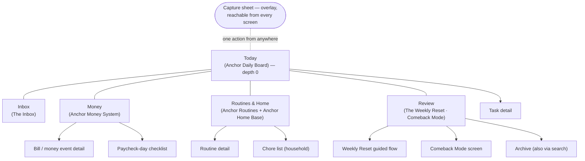
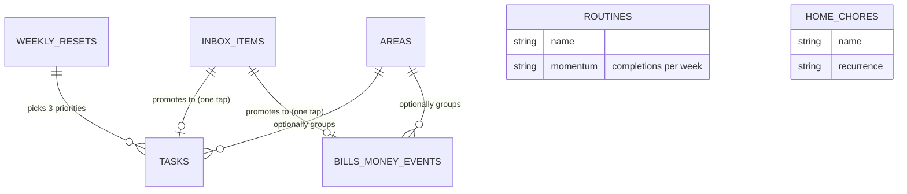
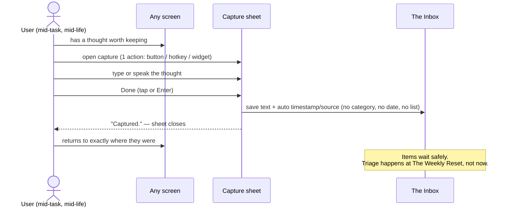
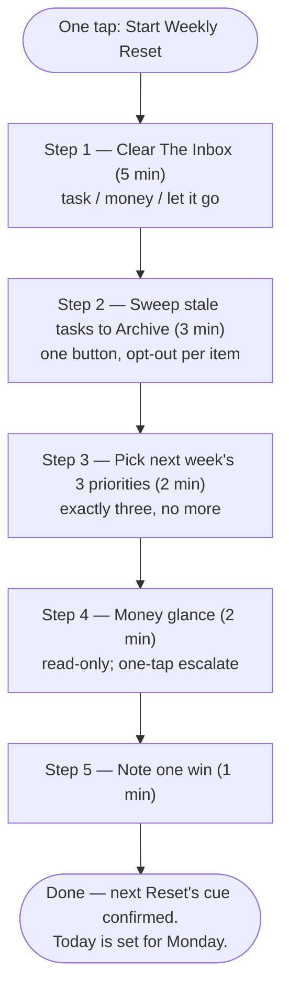
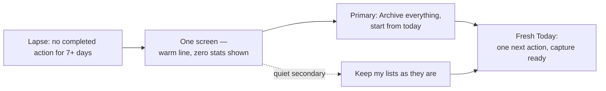

# 04 — Information Architecture

> **Status:** Draft for team review. Terminology, tiers, citation keys, and rulings follow [00 — Evidence Foundation](00-evidence-foundation.md) exactly.
> **Scope:** The structural skeleton of the ecosystem — navigation, screens, folders, databases, views, templates, dashboards, and the two protected flows (quick capture, The Weekly Reset / Comeback Mode). Applies to Anchor Life OS first, and by subset to Anchor Money System, Anchor Routines, Anchor Home Base, and the future Anchor App.

**Executive summary.** Information architecture is where our evidence stops being advice and becomes physics: if the backlog cannot render on the default screen, no one has to resist it. This document encodes the Ten Design Laws as structure — a five-item navigation with a hard depth limit of 2, a persistent "Today" anchor, capture reachable in one action from anywhere, every list capped or paginated, archives and settings deliberately buried, and two protected rituals (The Weekly Reset, Comeback Mode) that get first-class screens while "power features" get none. One honesty note governs everything below: no study has isolated navigation depth, view caps, folder naming, or dashboard layout in adults with ADHD (§5.2 of the foundation). The *workflows* this architecture delivers — calendar/task-list spine, task decomposition, weekly review — are T1 package components ([Safren-2010], [Solanto-2010], [Matsumoto-2024]); the *architectural* choices are T2 translations of general behavioral evidence ([IyengarLepper-2000], [Jachimowicz-2019], [Offloading-2025]) and T3 design rationale, and we label them that way throughout.

---

## A. IA principles derived from the Ten Design Laws

Seven structural principles. They are not style preferences; they are constraints every screen, view, and file in the ecosystem must pass. Violating one requires a written justification against the corresponding Law.

| # | Principle | Hard rule | Anchored in |
|---|---|---|---|
| P1 | **Persistent Today anchor** | The Anchor Daily Board is depth 0. The product opens there, every screen links back to it in one tap, and nothing can replace it as the default landing place | Laws 2 & 9; [Safren-2010] calendar/task-list spine |
| P2 | **Max navigation depth 2** | No screen lives more than two taps from Today. No nested folder trees, no sub-sub-pages. If something "needs" depth 3, it merges upward or gets cut | Law 3; [IyengarLepper-2000] |
| P3 | **Capture reachable from everywhere in ≤1 action** | A capture control is present on every screen, plus lock screen/widget/share sheet in the Anchor App. One action opens it; no screen may cover or bury it | Law 4; [Offloading-2025], [LivingSMART-2015] |
| P4 | **Backlog hidden by default** | Later/Someday items and the Archive never render on any default view. They exist behind one deliberate "show more" action, and are surfaced on schedule by The Weekly Reset, not by scrolling | Laws 3 & 7; abandonment evidence [Kenter-2023], [FOCUS-2023] |
| P5 | **Every list capped or paginated by design** | No unbounded scroll anywhere in the ecosystem. Every view declares its cap in §F. A list without a cap is a bug | Law 3; [IyengarLepper-2000] |
| P6 | **Empty-by-default mornings** | Today rebuilds itself each morning: at most 3 pre-committed tasks carry in; yesterday's unfinished items drain quietly back to the week pool with no red badge and no pile-up | Law 7; [Lally-2010]; metric 4 (§11 of foundation) |
| P7 | **No orphan screens** | Every screen has at least one entry point listed in §C and a visible way back. A screen that loses its last entry point is deleted, not left floating | Law 3 (governance) |

> **Evidence:** T2 [IyengarLepper-2000], [Jachimowicz-2019], [Offloading-2025]; T1 for the workflows carried ([Safren-2010], [Solanto-2010]) · **Confidence:** Moderate · **Rationale:** structure that removes choices and hides backlog reduces the per-visit cognitive cost that drives abandonment · **Expected outcome:** more days on which the user opens the tool, sees one next action, and acts · **Downside:** no ADHD trial isolates any of these structural choices; caps will occasionally hide something a user wanted immediately · **Difficulty:** Low · **Priority:** High

---

## B. Navigation model

### B1. Global navigation — exactly five items

Five, not six ([IyengarLepper-2000]; Law 3). Each item is a place, named for what the user is doing, not for a feature.

| Nav label | Opens | One-line job |
|---|---|---|
| **Today** | Anchor Daily Board | "What do I do right now?" |
| **Inbox** | The Inbox | "Everything I captured, waiting — safely." |
| **Money** | Anchor Money System dashboard | "Is anything due in the next 14 days?" |
| **Routines & Home** | Anchor Routines + Anchor Home Base | "What's the next routine step or chore?" |
| **Review** | The Weekly Reset home (and Comeback Mode) | "When is my next Reset, and can I start it in one tap?" |

### B2. Deliberately NOT in the navigation

- **Settings** — buried under the workspace menu (Notion) or a profile corner (Anchor App). Configuration is a once-a-quarter activity; it must not compete with daily actions for attention.
- **Archive** — reachable only from Review (the sweep step) and from search. An archive in the nav is an invitation to re-read old guilt.
- **Backlog / Someday** — a view state behind "show more," never a destination.
- **Reports/analytics** — the money glance lives inside Review and Money; there is no standalone charts section (Law 10: engagement with dashboards is a cost, not a goal; passive dashboards are not the active ingredient — the cue-and-act workflows are).
- **Template gallery, database pages, help** — inside the collapsed System area (§D). Databases are plumbing; users act through views and buttons, never through raw tables.



> **Evidence:** T2 [IyengarLepper-2000], [Jachimowicz-2019] (defaults/choice architecture, indirect); T3 for the specific five-item composition (design rationale only) · **Confidence:** Moderate · **Rationale:** five stable, task-named destinations keep orientation cheap and make the default path (Today) the path of least resistance · **Expected outcome:** users can name where things live after one week; fewer "lost in the workspace" support requests · **Downside:** consolidating Routines and Home into one item may feel crowded for heavy household users · **Difficulty:** Low · **Priority:** High

---

## C. Screen hierarchy — full inventory

Every screen in Anchor Life OS, its depth, and its entry points. This table is the P7 registry: a screen not listed here does not ship.

| Screen | Depth | Entry points | Purpose (one line) |
|---|---|---|---|
| Anchor Daily Board ("Today") | 0 | App/workspace open; every screen's home tap | Now / Next / Later; one next action |
| The Inbox | 1 | Global nav; capture confirmation toast | Holding area for everything captured; zero filing required |
| Money dashboard | 1 | Global nav | Next 14 days of bills and money events; one status line |
| Routines & Home | 1 | Global nav | Today's routine steps and due chores |
| Review home | 1 | Global nav; Sunday cue (Law 5) | Start The Weekly Reset; entry to Comeback Mode; last Reset's 3 priorities |
| Task detail | 2 | Today; This Week; Backlog; search | One task: First action / Next action / Done criteria |
| Bill / money event detail | 2 | Money dashboard; Reset money glance | One bill: amount, due date, if-then cue, paid toggle |
| Paycheck-day checklist | 2 | Money dashboard (payday row); payday cue | Fixed-order payday steps (§G) |
| Routine detail | 2 | Routines & Home | One routine's steps and momentum (weekly frequency, never streaks) |
| Chore list (household) | 2 | Routines & Home | Shared recurring chores (Anchor Home Base) |
| Weekly Reset guided flow | 2 | Review home (one tap) | Five timeboxed steps, one screen each (§L) |
| Comeback Mode screen | 2 | Review home ("Been away?"); auto-offered after ≥7-day lapse in Anchor App | One screen, one button: archive everything, start from today |
| Archive | 2 | Review (sweep step); search only | Where swept items rest; paginated; no badges, no counts on nav |
| Backlog ("Later") | 2 | "Show more" on Today; Tasks toggle (desktop) | Uncommitted tasks; paginated; never a default view |
| Start Here (onboarding) | 2 | First run; System area; buyer download README | One-page setup walk-through; visited once |
| Evidence Notes | 2 | System area; footer link on each dashboard | Plain-language tier labels for every feature |
| Settings | 2 | Workspace/profile menu only | Cue times, capture-button side, household sharing; visited rarely |
| Capture sheet | overlay | Every screen (P3); lock screen/share sheet in Anchor App | Type or speak; save; return to where you were |

Rules the inventory enforces: maximum depth 2 everywhere (P2); the capture sheet is an overlay, not a destination, so it can never trap the user; Archive and Settings are reachable but never adjacent to daily actions; there are no screens for analytics, badges, or achievements anywhere in the ecosystem ([KimCastelli-2021]; Law 10).

> **Evidence:** T3 (screen inventory is design rationale); carried workflows T1 ([Safren-2010], [Solanto-2010]) · **Confidence:** Low · **Rationale:** a finite, shallow, fully-enumerated screen set keeps every location learnable and every path short · **Expected outcome:** navigation errors and "where was that?" moments become rare within the first week · **Downside:** shallow hierarchies put more weight on each dashboard doing its one job well · **Difficulty:** Low · **Priority:** High

---

## D. Folder structure

### D1. Notion workspace (Anchor Life OS)

The sidebar shows exactly six top-level items — the five nav pages plus one collapsed System page. It never grows. Each page carries one distinctive icon (chosen in the design pass, one icon per page, no decorative clutter).

```text
ANCHOR LIFE OS (workspace)
├── Today            ← Anchor Daily Board; default page; pinned first
├── Inbox            ← The Inbox
├── Money            ← Anchor Money System dashboard
├── Routines & Home  ← Anchor Routines + Anchor Home Base
├── Review           ← The Weekly Reset home + Comeback Mode
└── System (collapsed by default)
    ├── Databases    ← all databases live here; opened by builders, not users
    ├── Archive
    ├── Template gallery
    ├── Start Here
    └── Evidence Notes
```

- Users act on the five pages through embedded, filtered views; they never open the Databases page in daily use.
- Anchor Home Base content can sit in a shared teamspace so a partner or housemate sees only the chore list — sharing is at the page level, not database level, to keep the mental model simple.
- Nothing else may be added to the sidebar top level. New features live inside an existing page or do not ship (Law 3).

### D2. Delivered file products (what buyers download)

Folder naming that survives ADHD is flat, numbered, and self-explaining: the name tells you what it is and what to do with it, sort order equals action order, and there is exactly one obvious first file. One download unzips to one folder — never loose files scattered into Downloads.

```text
Anchor-Money-System/
├── 0-START-HERE.pdf                  ← one page: what you bought, the one first step
├── 1-Anchor-Money-Spreadsheet.xlsx
├── 2-Google-Sheets-copy-link.pdf
├── 3-Printables/
│   ├── Bill-Tracker-Letter.pdf
│   ├── Bill-Tracker-A4.pdf
│   └── Paycheck-Day-Checklist.pdf
└── 4-Evidence-Notes.pdf              ← the honesty layer, in every box
```

Naming rules (all products): numbered prefixes force the reading order; maximum one folder level below the product root (P2 applies to folders too); no version strings, dates, or internal jargon in buyer-facing names (version lives in the PDF footer); no folder named "Misc," "Other," or "Extras" — if it has no home, it has no place in the box; every product folder contains `0-START-HERE` and `Evidence-Notes`.

> **Evidence:** design rationale only (T3); mechanism borrowed from [Offloading-2025] (external structure carries the memory) and [IyengarLepper-2000] (fewer visible options) · **Confidence:** Low · **Rationale:** the download experience is the product's first executive-function test — numbering and self-explaining names remove the "where do I even start" stall · **Expected outcome:** more buyers reach first use without opening a help article · **Downside:** none measured; folder naming has never been studied in ADHD populations, and we will not pretend otherwise · **Difficulty:** Low · **Priority:** Medium

---

## E. Databases — the canonical list

Seven databases, one of them optional and off by default. Every additional database multiplies filing decisions at exactly the moment the system must ask for none (Law 3; [IyengarLepper-2000]), and maintenance burden is an abandonment driver ([Kenter-2023]: only 29% completed all modules of a well-built intervention). Each database below justifies its existence; anything that could be a view, a template, or a property instead of a database, is.

| Database | One-line purpose | Why it must exist (Law 3 test) |
|---|---|---|
| **Inbox Items** | Every capture lands here with text + timestamp, nothing else required | Capture must be write-only and judgment-free; mixing captures into Tasks would force categorization at capture time (violates Law 4, [Offloading-2025]) |
| **Tasks** | Committed work, each with First action / Next action / Done criteria | The T1 core: the calendar/task-list spine and decomposition live here ([Safren-2010], [Matsumoto-2024]) |
| **Bills & Money Events** | Every dated money obligation or event: bill, paycheck, transfer, renewal | Money items have different fields (amount, autopay, account) and different failure costs ([Bangma-2019], [Swedish-Registry]); merging them into Tasks would bloat every task form |
| **Routines** | Personal recurring routines with momentum = completions per week, never streaks | Recurrence semantics differ from tasks (no "done forever"); miss-tolerant metrics are structural, not cosmetic (Law 7; [Lally-2010], [KimCastelli-2021]) |
| **Home Chores** | Shared household upkeep on its own recurrence | Separate from Routines because the sharing model differs: chores are visible to the household, routines are private ([UKAAN-2021] environmental structuring) |
| **Weekly Resets** | One row per completed Weekly Reset: date, 3 picked priorities, one win | Makes the ritual a first-class record; powers metric 5 (§11) and lapse detection for Comeback Mode ([Solanto-2010] homework-completion correlation) |
| **Areas** *(optional, ships OFF)* | Light grouping (Work, Home, Health, Money) for tasks and bills | Only for users who ask for it; assigning an Area is always optional and deferred — an empty Area field never blocks anything |

**Deliberately not built** (each was proposed and cut): a Projects database (a project is a Task using the decomposition template, sub-steps in the task page — a second hierarchy would double filing decisions); a Notes database (notes stay as page content or archived Inbox Items); a Goals database (the 3 weekly priorities in Weekly Resets are the goal layer); a separate Habits tracker (Anchor Routines covers it); a Subscriptions database (a subscription is a recurring row in Bills & Money Events); Contacts, meal planners, and reading trackers (out of scope; other tools do this and we do not need their maintenance burden).



Routines and Home Chores hold zero relations by design — they are self-contained recurrence lists, and every relation we do not create is a link no one has to maintain.

> **Evidence:** T1 for the content the databases carry ([Safren-2010], [Solanto-2010], [Matsumoto-2024]); T2 for the minimal-count structure ([IyengarLepper-2000], [Jachimowicz-2019]); money databases address T-problem evidence ([Bangma-2019], [Barkley-2008]) with no validated tool claims (§4D ruling) · **Confidence:** Moderate · **Rationale:** each database earns its place by carrying a distinct workflow; everything else is a view or template · **Expected outcome:** setup in minutes, near-zero schema maintenance, fewer half-migrated abandoned workspaces · **Downside:** power users will ask for Projects and Goals databases; saying no is a support cost we accept · **Difficulty:** Medium · **Priority:** High

---

## F. Views — per database, with caps

Every view declares filter, sort, cap, and its default platform. "Cap" means visible items before an explicit "show more" (P5). Views marked hidden exist but appear on no dashboard.

**Tasks**

| View | Filter & sort | Cap | Mobile | Desktop |
|---|---|---|---|---|
| Today | due today OR flagged Next; not Done/Archived; flagged first, then time | **3 committed visible**; rest behind "show more" | default | default |
| This Week | due ≤7 days; grouped by day | 10 per day group | — | on |
| Backlog ("Later") | no date, not flagged; newest first | paginated 10 | hidden | behind toggle |
| Done this week | completed ≤7 days | 25 | hidden | Review only |
| Archive | archived | paginated 25 | hidden | via Review/search |

**Inbox Items**

| View | Filter & sort | Cap | Mobile | Desktop |
|---|---|---|---|---|
| Unprocessed | status New; newest first | badge caps at "9+"; list paginated 25 | default | default |
| Processed log | promoted or archived | paginated 25 | hidden | hidden |

**Bills & Money Events**

| View | Filter & sort | Cap | Mobile | Desktop |
|---|---|---|---|---|
| Next 14 Days | date ≤14 days; unpaid first, then date | naturally capped by window; never hides an unpaid item inside the window | default | on |
| This Month | current month; grouped by week | month window | — | default |
| Payday | type Paycheck, next occurrence + linked checklist | 1 | on | on |
| Paid / History | paid or past | paginated 25 | hidden | hidden |

**Routines**

| View | Filter & sort | Cap | Mobile | Desktop |
|---|---|---|---|---|
| Today's Routines | scheduled today; morning first ([Singh-2024]: morning and self-selected habits stronger) | 3 | default | default |
| Momentum | completions/week, trailing 4 weeks; no streak counters anywhere ([KimCastelli-2021], [Lally-2010]) | 4 weeks | hidden | behind toggle |

**Home Chores**

| View | Filter & sort | Cap | Mobile | Desktop |
|---|---|---|---|---|
| Due Now | due or overdue; oldest first; overdue styled neutrally, never red-alarm (Law 7) | 5 | default | default |
| By Room / All | grouped by room | paginated 10 | hidden | behind toggle |

**Weekly Resets**

| View | Filter & sort | Cap | Mobile | Desktop |
|---|---|---|---|---|
| Latest | most recent row: date, 3 priorities, one win | 1 | default | default |
| History | past resets, newest first | paginated 10 | hidden | behind toggle |

**Areas** (only if enabled): one page per area embedding the Tasks and Bills views above, re-filtered; no area gets its own new view types.

The pattern to notice: mobile defaults are always the smallest, most current slice (today, next 14 days, due now); desktop may additionally show the week or month; history and logs are hidden everywhere and visited through Review or search. A today-only default view is itself unproven as an isolated feature in ADHD (§5.2; conflict ruling on visual simplification) — we ship it as T3-labeled structure justified by choice-overload evidence, inside a T1-derived workflow.

> **Evidence:** T2 [IyengarLepper-2000] (caps), [Offloading-2025] (externalized current slice); T3 for today-only views as isolated features (§6 ruling) · **Confidence:** Moderate · **Rationale:** every view answers one question with the fewest items that answer it; everything else costs a deliberate action to see · **Expected outcome:** committed-task completion rate becomes measurable and honest (metric 4: done / committed, committed ≤3) · **Downside:** caps can hide a wanted item one tap away; users migrating from "see everything" tools may distrust the quiet at first · **Difficulty:** Medium · **Priority:** High

---

## G. Templates — the gallery

Templates are how defaults do the organizing ([Jachimowicz-2019]). Five canonical templates ship in the gallery; starter routines and chores ship as pre-filled rows, not templates.

| Template | Database | Pre-filled structure |
|---|---|---|
| **Task decomposition** | Tasks | Fields: **First action** (≤10 minutes, physical, startable now), **Next action**, **Done criteria** ("done looks like: …"), optional if-then cue line ("If it is [time/place], I do the first action" [Gollwitzer-2006]). Body: a checklist capped at 7 steps — if it needs more, the Done criteria are too big ([Safren-2010] task breakdown; [Matsumoto-2024] problem-solving iSMD 0.42) |
| **Paycheck day** | Bills & Money Events | Fixed-order checklist, one step visible at a time: confirm deposit → pay/schedule every bill due before the next paycheck → one pre-decided savings transfer → set the spending number until next payday. Auto-escalation of the savings amount is offered, honestly labeled ([ThalerBenartzi-2004], with its causal caveat) |
| **Bill** | Bills & Money Events | Name, amount, due date, autopay yes/no, account, recurrence auto-set from due date, if-then cue ("If it is the 1st at 8pm, I pay rent" — Law 5, [Gollwitzer-2006]); cue exists only because the action is pre-decided ([Nordby-2022] constraint) |
| **Weekly Reset** | Weekly Resets | The five timeboxed steps of §L pre-listed; fields for 3 priorities and one win; scheduling line for the next Reset's cue |
| **Comeback** | Weekly Resets (special row type) | One page: a warm pre-written line, the "Archive everything, start from today" button, and a single field for one next action. Deliberately contains no review of what was missed ([Lally-2010]; Law 7) |

Money templates carry an inline Evidence Notes line: the money *problem* in ADHD is well documented ([Bangma-2019], [Barkley-2008], [Swedish-Registry], [Einarsson-2024], [DelayDiscounting-Meta]); no budgeting feature — including these templates — has trial evidence for financial outcomes (§4D ruling). We say so on the template itself.

> **Evidence:** T1 for decomposition and weekly-review content ([Safren-2010], [Solanto-2010], [Matsumoto-2024]); T2 for if-then cue fields ([Gollwitzer-2006], indirect) and defaults ([Jachimowicz-2019]); T3/problem-evidence-only for money templates (§4D) · **Confidence:** Moderate · **Rationale:** templates put the evidence-backed structure one tap away so the user never builds it from a blank page · **Expected outcome:** most tasks and bills created via template rather than blank entry; decomposition fields actually filled in · **Downside:** template rigidity can chafe; the ≤10-minute First action rule is a heuristic, not a tested threshold · **Difficulty:** Low · **Priority:** High

---

## H. Relationships & filters — invisible by design

Relations exist so the user never has to think about them. The rule: **no manual linking at capture time, ever** ([Offloading-2025] — offloading works because it is cheap; Law 4).

- **Capture writes text plus auto-metadata only** (created time, source device). No pickers, no tags, no project selector, no due date prompt. A capture with a category requirement is a capture that does not happen.
- **Promotion sets relations behind buttons.** During Inbox triage (mostly inside The Weekly Reset), each item shows three choices: *Make it a task* / *It's money* / *Let it go*. The button copies the text into the right database, stamps the back-link to the Inbox Item, and archives the original. The user never opens a relation property.
- **Today assembles itself from filters, not filing.** Due dates and the Next flag drive the Anchor Daily Board; nothing appears on Today because someone filed it there, and nothing is lost because someone forgot to.
- **The Weekly Reset writes its own relations.** Picking 3 priorities creates the Weekly Resets → Tasks links; the user just taps three tasks.
- **Areas are optional chips at triage,** one tap, skippable forever. An empty Area field never blocks a view, a rollup, or a flow.
- **Rollups and formulas do the reading.** The money status line, momentum counts, and lapse detection are computed; the user never writes a filter. In Notion this is buttons + formulas + pre-built views; in the Anchor App it is server-side and the constraint still holds: automation over user initiation (Law 8).

> **Evidence:** T2 [Offloading-2025], [Jachimowicz-2019]; T3 for the specific button-driven promotion pattern (design rationale) · **Confidence:** Moderate · **Rationale:** every relation the system sets is a decision the user does not spend at the moment of lowest capacity · **Expected outcome:** captures per user rise and triage happens weekly instead of never · **Downside:** hidden automation can surprise users who want manual control; buttons in Notion have platform limits we must document honestly · **Difficulty:** Medium · **Priority:** High

---

## I. Dashboard hierarchy and decision-load budgets

One home, four area dashboards. Each dashboard answers exactly one question (stated in §B1), shows its answer above the fold, and has a **decision-load budget**: the maximum number of interactive choices visible before scrolling. The budget is a ratchet — adding a visible choice requires removing one.

| Dashboard | Above the fold | Visible choices (counted) | Budget |
|---|---|---|---|
| **Anchor Daily Board** (Today) | Date line · **Now** card (1 task, its First action) · capture button · money line (only if something is due ≤48h) · one routine chip | Now card, capture, routine chip, conditional money line, "show more" | **≤5** |
| **Inbox** | Count ("9+" max) · the top item focused · three triage buttons on it | 3 triage buttons + open-next + capture | ≤6 |
| **Money** | One status line ("Nothing due before Friday" / "2 due this week") · Next 14 Days list | per-item paid toggle, payday link, capture | ≤6 |
| **Routines & Home** | Current routine step · due chores (≤5) | step done-tap, chore ticks, capture | ≤7 |
| **Review** | "Start Weekly Reset" (one big affordance) · last Reset's 3 priorities · quiet "Been away?" link | start button, 3 priority links, comeback link, capture | ≤6 |

Notes: the Anchor Daily Board's Now/Next/Later structure means **Next** (max 2) and everything below live under the fold or behind "show more" — above the fold there is one action to take. Dashboards display no engagement widgets: no streak flames, no completion percentages on the home screen, no charts of yourself ([KimCastelli-2021]; Law 10 — and [FOCUS-2023]: engagement is not the outcome). Passive dashboards are explicitly not our active ingredient; the dashboards exist to route one action, and no isolated dashboard design has ADHD trial evidence (§5.2).

> **Evidence:** T2 [IyengarLepper-2000] (choice count); T3 for dashboards as such (§5.2 — never isolated in ADHD trials) · **Confidence:** Low · **Rationale:** counting visible choices makes "reduce decisions" auditable instead of aspirational · **Expected outcome:** time from open to first action shrinks; Today's committed-≤3 stays honest · **Downside:** a budget of 5 is a design constraint we chose, not a measured threshold; we will tune it against metric 4 rather than defend it · **Difficulty:** Medium · **Priority:** High

---

## J. Mobile layout and desktop layout

### J1. Mobile — one column, capture under the thumb

- **One column, always.** No side-by-side panes, no tabs within tabs. Scroll order on Today: Now card → Next (collapsed count) → routine chip → money line. The screen ends; it does not feed.
- **Capture button fixed in the thumb zone**: bottom corner, right by default, switchable to left in Settings (buried, but real). It floats above every screen (P3) and above the keyboard.
- **Favorites order** (Notion mobile sidebar, and tab order in Anchor App): Today, Inbox, Money, Routines & Home, Review — the same five, same order as desktop, nothing else favorited. Order stability is part of the anchor: muscle memory should survive a bad week.
- **Mobile deliberately omits:** Backlog, Archive, Momentum charts, template management, bulk operations, Settings beyond cue times and capture-side, and all database pages. Omitted, not forbidden — each remains reachable through search or desktop; none renders by default on a phone.
- **Mobile fully supports** capture (its primary job — the phone is the point-of-performance device; [LivingSMART-2015] and [Selaskowski-2022] support structured smartphone use as a delivery vehicle, coached and package-level respectively) and The Weekly Reset (protected everywhere; a Reset done on a couch beats a perfect one skipped).

### J2. Desktop — two panes, maximum

- **Two panes max:** left = the list or dashboard context, right = the one open item. Never three columns; no stacking peek-overs more than one deep.
- The Weekly Reset runs **full-screen, one step at a time**, even on desktop — the flow owns the screen for 15 minutes (Law 6 protects the ritual; §L).
- Desktop adds This Week and This Month views and the behind-toggle views of §F; it adds no new destinations (the nav is identical on every platform).

> **Evidence:** T2 for mobile as structured-delivery vehicle ([LivingSMART-2015], [Selaskowski-2022] — package-level, not layout-level); T3 for one-column, thumb-zone, and two-pane specifics (design rationale only) · **Confidence:** Low · **Rationale:** capture happens where life happens (phone), and layout should spend zero attention on window management · **Expected outcome:** capture volume concentrates on mobile; desktop sessions concentrate on Reset and week planning · **Downside:** no ADHD study has compared layouts; power users may want denser desktop views than two panes allow · **Difficulty:** Low · **Priority:** Medium

---

## K. Quick capture flow

The most protected micro-interaction in the ecosystem (Law 4). Target: **≤2 interactions around the thought itself, zero categorization** ([Offloading-2025] — offloading helps most for prospective memory, exactly what ADHD needs externalized).

1. **Open** — one action from anywhere: the floating button (mobile), a global hotkey (desktop/Anchor App), lock-screen widget or share sheet (Anchor App). Interaction 1.
2. **Type or speak** the thought. No fields, no dropdowns, no date picker, no "which list?" — the sheet is a single text box with a mic.
3. **Done** — tap Save or hit Enter. Interaction 2. The item lands in The Inbox with timestamp and source auto-stamped; a quiet "Captured" toast confirms; the sheet closes back to exactly where you were ([Safren-2010] distractibility management: "write it down, return to task").

Edge rules: offline captures queue and sync later — capture never visibly fails; duplicates are fine and get merged at the Reset, not at capture; voice notes save as text-plus-audio without transcription blocking the save; the capture sheet never shows the Inbox count (no guilt at the moment of offloading).



> **Evidence:** T2 [Offloading-2025] (meta-analytic, general population — indirect for ADHD); T1-adjacent context [LivingSMART-2015]; the ≤2-interaction figure is a design spec, not a studied threshold · **Confidence:** Moderate · **Rationale:** every step between thought and saved text is a chance for working memory to drop the thought · **Expected outcome:** capture becomes the reflex path for intrusive to-dos; fewer lost obligations · **Downside:** a frictionless inbox grows fast; without the Reset's triage step it becomes a guilt pile — the two features ship together or not at all · **Difficulty:** Medium (platform-dependent) · **Priority:** High

---

## L. Review flow — The Weekly Reset and Comeback Mode

### L1. The Weekly Reset

The single most protected workflow in the ecosystem (Law 6). Fifteen minutes, five steps, each step one full screen with its own timebox and its own single job. The timeboxes sum to 13 minutes; the 2-minute slack is deliberate — finishing early beats running over (Law 7). The Reset fires from a pre-decided weekly cue chosen at setup ("If it is Sunday 10am, I start the Reset" — Law 5, [Gollwitzer-2006]; cue points at a pre-decided action because reminders alone demonstrably do not carry adherence: [Nordby-2022], [FOCUS-2023]). Rationale for the ritual itself: weekly review is a named component of the T1 packages ([Safren-2010], [Solanto-2010] — where home-exercise completion correlated with improvement), and [NICE-NG87] emphasizes regular follow-up over set-and-forget. Weekly Reset completion is metric 5, our strongest defensible leading indicator.

| Step | Screen job | Timebox |
|---|---|---|
| 1. Clear The Inbox | Top item focused; three buttons: *Make it a task* / *It's money* / *Let it go* | 5 min |
| 2. Sweep stale tasks | Tasks untouched >14 days listed; one button sweeps all to Archive; per-item "keep" opt-outs | 3 min |
| 3. Pick next week's 3 | Tap exactly 3 priorities; the picker accepts no more than 3 | 2 min |
| 4. Money glance | Read-only Next 14 Days; one-tap "make it tomorrow's Now" for anything urgent | 2 min |
| 5. One win | Single text field, gentle pre-filled suggestion; saved to the Weekly Resets row | 1 min |



If a step's timebox expires, the screen offers "good enough — next step" as the primary action. A partial Reset saves as done-with-gaps; there is no failed state (Law 7).

### L2. Comeback Mode

Lapses are the expected path, not the exception ([Kenter-2023]: 29% full completion; [FOCUS-2023]: engagement decays; [Lally-2010]: a missed occasion does not doom the habit). Comeback Mode is the lapse-recovery flow: one screen, one button, no guilt.

- **Trigger:** no completed action for ≥7 days. In the Anchor App, detected and gently offered; in Notion, a formula on the last Weekly Resets row surfaces the standing "Been away?" link on Review — self-triggered, honestly labeled as such.
- **The screen:** one warm sentence ("Welcome back. Nothing here needs an apology."), one primary button — **"Archive everything, start from today"** — and a quiet secondary link ("Keep my lists as they are").
- **The button does:** archive all overdue and stale tasks and all unprocessed Inbox Items (recoverable from Archive, nothing is deleted); reset Today to empty; ask for one next action, offering the smallest starter if the field stays blank. No missed-day statistics, no "you were gone 12 days," no streak to mourn — the momentum metrics simply resume (Law 7; [KimCastelli-2021] on punitive mechanics decaying or backfiring).
- **Measured by** Comeback Rate (metric 6): % who return within 14 days after a ≥7-day lapse — our signature metric, because recovery is the outcome this architecture is built to make cheap.



> **Evidence:** T1 for weekly review as package component ([Safren-2010], [Solanto-2010], [NICE-NG87]); T2 for forgiveness design ([Lally-2010], [KimCastelli-2021], adherence evidence [Kenter-2023], [FOCUS-2023]); the specific 5-step/15-minute format and the one-button archive are design rationale (T3), untested as isolated features · **Confidence:** Moderate · **Rationale:** the review ritual is the practice loop the evidence favors, and Comeback Mode removes the restart cost that turns a lapse into an exit · **Expected outcome:** Weekly Reset completion ≥50% of active weeks (metric 5) and a measurable Comeback Rate (metric 6) · **Downside:** archiving a backlog wholesale can feel drastic; the secondary "keep my lists" path exists for exactly that, and Archive makes it reversible · **Difficulty:** Medium · **Priority:** High

---

*Previous: [03 — Product Architecture](03-product-architecture.md) · Next: [05 — UX Specification](05-ux-specification.md) · Full index in [README](README.md).*
