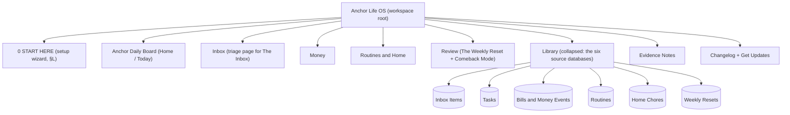

# 08 — Notion Strategy

> **Status:** Draft for team review. Terminology, tiers, citation keys, and rulings follow [00 — Evidence Foundation](00-evidence-foundation.md) exactly. This document is the Notion *implementation* of the platform-agnostic structure fixed in [04 — Information Architecture](04-information-architecture.md): same six databases, same views and caps, same templates, same dashboards. Where Notion cannot deliver 04's spec, the gap is stated, not papered over.
> **Scope:** Anchor Life OS in full; the minis (Daily Board Lite, Weekly Reset Kit, Anchor Routines, Anchor Home Base) and Anchor Money System (Notion edition) are subsets of the schemas below.

**Executive summary.** Notion is our primary build platform because it lets us ship real databases, relations, formulas, buttons, and pre-filled defaults with zero infrastructure, on a free plan buyers already have — and because the duplicate-to-your-own-workspace model means buyers own their data and we never see it. It is also a platform with honest weaknesses for exactly our audience: no reliable push notifications, weak offline behavior, mobile sync lag, and no way to push updates into a duplicated template. This document specifies the complete Anchor Life OS workspace around both facts: six canonical databases with every property justified (Law 3), formulas spelled out (days-until-due, stale flags, miss-tolerant momentum), templates that pre-fill the evidence-backed structure ([Safren-2010], [Matsumoto-2024], [Jachimowicz-2019]), buttons that make capture and Comeback Mode one tap, a mobile-first view order, and a START HERE wizard that delivers a first win in under two minutes. Throughout, one constraint from the evidence governs the reminder story: cues help only when they trigger a small, pre-decided action inside a structured system — reminder blasts alone do not move adherence ([Nordby-2022], [Gollwitzer-2006], Law 5) — so every build pairs Notion with explicit phone-reminder instructions that always name the action, never just the app.

---

## A. Why Notion — capabilities and limits, honestly

### A.1 What Notion gives us

- **Real structure without infrastructure:** databases, relations, rollups, formulas, buttons, and database templates — enough to implement 04's IA faithfully, shippable as a link.
- **The duplicate-to-own-workspace model:** the buyer duplicates our master template into their own account. They own their data; we never see, host, or breach it. Privacy by architecture.
- **Free plan sufficiency:** everything in this document works on Notion's free personal plan (we deliberately avoid paid-plan dependencies — §D.4).
- **An existing buyer base:** "notion template" is an established Etsy category (07 §H); we meet demand rather than manufacturing it.

### A.2 What Notion does not give us (and what we do about each)

| Limit | Consequence | Our response |
|---|---|---|
| **No true push notifications.** Notion reminders surface in-app and by email; they are not dependable phone-level cues | The cue layer — the thing Law 5 needs — cannot live in Notion | Every product ships a **phone-reminder pairing page**: 3–5 native phone alarms/reminders the buyer sets once, each naming a pre-decided action and its Anchor screen ("8:00 pm daily: 'Pay one bill — open Money'"). And we say the humbling part out loud, in the product: reminders by themselves did not improve adherence in a direct ADHD trial [Nordby-2022] — a cue only earns its keep pointing at a small, already-decided act [Gollwitzer-2006] |
| **Weak offline support** | The capture promise ("always available") breaks in dead zones | Capture instructions include the offline fallback: phone's native quick-note now, paste into The Inbox later (Law 4 — capture first, organize later) |
| **Mobile sync lag / cold start** | Seconds of loading can kill a capture impulse | Capture path optimized for the widget/shortcut (§F.3), not app navigation; dashboards kept light (no heavy galleries on Home) |
| **No update push to duplicated templates** | Buyers on old versions forever unless we design delivery | The versioning and changelog system in §K |
| **No required fields, no hard view caps** | 04's "3 committed visible" and "Next action required" cannot be machine-enforced | Enforced by ritual and template instead: the Weekly Reset pick-3 step and pre-filled prompts (§B.2, §C.1); stated honestly as convention, not constraint |
| **Database automations are largely a paid-plan feature** | Automation recipes would break for free-plan buyers | Core flows built on **buttons** (free) only; automations offered as optional extras for paid-plan users (§D.4) |

> **Evidence:** platform choice is design rationale (T3); the reminder caveat is T1 constraint evidence ([Nordby-2022] null for SMS-style prompts; [FOCUS-2023] engagement ≠ outcome); cue design T2 ([Gollwitzer-2006] d = 0.65); capture offloading T1/T2 ([Offloading-2025]) · **Confidence:** Moderate · **Rationale:** Notion is the fastest honest path to shipping the T1 workflows as real software-like structure while buyers keep their data · **Expected outcome:** working systems in buyers' own workspaces with zero infrastructure risk on our side · **Downside:** we build our core product on a platform we do not control, whose limits (notifications, offline) sit exactly on ADHD pain points — the pairing instructions are a workaround, not a fix, and the Anchor App exists on the roadmap for that reason (00 §8) · **Difficulty:** Medium · **Priority:** High

---

## B. Anchor Life OS — complete workspace architecture

### B.1 Page tree



Depth never exceeds 2 (04 §A). Buyers live on the five dashboard pages; the Library holds the source databases and is visited roughly never — every working surface is a linked, filtered view. The optional **Areas** database from 04 §E ships as a documented add-on page, disconnected and off by default; enabling it is a conscious act, not a default decision load.

### B.2 The six canonical databases

Canon per 04 §E: **Inbox Items, Tasks, Bills & Money Events, Routines, Home Chores, Weekly Resets.** Every property below carries its justification — a property that cannot say why it exists does not ship (Law 3; maintenance burden is abandonment fuel [Kenter-2023]). All formulas use current Notion formula syntax.

#### B.2.1 Inbox Items

Write-only external memory (Law 4, [Offloading-2025]). Nothing is required at capture beyond the text itself.

| Property | Type | Options / formula | Why it exists |
|---|---|---|---|
| Thought | Title | — | The capture. The only thing a user ever types here |
| Captured | Created time | auto | Timestamp with zero user effort; powers "newest first" |
| Let go | Checkbox | default unchecked | The third triage outcome (04 §H): archived without becoming anything. Unchecked = unprocessed |

Three properties. That is the entire schema, and the restraint is the feature: any additional field (category, priority, source) is a decision imposed at the moment of lowest capacity, which is how capture dies.

**Relations:** none stored on Inbox Items. Promotion (§B.3) *moves* the page into Tasks or Bills & Money Events using Notion's native "Move to," which preserves title and body. 04 specifies promote-and-back-link; Notion cannot cheaply copy-with-backlink without paid automations, so the Notion edition promotes by moving — the honest platform difference, documented in-template.

#### B.2.2 Tasks

The T1 spine: task list + decomposition ([Safren-2010]; [Matsumoto-2024] organizational strategies, incremental OR 2.03).

| Property | Type | Options / formula | Why it exists |
|---|---|---|---|
| Task | Title | — | The commitment, phrased as an outcome |
| Lane | Select | `Now` / `Next` / `Later` — default `Later` | The Anchor Daily Board's three lanes (00 §8) as one draggable property. Implements 04's "Next flag" with the same semantics: committed = `Now` or `Next`. Convention (ritual-enforced, §I): `Now` holds 1, `Next` holds ≤2 |
| Next action | Text | template pre-fills prompt text | **Required by template** (unenforceable in Notion; the pre-fill and the Daily Board card make an empty one visible). The single small step that makes the task startable [Safren-2010] |
| First action | Text | template pre-fills "≤2 minutes, physical, startable now" | Decomposition's ignition step ([Safren-2010]; 04 allows up to 10 minutes — the threshold is a heuristic, not a tested number; ≤2 minutes is the default prompt) |
| Done means | Text | template prompt: "done looks like:" | Done criteria stop perfectionism-driven non-finishing [Matsumoto-2024 problem-solving] |
| Due | Date | optional | Drives Today and This Week views; optional because most tasks have no real date and fake dates rot trust |
| Done | Checkbox | — | One-tap completion on any view, mobile-native |
| Done on | Date | set by the `Finish` button (§D.2); manual fallback | Timestamps completion for "Done this week" and metric 4 without relying on last-edited noise |
| Archived | Checkbox | — | Comeback Mode's target (Law 7): archiving is reversible, deletion is not. Every working view filters `Archived = unchecked` |
| Stale | Formula | see below | Surfaces the Weekly Reset "sweep stale" candidates (04 §L step 2) |
| Created | Created time | auto | Age context during triage |
| Last touched | Last edited time | auto | Feeds the stale flag |
| Picked in Reset | Relation → Weekly Resets | set by the Reset ritual, never at capture | Links the 3 weekly priorities to their Reset row (04 §H: the ritual writes its own relations) |

**Stale flag formula** (auto-archive *suggestion* — the user sweeps; the system never silently deletes):

```
if(
  and(
    !prop("Done"),
    !prop("Archived"),
    dateBetween(now(), prop("Last touched"), "days") >= 14
  ),
  "Stale — untouched 2+ weeks",
  ""
)
```

14 days = two missed Weekly Resets, matching 04 §L ("tasks untouched >14 days"). The label is descriptive, not scolding; stale styling is neutral (Law 7).

#### B.2.3 Bills & Money Events

Every dated money obligation: bill, subscription, paycheck, transfer, renewal (04 §E; a subscription is a recurring row here, not its own database). Problem evidence is why this database exists at all [Bangma-2019] [Swedish-Registry] [Barkley-2008]; no formula in it claims to fix anything (00 §4D ruling).

| Property | Type | Options / formula | Why it exists |
|---|---|---|---|
| Name | Title | — | "Rent," "Spotify," "Payday" |
| Type | Select | `Bill` / `Subscription` / `Paycheck` / `Transfer` / `Renewal` | Different types render differently (Paycheck rows anchor the Payday view; Subscriptions feed the audit) |
| Amount | Number | currency format | The number working memory drops first |
| Next due | Date | — | The load-bearing date; everything below derives from it |
| Frequency | Select | `Weekly` / `Every 2 weeks` / `Monthly` / `Quarterly` / `Yearly` / `One-time` — default `Monthly` | Recurrence semantics + the monthly-equivalent math |
| Autopay | Checkbox | — | The single most important money flag: autopay rows are "watch," manual rows are "act" (Law 8: automate what the bank will automate for us) |
| Account | Select | user-defined, optional | Which account pays — the overdraft-relevant detail; optional so it never blocks entry |
| If-then cue | Text | template pre-fills pattern: "If it is [day] at [time], I [action]" | Implementation intention attached to the bill itself ([Gollwitzer-2006]; exists only because the action is pre-decided — the [Nordby-2022] constraint, Law 5). Pairs with one phone alarm (§A.2) |
| Paid this cycle | Checkbox | reset manually at Paycheck day | The at-a-glance "handled or not" state driving Next 14 Days sorting |
| Days until due | Formula | see below | Time made visible without mental date math (Law 9 workflow, not widget) |
| Monthly equivalent | Formula | see below | Makes subscription leak visible in one honest number per row |
| Last paid | Date | set by `Mark paid` button (§D.2) | History without a ledger's upkeep |
| Notes | Text | optional | Confirmation numbers, cancellation notes |

**Days until due formula:**

```
lets(
  d, dateBetween(prop("Next due"), now(), "days"),
  ifs(
    empty(prop("Next due")), "",
    d < 0, "needs a look — date passed",
    d == 0, "due today",
    d == 1, "due tomorrow",
    d <= 7, format(d) + " days",
    format(d) + " days"
  )
)
```

Note the first branch's wording: a passed date reads "needs a look," never "OVERDUE" in red capitals — the row may simply need its date advanced after payment (§D.3), and alarm styling that cries wolf trains people to stop looking (Law 7).

**Monthly equivalent formula** (Subscriptions/Bills only; Paychecks excluded):

```
lets(
  a, prop("Amount"),
  ifs(
    prop("Type") == "Paycheck", 0,
    prop("Frequency") == "Weekly", round(a * 52 / 12 * 100) / 100,
    prop("Frequency") == "Every 2 weeks", round(a * 26 / 12 * 100) / 100,
    prop("Frequency") == "Quarterly", round(a / 3 * 100) / 100,
    prop("Frequency") == "Yearly", round(a / 12 * 100) / 100,
    prop("Frequency") == "One-time", 0,
    a
  )
)
```

#### B.2.4 Routines

Momentum = completions per week, never streaks (04 §E; Law 7; [Lally-2010] one miss ≠ failure; [KimCastelli-2021] punitive gamification decays or backfires). **Implementation model:** each row is a *routine-week card*, auto-created weekly by a recurring database template (§D.3) — one card per routine per week. This is the only free-plan Notion design that yields dated completion history, a this-week view, and trailing-4-week momentum (04's Momentum view) without a seventh "checks" database (cut in 04 §E) or manual weekly resets of checkboxes (a Law 8 violation).

| Property | Type | Options / formula | Why it exists |
|---|---|---|---|
| Card | Title | template: "Routine — week of [date]" | One routine-week instance |
| Routine | Select | one option per routine ("Meds," "Walk," "Tidy reset") | Groups cards across weeks; powers the Momentum view grouping |
| Scheduled days | Multi-select | `Mon`…`Sun` | Which days this routine wants; feeds "Today's Routines" ([Singh-2024]: self-selected and morning routines fare better — the wizard suggests mornings, the user picks) |
| Target per week | Number | template pre-fill per routine | The denominator of momentum; a routine done 3 of 3 target days is at 100%, no matter which days |
| Mon … Sun | 7 × Checkbox | — | The completion record. Seven ticks are the whole "tracker" — no journaling, no counts, no streak math |
| This week | Formula | see below | Completions so far this week |
| Momentum | Formula | see below | The one metric: capped, forgiving, restarts fresh every Monday with history preserved on last week's card |
| Today? | Formula | see below | Filters "Today's Routines" without the user touching a filter |
| Anchor cue | Text | template pre-fill: "after [existing habit]" | The if-then anchor ([Gollwitzer-2006]); routines attach to life, not to notifications [Nordby-2022] |
| Active | Checkbox | default checked | Pausing a routine without deleting its history (recovery-friendly, Law 7) |
| Created | Created time | auto | Identifies "this week's" cards |

**This week / Momentum / Today? formulas:**

```
/* This week */
(prop("Mon") ? 1 : 0) + (prop("Tue") ? 1 : 0) + (prop("Wed") ? 1 : 0) +
(prop("Thu") ? 1 : 0) + (prop("Fri") ? 1 : 0) + (prop("Sat") ? 1 : 0) +
(prop("Sun") ? 1 : 0)

/* Momentum — capped at 100%, denominator floored at 1 */
min(1, prop("This week") / max(prop("Target per week"), 1))
   /* number format: percent */

/* Today? — true when today's weekday is a scheduled day
   (multi-select values are strings; options are named Mon…Sun) */
prop("Scheduled days").includes(formatDate(now(), "ddd"))
```

**Honest deviation, recorded:** the ideal metric is completions in a *trailing 7 days* / target, capped. Free-plan Notion cannot compute a rolling window without a second database, so the shipped metric is *this calendar week* / target, capped — with last week's card keeping its own score forever. A Monday-morning 0% is a fresh week, not a loss: no card ever shows a broken streak because streaks do not exist here. The trailing-window version is an Anchor App capability (00 §8).

**Relations:** none (04 §E: Routines and Home Chores hold zero relations by design).

#### B.2.5 Home Chores

Shared household upkeep on its own recurrence (04 §E: separate from Routines because chores are household-visible, routines private [UKAAN-2021]).

| Property | Type | Options / formula | Why it exists |
|---|---|---|---|
| Chore | Title | — | "Kitchen counters," "Sheets" |
| Room | Select | `Kitchen` / `Bathroom` / `Bedroom` / `Living` / `Admin & outside` | 04's "By Room" grouping; also how humans think about chores |
| Cadence | Select | `Daily` / `Weekly` / `Every 2 weeks` / `Monthly` / `Seasonal` | Recurrence without dates to manage |
| Last done | Date | set by the `Did it` button (§D.2) | The only fact the user ever records |
| Due again | Formula | see below | A computed date, so nobody schedules chores by hand (Law 8) |
| Ready | Formula | see below | The status language: chores become "ready," never "overdue" — a chore ready for three weeks renders exactly like one ready today (Law 7; 04 §F: overdue styled neutrally, never red-alarm) |
| Effort | Select | `5 min` / `15 min` / `30+ min` | Lets the "5-minute wins" view answer "what fits the energy I actually have" — a pre-decided menu instead of a survey of the whole house (Law 3) |
| Owner | Person | optional | The sharing model: visible ownership without nagging; empty is fine |

**Due again / Ready formulas:**

```
/* Due again — a real date, filterable and sortable */
lets(
  gap,
  ifs(
    prop("Cadence") == "Daily", 1,
    prop("Cadence") == "Weekly", 7,
    prop("Cadence") == "Every 2 weeks", 14,
    prop("Cadence") == "Monthly", 30,
    90
  ),
  if(empty(prop("Last done")), now(), dateAdd(prop("Last done"), gap, "days"))
)

/* Ready — neutral two-state language */
if(prop("Due again") <= now(), "Ready", "Fresh")
```

**Relations:** none, by design (04 §E).

#### B.2.6 Weekly Resets

One row per completed Weekly Reset — the ritual as a first-class record, powering metric 5 (00 §11) and lapse detection ([Solanto-2010]: home-exercise completion correlated with improvement; [NICE-NG87]: regular follow-up).

| Property | Type | Options / formula | Why it exists |
|---|---|---|---|
| Reset | Title | template: "Reset — week of [date]" | The record |
| Kind | Select | `Reset` / `Comeback` — default `Reset` | Comeback Mode rows live here as a special row type (04 §G), which makes the Comeback Rate (metric 6) countable from one database |
| Date | Date | template pre-fills today | When it happened |
| Inbox cleared | Checkbox | — | Step 1 done |
| Stale swept | Checkbox | — | Step 2 done |
| Priorities picked | Checkbox | — | Step 3 done |
| Money glanced | Checkbox | — | Step 4 done |
| Win noted | Checkbox | — | Step 5 done |
| One win | Text | template prompt: "one thing that worked this week, however small" | The anti-shame ledger; relapse-prevention framing ([Safren-2010]) — five step checkboxes make partial resets count instead of reading as failures (Law 7) |
| Priorities | Relation → Tasks | set by tapping 3 tasks during step 3 | The goal layer (04 cut a Goals database; this relation is it) |
| Priorities done | Formula | see below | Reads completion through the relation — the user never computes their own score |
| Steps done | Formula | see below | "3 / 5" honest partial credit |
| Been away? | Formula | see below | Lapse detection: the standing, gentle Comeback surface (04 §M trigger: ≥7 days) |

**Formulas:**

```
/* Priorities done — reads the related Tasks' Done checkbox */
format(prop("Priorities").filter(current.prop("Done")).length())
  + " / " + format(prop("Priorities").length())

/* Steps done */
format(
  (prop("Inbox cleared") ? 1 : 0) + (prop("Stale swept") ? 1 : 0) +
  (prop("Priorities picked") ? 1 : 0) + (prop("Money glanced") ? 1 : 0) +
  (prop("Win noted") ? 1 : 0)
) + " / 5"

/* Been away? — on the latest row (the Review page shows only the latest),
   ≥7 days without a newer Reset surfaces the Comeback line.
   Deliberately no day count: never "you were gone 12 days" (04 §M). */
if(
  dateBetween(now(), prop("Date"), "days") >= 7,
  "Been away? Comeback is one tap — no catch-up needed.",
  ""
)
```

### B.3 Relations map (complete)

| From | To | Set by | Never set at |
|---|---|---|---|
| Weekly Resets `Priorities` | Tasks | Tapping 3 tasks in Reset step 3 | Capture or task creation |
| Tasks `Picked in Reset` | Weekly Resets | Auto (two-way relation) | — |
| Inbox Items | — | Promotion = native "Move to" Tasks / Bills & Money Events | — |
| Routines / Home Chores | — | Zero relations, by design (04 §E) | — |
| Areas (optional add-on, ships off) | Tasks, Bills & Money Events | Optional one-tap chip at triage | Capture |

That is the entire relation surface: one two-way relation, written by a ritual, plus an optional add-on. Every relation not created is a link no one has to maintain (04 §E).

> **Evidence:** T1 for the workflows the schemas carry ([Safren-2010], [Solanto-2010], [Matsumoto-2024]); T2 for minimal-schema/defaults structure ([IyengarLepper-2000], [Jachimowicz-2019], [Offloading-2025]); money schema addresses problem evidence only ([Bangma-2019], [Swedish-Registry]; 00 §4D — no outcome claims); specific property choices are T3 design rationale · **Confidence:** Moderate · **Rationale:** every property either carries a T1 workflow, computes something the user would otherwise compute, or is auto-set — nothing exists "for completeness" · **Expected outcome:** setup measured in minutes; near-zero schema maintenance; the stale/momentum/due formulas do the reading so the user only ever acts · **Downside:** the routine-week card model is unconventional and depends on recurring templates being set up once per routine (wizard step, §L); power users will ask for more properties and we will say no in public · **Difficulty:** Medium · **Priority:** High

---

## C. Database templates — exact pre-fills

Defaults do the organizing ([Jachimowicz-2019] d = 0.68): a buyer should never meet a blank page where structure was the point. Five canonical templates (04 §G), specified as shipped.

### C.1 Task decomposition ("Break it down") — Tasks, set as default template

Pre-filled properties: `Lane = Later`, `Next action` = *"→ write the very next physical step"*, `First action` = *"→ something ≤2 minutes you could do right now (up to 10 minutes still counts)"*, `Done means` = *"done looks like: …"*.
Pre-filled body:

```
First action (≤2 min): …
Next action: …
Done means: …
If-then cue (optional): If it is [time/place], I do the first action.
Steps (7 max — if it needs more, "Done means" is too big):
[] …
```

Anchors: task breakdown and one-next-action are named T1 components ([Safren-2010]; [Matsumoto-2024] problem-solving iSMD 0.42); the if-then line is T2 [Gollwitzer-2006]. The template *is* the enforcement of "Next action required": Notion has no required fields, so the arrow-prompts make an unfilled field look unfinished, and the Anchor Daily Board shows the Next action on every card — an empty one is visible at exactly the moment it matters.

### C.2 Bill — Bills & Money Events

Pre-filled: `Type = Bill`, `Frequency = Monthly`, `Autopay = unchecked`, `If-then cue` = *"If it is the [1st] at [8 pm], I pay [name] — takes 2 minutes."* Body checklist: `[] amount confirmed` `[] account chosen` `[] autopay possible? (if yes, set it and check the box — the best bill is one you never think about)` `[] one phone alarm set to match the cue`.

### C.3 Paycheck day — Bills & Money Events

Pre-filled: `Type = Paycheck`, `Frequency` per pay cycle. Body is 04 §G's fixed-order checklist, one step visible at a time (each step a toggle; open one, do it, close it):

```
▸ 1. Confirm the deposit landed.
▸ 2. Pay or schedule every bill due before your next paycheck.
     (Open the "Until next paycheck" view inside this toggle. Mark each one
      "Paid this cycle" and advance its Next due date — yes, by hand: §D.3
      explains why we did not automate this.)
▸ 3. Move one pre-decided savings transfer.
     (The amount was decided once, on a calm day — not renegotiated today.
      Optional auto-escalation each raise, honestly labeled: the original
      Save More Tomorrow evidence is promising but its causal rating is low.)
▸ 4. Set your spending number until next payday. Write it on the line below.
Spending number: ___ until ___
```

Anchors: fixed order and one-visible-step are decision reduction (Law 3); the pre-decided transfer is [ThalerBenartzi-2004] *with its causal caveat stated in the template itself*; the money problem this serves is documented [Bangma-2019] [Barkley-2008], and the template's inline Evidence Notes line says no budgeting workflow — including this one — has outcome trials (00 §4D).

### C.4 Weekly Reset — Weekly Resets, set as default template

Pre-filled: `Kind = Reset`, `Date = today`, all five step checkboxes unchecked, `One win` = *"one thing that worked this week, however small"*. Body: the five-step ritual of §I, each step a toggle containing its working view, with timebox labels ("~4 min") and a top line: *"15 minutes. A timer helps some people; if you use one, set it for 15 and stop when it rings — an unfinished Reset still counts (check what you did)."* (Timers are optional and labeled: visual-timer evidence is child-population only [Hallez-2024]; T3.)

### C.5 Comeback — Weekly Resets, `Kind = Comeback`

One page, deliberately containing **no review of what was missed** ([Lally-2010]: missing occasions does not doom the habit; Law 7):

```
Welcome back. Nothing is ruined. Backlogs are the tool's problem, not yours.
[ Comeback button — archives the pile, resets Today ]   (§D.2)
One next action (small is correct): ___
That's it. You're current again.
```

> **Evidence:** T1 template content ([Safren-2010], [Solanto-2010], [Matsumoto-2024]); T2 defaults and cues ([Jachimowicz-2019], [Gollwitzer-2006], [ThalerBenartzi-2004] with caveat); T3 for exact wordings and thresholds · **Confidence:** Moderate · **Rationale:** templates are where the evidence-backed structure becomes one tap instead of a construction project · **Expected outcome:** most tasks/bills/resets created from templates; decomposition fields actually filled · **Downside:** prompt text that survives contact with real use becomes noise if users stop reading it; we keep prompts to one line each and test wording in Anchor Lab · **Difficulty:** Low · **Priority:** High

---

## D. Buttons and automations

### D.1 Capture button — "＋ Capture"

Present at the top of all five dashboards and pinned in the mobile flow (§F). Spec: **one action** — *Add page to → Inbox Items*, no properties set, open in center peek. The buyer types one line and hits done; total cost ≈ 2 taps + typing. Zero required fields is the entire design (Law 4).

### D.2 Row buttons (button properties)

- **Tasks · `Finish`:** edit this page → `Done = checked`, `Done on = now`. (One tap completes and timestamps; keeps metric 4 honest without trusting last-edited noise.)
- **Bills & Money Events · `Mark paid`:** edit this page → `Paid this cycle = checked`, `Last paid = now`. (Advancing `Next due` stays manual — §D.3.)
- **Home Chores · `Did it`:** edit this page → `Last done = now`. (The formulas do the rest; the chore quietly turns "Fresh.")

If a buyer's Notion version lacks button properties, each template's body carries the same action as a page button — documented in START HERE.

### D.3 "Start Weekly Reset" and "Comeback" buttons

**Start Weekly Reset** (Review page): one action — *Add page to → Weekly Resets* using the Weekly Reset template, open full page. The template's first toggle is Step 1; the ritual is self-guiding from there (§I).

**Comeback** (Review page and inside the Comeback template): the one-button lapse recovery (00 §8; 04 §M — archive, reset, one next action, zero guilt), as a multi-step button:

1. *Edit pages in → Tasks* where `Archived = unchecked` AND `Done = unchecked` AND `Due is before today` → set `Archived = checked`, `Lane = Later`.
2. *Edit pages in → Tasks* where `Archived = unchecked` AND `Done = unchecked` AND `Last touched is 2+ weeks ago` → set `Archived = checked`, `Lane = Later`. (Mirrors the stale formula; button filters use last-edited time directly.)
3. *Edit pages in → Tasks* where `Lane = Now` OR `Lane = Next` → set `Lane = Later`. (Resets Today to empty.)
4. *Edit pages in → Inbox Items* where `Let go = unchecked` → set `Let go = checked`. (The unprocessed pile is released; nothing is deleted, everything is recoverable from archive views.)
5. *Add page to → Weekly Resets* using the Comeback template (`Kind = Comeback`), open it — which asks for exactly one next action.

Everything is archive, never delete; the button's label text in-product says so ("archives — undo anytime"). If a step's filter is not supported verbatim on the buyer's Notion version, START HERE documents the 30-second manual sweep (select-all in the pre-filtered view → set property).

### D.4 Automations policy — and what we deliberately do not automate

- **Core flows use buttons only** (free plan). Notion *database automations* mostly require a paid plan, so nothing essential depends on them. For paid-plan users, an optional recipes page documents two: when `Done` checked → set `Done on = now` (removes the Finish button's job); when a page is added to Weekly Resets → set `Date = now`.
- **Recurring database templates** power routine-week cards (§B.2.4): each routine's template repeats weekly (Monday). Setup is once per routine, in the wizard (§L). Sample routines ship with recurrence **off** so demo cards never spam a buyer's workspace; the wizard's routine step turns them on after personalization.
- **Deliberately not automated, with reasons stated in-product:**
  - **Bill date advancement.** Marking a bill paid and advancing its date happens by hand at Paycheck day. This is the one moment eyes must touch money (the glance is the point); silent auto-advancing dates would manufacture false "all handled" comfort with no bank connection behind it. Real automation belongs to the tier that can do it honestly — bank feeds in the future Anchor App (Law 8 applied *fully* only where it can be applied *truthfully*).
  - **AI triage of The Inbox.** Chatbot/AI layers show no superiority as active ingredients ([Selaskowski-2023] null vs conventional app; [Jang-2021] mixed); auto-categorization that guesses wrong destroys capture trust. Triage stays a human tap inside the Reset.
  - **Streak tracking, usage nudges, re-engagement mechanics.** Excluded by Law 7 and Law 10 ([KimCastelli-2021] decay/backfire; [FOCUS-2023] engagement ≠ outcome). The workspace never notices you were gone — only the gentle "Been away?" line does, and it says one kind sentence.

> **Evidence:** T2 for one-tap capture and button-carried defaults ([Offloading-2025], [Jachimowicz-2019]); Comeback mechanics are T2-anchored forgiveness design ([Lally-2010], [KimCastelli-2021], abandonment evidence [Kenter-2023], [FOCUS-2023]); refusal of AI triage grounded in [Selaskowski-2023]; specific button recipes T3 · **Confidence:** Moderate · **Rationale:** buttons collapse multi-step recoveries into the one tap a depleted person can actually perform — and the automation we refuse is the automation that would lie · **Expected outcome:** Comeback Rate (metric 6) becomes real: lapses end with one tap instead of a rebuild · **Downside:** Notion button capabilities shift under us; every recipe carries a manual fallback and a claim-nothing tone about platform behavior · **Difficulty:** Medium · **Priority:** High

---

## E. Views — per database, mobile-first

Implements 04 §F exactly (names, filters, caps). Notion cannot hard-cap "3 visible," so caps are produced structurally: by filters (only ≤3 tasks are ever in committed lanes), by windows (14 days), or by convention the ritual maintains. **The first view listed is the default view** — Notion opens a linked database on its first view, which is how "mobile default" is enforced (§F.1).

| Database | View (order = priority) | Type | Filter / sort | Cap mechanism | Platform |
|---|---|---|---|---|---|
| Tasks | **Today** | List | `Archived` unchecked, `Done` unchecked, (`Lane` is `Now` or `Next`) OR (`Due` is today); sort `Lane` (Now first), then `Due` | Pick-3 ritual keeps committed ≤3; due-today items append below | default both |
| Tasks | Now / Next / Later | Board grouped by `Lane` | `Archived` unchecked, `Done` unchecked | Lane convention: Now 1, Next ≤2; Later scrolls | desktop |
| Tasks | This Week | Table grouped by day | `Due` within 1 week | window | desktop |
| Tasks | Stale sweep | List | `Stale` is not empty | shown only inside Reset step 2 | ritual only |
| Tasks | Done this week | List | `Done on` within 1 week | window | Review only |
| Tasks | Archive | List | `Archived` checked | paginated | hidden |
| Inbox Items | **Unprocessed** | List | `Let go` unchecked; sort `Captured` desc | count visible at top | default both |
| Inbox Items | Released | List | `Let go` checked | paginated | hidden |
| Bills & Money Events | **Next 14 Days** | List | `Next due` within 2 weeks; sort: `Paid this cycle` unchecked first, then `Next due` asc | window; an unpaid item inside the window is never hidden | default both |
| Bills & Money Events | This Month | Calendar/Table | current month | window | desktop |
| Bills & Money Events | Payday | List | `Type = Paycheck`, next occurrence | 1 | both |
| Bills & Money Events | Subscription audit | Table | `Type = Subscription`; sort `Monthly equivalent` desc; sum shown | totals row | Reset step 4 / desktop |
| Bills & Money Events | Paid / History | List | `Paid this cycle` checked or `Next due` past | paginated | hidden |
| Routines | **Today's Routines** | List | `Active` checked, `Today?` true, `Created` this week; morning routines sorted first | scheduled-today only (typically ≤3) | default mobile |
| Routines | This week | Gallery (cards: Routine, This week, Momentum, day ticks) | `Active` checked, `Created` this week | one card per routine | default desktop |
| Routines | Momentum (trailing 4 weeks) | Table grouped by `Routine` | `Created` within 4 weeks; newest first | 4 cards per routine | behind toggle |
| Home Chores | **Due now** | List | `Ready = "Ready"`; sort `Due again` asc (oldest first) | top 5 surfaced on dashboard | default both |
| Home Chores | 5-minute wins | List | `Ready = "Ready"`, `Effort = 5 min` | short by nature | mobile |
| Home Chores | By Room | Board grouped by `Room` | all | grouped | desktop, behind toggle |
| Weekly Resets | **Latest** | List | sort `Date` desc | limit: newest row is all the dashboard embeds | default both |
| Weekly Resets | Reset history | Table | sort `Date` desc; shows `Steps done`, `Priorities done`, `One win`, `Kind` | paginated | Review, behind toggle |

Two 04 rules restated because Notion tempts violations: history and logs appear on no dashboard (visited through Review or search only), and no dashboard shows completion percentages or momentum on the *Home* screen — momentum lives one tap away on the Routines page (04 §I: no engagement widgets on Home; [KimCastelli-2021], Law 10).

> **Evidence:** T2 [IyengarLepper-2000] (capped current slice), [Offloading-2025] (the view answers so memory does not have to); today-only defaults as isolated features are T3 (00 §6 visual-simplification ruling) inside a T1-derived workflow · **Confidence:** Moderate · **Rationale:** each view answers exactly one question with the fewest rows that answer it; view order enforces mobile defaults mechanically · **Expected outcome:** metric 4 stays honest (done / committed with committed ≤3); money never requires digging past one view · **Downside:** Notion offers no true per-device defaults and no hard caps — conventions can drift, and the Weekly Reset is the drift-correction mechanism · **Difficulty:** Medium · **Priority:** High

---

## F. Mobile optimization

### F.1 The rules the workspace ships with

- **One column everywhere.** No side-by-side columns on any dashboard: Notion stacks columns on mobile in ways that reorder content, so we never design a layout that depends on horizontal position (04 §J1).
- **First view = mobile view.** Every linked database's first view is the smallest current slice (Today, Unprocessed, Next 14 Days, Today's Routines, Due now, Latest) — see §E.
- **Above-the-fold discipline:** on a phone, the first screen of each dashboard must show its one question answered plus the capture button, within 04 §I's decision-load budgets (Home ≤5 visible choices).
- **Buttons placed first and last.** Notion has no fixed thumb-zone docking, so interactive blocks go at the very top of each page (visible on open, no scroll) and long dashboards repeat the Capture button at the bottom, where the thumb rests after scrolling.

### F.2 Favorites order (set by the wizard, documented with screenshots-to-be)

1. Anchor Daily Board · 2. Inbox · 3. Money · 4. Routines & Home · 5. Review. Nothing else is favorited by default — the Library and Changelog are deliberately not one tap away (Law 3; archives stay buried, 04 §A).

### F.3 Phone capture widget — the 10-second path into The Inbox

The capture promise fails if it needs 4 taps and a cold app start. The wizard's phone step (§L) walks through, with `[screenshot-to-be]` placeholders per platform:

- **iOS:** add the Notion widget → configure to *New page in → Inbox Items*; optionally a Shortcut ("Add to Anchor Inbox") added to the share sheet and Action Button/Back Tap. Path: unlock → tap widget → type → done.
- **Android:** Notion widget → *New page* pinned to home screen, target database Inbox Items; share-sheet route for capturing links/text from other apps.
- **Offline fallback (both):** phone's native notes/voice memo now, paste into The Inbox later — capture first, organize later applies even against Notion's own offline weakness (§A.2, Law 4).

> **Evidence:** T1/T2 for low-friction capture as the mechanism ([Offloading-2025] offloading helps most for prospective memory; [LivingSMART-2015] structuring everyday life via the user's own phone); specific widget/layout choices T3 · **Confidence:** Moderate · **Rationale:** capture frequency is decided in the two seconds after a thought appears; the widget is the only Notion path fast enough · **Expected outcome:** captures happen at thought-speed; The Inbox becomes trusted external memory · **Downside:** widget setup is a real onboarding cost on day one and platform UIs change; the wizard budgets 3 minutes for it and the email course repeats it · **Difficulty:** Low · **Priority:** High

---

## G. Dashboard hierarchy — what each page shows above the fold

Implements 04 §I's budgets in Notion blocks. "Above the fold" = first phone screen.

| Page | Above the fold (in block order) | Visible choices | Budget (04) |
|---|---|---|---|
| **Anchor Daily Board** (Home) | Date line (unlinked text) · `＋ Capture` button · **Today** view: the `Now` card with its Next action showing · conditional money line — a single linked line that appears only when something unpaid is due ≤48 h · one routine chip (first of Today's Routines) | Capture, Now card, routine chip, conditional money line, "show more" (opens Next/Later) | ≤5 |
| **Inbox** | Unprocessed count · top item focused · triage instructions on the item: Move to Tasks / Move to Bills & Money Events / Let go | 3 triage choices + open-next + capture | ≤6 |
| **Money** | One status line ("Nothing due before Friday" — maintained by the Reset money glance) · **Next 14 Days** view · `Payday` link | per-item Mark paid, payday link, capture | ≤6 |
| **Routines & Home** | Today's Routines (≤3, day-tick on the card) · Due now chores (top 5, `Did it` buttons) | routine ticks, chore buttons, capture | ≤7 |
| **Review** | `Start Weekly Reset` button (the one big affordance) · Latest Reset: its 3 priorities and One win · the quiet `Been away?` line (formula-driven, usually empty) · `Comeback` button below it | start, 3 priority links, comeback, capture | ≤6 |

Below the fold, in this order only: Daily Board → Next/Later board behind "show more"; Money → This Month + Subscription audit; Routines & Home → This week gallery, then Momentum behind a toggle; Review → Reset history behind a toggle. Nothing on Home shows counts, percentages, or charts of the user (04 §I; Law 10).

---

## H. Quick capture flow — step by step

The protected flow (04 §K): any thought, into The Inbox, from anywhere, in under 10 seconds, with zero decisions.

1. Thought appears — mid-task, mid-conversation, 2 a.m.
2. Phone: widget/shortcut (§F.3) → type or dictate one line → done. Desktop: `＋ Capture` on any dashboard → center peek → type → Esc. `[screenshot-to-be: iOS widget → peek card, 3 frames]` `[screenshot-to-be: desktop capture peek]`
3. That is the whole flow. **No** due date, lane, category, or relation is asked for — the page lands in Inbox Items with `Captured` stamped automatically ([Offloading-2025]: offloading works because it is cheap; a capture with a filing requirement is a capture that does not happen).
4. Return to life. The distraction is now the system's problem — "write it down, return to task" is a named T1 component ([Safren-2010] distractibility management).
5. Triage happens later, batched, mostly inside The Weekly Reset (step 1, §I): per item, one of three taps — *Move to Tasks* (it becomes a task, decomposition template invited), *Move to Bills & Money Events* (it was money), *Let go* (checkbox; archived unjudged — most captures were never commitments, and releasing them is a feature, not a failure).

---

## I. The Weekly Reset in Notion — step by step, 15 minutes

The single most protected workflow in the ecosystem (00 §8). Cue: one phone reminder, set in the wizard, naming the act ("Sunday 10:00 — Weekly Reset, 15 minutes, kettle on"): cue → pre-decided action (Law 5, [Gollwitzer-2006]), never a bare "use your planner!" nag ([Nordby-2022]). Press `Start Weekly Reset`; the template opens with five toggles; open each, do it, check its box, close it. An unfinished Reset still counts — check what you did (partial credit is structural: five checkboxes, not one).

| Step (one toggle each) | What is inside the toggle | Done when | Timebox |
|---|---|---|---|
| 1 · Clear The Inbox | The **Unprocessed** view. Per item: Move to Tasks / Move to Bills & Money Events / Let go | Unprocessed shows zero (or you chose to stop — check the box anyway; the rest waits safely) | ~4 min |
| 2 · Sweep stale | The **Stale sweep** view (untouched 14+ days). Select all → `Archived` checked; un-select any genuine keeper (opt-out per item, 04 §L) | Stale sweep shows zero | ~3 min |
| 3 · Pick 3 | The Later/Next board. Tap ≤3 tasks into the `Priorities` relation; set their `Lane` (1 × Now, ≤2 × Next). Rule shown inline: *a priority without a `Next action` filled in is not picked yet* | 3 (or fewer) priorities linked, lanes set | ~4 min |
| 4 · Money glance | The **Next 14 Days** view plus the Subscription audit's total. Look; fix any date that says "needs a look"; update Money's status line | You can say aloud what is due before next payday | ~2 min |
| 5 · One win | The `One win` field with its gentle prompt | One sentence written, however small | ~1 min |

Total ≈ 14 minutes against the 15-minute timebox. Timer optional and labeled honestly (§C.4; [Hallez-2024] is child evidence — T3). Why this ritual is the hill we defend: review/practice loops are T1 package components, and homework-style completion correlated with improvement in the trial closest to our design ([Solanto-2010]; [Safren-2010]; [NICE-NG87] regular follow-up) — Weekly Reset completion is metric 5 (00 §11), target ≥50% of active weeks.

---

## J. Free vs paid template split

Reconciling the ladder (07 §B): **Daily Board Lite is the free tier's build** — delivered free through the First Action Kit email opt-in — and sells for $9 on Etsy, where free listings do not exist. Identical file both routes; nobody who paid $9 got a different product than the opt-in, and the listing says so.

| Capability | Daily Board Lite (free / $9) | Anchor Planner ($34) | Anchor Life OS ($79) |
|---|---|---|---|
| The Inbox + `＋ Capture` button | Yes | Yes | Yes |
| Tasks (trimmed: Task, Lane, Next action, Due, Done, Archived) | Yes | Full schema §B.2.2 | Full schema |
| Anchor Daily Board (Today + Now/Next/Later) | Yes | Yes | Yes |
| The Weekly Reset | Static one-page checklist (no history) | Full Weekly Resets database, templates, history | Full |
| Comeback Mode | Manual checklist page | One-tap `Comeback` button | One-tap button |
| Task decomposition template | Prompt text only | Full template | Full template |
| Bills & Money Events | — | — | Full (or via Anchor Money System) |
| Routines / Home Chores | — | — | Full |
| Phone pairing + capture widget guide | Yes | Yes | Yes |
| Evidence Notes page | Yes — the honesty layer is never a paid feature | Yes | Yes |
| Versioned updates + Changelog (§K) | Re-download only | Yes | Yes |

The split rule: **the free tier must genuinely deliver the core loop** (capture → Today → one next action → restart), because a crippled sample would be shame-bait and would misrepresent the paid products. Paid tiers add *systems* (money, routines, home), *history* (Weekly Resets records, momentum), and *one-tap recovery* — not the basic dignity of a working tool.

> **Evidence:** T1 for the loop the free tier carries ([Safren-2010] task-list core); commercial split T3 · **Confidence:** Moderate · **Rationale:** the free tier is our honest demo and our lead magnet; its ceiling is systems-depth, not usefulness · **Expected outcome:** opt-in users reach a real first win before any purchase; Lite buyers upgrade for systems, not out of frustration · **Downside:** a genuinely useful free tier will satisfy some people forever; that outcome is acceptable and on-brand · **Difficulty:** Low · **Priority:** High

---

## K. Versioning and update delivery for duplicated templates

The honest constraint first: **a duplicated Notion template is a fork.** We cannot push updates into a buyer's workspace, see their version, or migrate their data. Anyone selling Notion templates who implies otherwise is bluffing. The system that respects the constraint:

- **Version scheme:** `v2026.07` (year.month), stamped in three places — the template root page footer, the Changelog page, and the download PDF footer. No version strings in buyer-facing page *names* (04 §D).
- **Changelog + Get Updates page (in every template):** newest first; each entry states *what changed*, *why* (often: evidence re-grade from Part 14 literature monitoring), and *how to apply it by hand* to an existing workspace.
- **Update classes:** **Patch** (copy edits, formula fixes) → a "2-minute patch" instruction block (e.g., "open Tasks → Stale property → replace the formula with the block below"). **Minor** (new view/template) → add-by-hand instructions. **Major** (schema change) → we do *not* ask buyers to rebuild by hand; instructions cover a fresh duplicate plus data carry-over (Notion CSV export/import per database, relations re-linked at the next Weekly Reset), stated cost honestly ("about 20 minutes").
- **Distribution:** the Etsy download PDF always points at the current master, and buyers re-download free from Etsy Purchases (07 §I); the email list gets an update note per minor/major release; Anchor Lab members get releases early with a walkthrough. The master template link never changes, so a fresh duplicate is always the newest version.
- **Support boundary, stated kindly in the Changelog page:** we support the current and previous versions; older forks still work forever (they are the buyer's pages), they just stop receiving instructions.

> **Evidence:** T3 (operational design; no evidence claims) · **Confidence:** High (the constraint is a platform fact), Low (uptake of manual patches) · **Rationale:** version honesty is product honesty — pretending template updates are seamless would be a small lie in a product whose brand is not lying · **Expected outcome:** buyers know exactly what they have and what changed; support tickets cite versions · **Downside:** manual patching has real friction and most buyers will skip minor updates; we design updates so skipping them breaks nothing · **Difficulty:** Medium · **Priority:** Medium

---

## L. The setup wizard — START HERE page spec

The first two minutes decide whether this becomes a tool or a tab. The wizard is one page (`0 START HERE`), five toggles, opened automatically as the template's landing page. Design laws in force: smart defaults everywhere ([Jachimowicz-2019] d = 0.68 — the workspace arrives *already working*), one visible step at a time (Law 2), and no gamified progress theater — five checkboxes, plain language.

**Sample data ships live:** 3 tasks (one per lane, each with decomposition filled), 4 bills + 1 paycheck, 3 routines (recurrence off, §D.4), 6 chores, and one completed example Weekly Reset — every sample title prefixed `SAMPLE — `. The buyer explores a *populated, working* system, then clears it in one tap: the **`Clear samples` button** (multi-step: edit pages in each database where `Title contains "SAMPLE"` → `Archived` / `Let go` checked; manual fallback documented). Nothing is deleted; archives keep everything recoverable.

```
Welcome. Two minutes to your first win. Open step 1.

▸ 1 · Your first win (2 minutes)
    Tap "+ Capture" at the top of this page. Type anything on your mind.
    Now open the Anchor Daily Board: drag one SAMPLE task into Now.
    That's the whole core move - capture what appears, pick one thing.
    ✅ Check this box. You have used the system now.

▸ 2 · Make Today yours (3 minutes)
    On the Daily Board, drag SAMPLE tasks out of Now/Next and put one real
    task in Now (the "Break it down" template will offer First action /
    Next action / Done means - fill Next action at minimum).

▸ 3 · Phone setup (3 minutes)
    Add the capture widget [screenshot-to-be: iOS] [screenshot-to-be: Android].
    Set ONE phone reminder, worded as an action, for your Weekly Reset
    ("Sunday 10:00 - Weekly Reset, 15 min"). Honest note: reminders alone
    don't change follow-through - trials have checked. A reminder that names
    a small pre-decided act, pointing at a system that makes it easy, is the
    version worth having. That's what you just set.

▸ 4 · Real data, one sitting (10 minutes, optional today)
    Add your real bills (Bill template) and 1-3 routines. Turn each routine
    template's weekly repeat on [screenshot-to-be]. Then press "Clear samples".

▸ 5 · When it falls apart (1 minute, read only)
    It will, sometimes - for everyone. Open Review and look at the Comeback
    button. That's the plan for that. No catch-up will ever be required.
    Your first Weekly Reset is this Sunday. 15 minutes. It's already cued.
```

Step 1's win is deliberately *interaction with meaning* (capture + commit), not busywork: the capture is real, the sample drag teaches the only gesture Today needs. Steps are ordered so stopping after any step leaves a working system — stopping after step 1 still leaves capture + Today functional with samples as scaffolding.

> **Evidence:** T2 defaults and pre-filled structure ([Jachimowicz-2019]); first-win-fast rationale from abandonment evidence ([Kenter-2023] 29% completion; [FOCUS-2023] decay) and coached-structuring precedent ([LivingSMART-2015]); the reminder honesty note implements [Nordby-2022] + [Gollwitzer-2006] (Law 5); wizard specifics T3 · **Confidence:** Moderate · **Rationale:** motivation is highest and executive capacity lowest at unboxing; the wizard spends the former without taxing the latter · **Expected outcome:** duplicated-to-first-win in ≤2 minutes; measurably fewer bought-but-never-opened outcomes (Part 14 panel) · **Downside:** a 5-step wizard is still a wall to some brains — which is why step 1 alone is a complete stopping point and says so · **Difficulty:** Medium · **Priority:** High

---

*Previous: [07 — Etsy Strategy](07-etsy-strategy.md) · Next: [09 — Landing Page](09-landing-page.md) · Full index in [README](README.md).*
