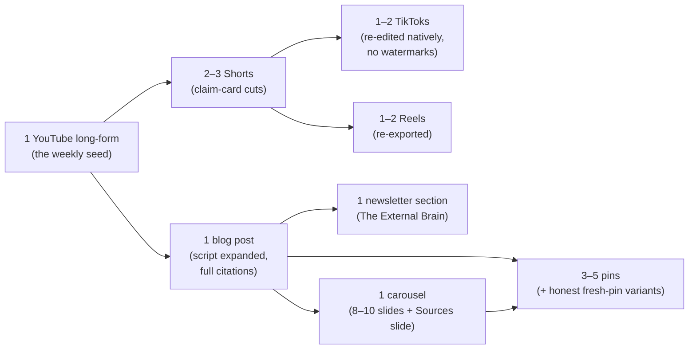

# 12 — One-Year Editorial Calendar (Index)

A 1,300-idea, ten-theme content pool for one year of evidence-honest publishing, split across four platform files: [12a](12a-editorial-calendar-youtube-blog-newsletter.md) (YouTube, blog, newsletter), [12b](12b-editorial-calendar-shorts-tiktok.md) (Shorts, TikTok), [12c](12c-editorial-calendar-reels-carousels.md) (Reels, carousels), and [12d](12d-editorial-calendar-pinterest.md) (Pinterest). Every idea teaches one evidence-based concept or an honest product angle, carries a `[THEME|Tier]` tag, and traces to the citation registry in [00 — Evidence Foundation](00-evidence-foundation.md) §4. Strategy, voice, accuracy gates, and per-platform mechanics live in [11 — Content Strategy](11-content-strategy.md); this file is the operating system that turns the pools into weeks.

---

## a) How to use this calendar

1. **It's a pool, not a schedule.** Nothing in 12a–12d carries a date. 1,300 ideas is deliberately more than a solo creator publishes in a year — the surplus exists so that picking is always selection, never generation under pressure.
2. **Pick by monthly theme.** Each month (§c) has a primary and secondary theme. At the weekly planning session, filter the platform pools by those theme tags, pick the week's items, and adapt freely — ideas are starting points, not scripts.
3. **Dating happens at the business Weekly Reset.** We assign real dates only for the week ahead, during the same 15-minute weekly review ritual we sell (Law 6). The calendar works exactly like our product: externalized pool, one small pre-decided next step, weekly review — we run the business on our own philosophy.
4. **Comeback plan for missed weeks: skip, never backfill.** A missed week is archived, not owed (Law 7 — this is Comeback Mode for the business). Resume with the current week's picks. Because the pool is undated, "behind" is structurally impossible; there is no backlog to catch up on, ever.
5. **Honor the tags.** T2/T3 ideas must ship with "indirect" / "experimental" language in the asset itself (§10); T4 ideas are only ever "what doesn't work" content; RE ideas name their §4 citation key and keep the caveat attached to the number (11 §3 gates).
6. **Keywords and mechanics are hypotheses.** Pinterest keyword phrases in 12d are unvalidated search hypotheses (validate in Pinterest Trends), and all platform-mechanics notes are best-practice-to-validate, dated 2026-07 (11 §5 standing note).

**The Friday picking checklist** (5 minutes inside the Weekly Reset — the whole selection step, pre-decided):

- [ ] Open this file → read the current month's primary + secondary theme (§c).
- [ ] Pick 1 seed idea (12a pool) matching the primary theme — that's the week's video *or* blog post.
- [ ] Pick 3–5 short-form ideas (12b/12c pools) — at least one from the secondary theme, at most one PW.
- [ ] Pick 5 pins (12d pool) — favor printable/checklist pins in printable-heavy months (Mar, Jul–Sep).
- [ ] Confirm each pick's tier language survives its format (a T3 idea whose "experimental" label won't fit the format gets swapped, not stripped).
- [ ] Date them for next week. Done — no browsing beyond this.

## b) Tag legend (restated from foundation §9)

- **Format:** `[THEME|Tier]`, e.g. `[EF|T1]` = executive-function theme, Tier 1 evidence behind the concept taught. The tier grades the underlying claim, per the §4 registry.
- **Theme codes:** **EF** executive function · **MO** money · **PL** planning · **HO** home · **HA** habits · **TB** time blindness · **DF** decision fatigue · **OR** organization · **PW** product walkthrough · **RE** research explanation.
- **Tiers:** **T1** clinically supported (adult-ADHD RCTs/meta-analyses) · **T2** moderately supported (package-level, or strong indirect/general-population evidence) · **T3** experimental (mechanism-plausible, unproven) · **T4** unsupported/refuted — used only for honest "this doesn't work / isn't proven" content, never marketed as beneficial (§3, §10).
- Problem-documentation claims (§4D money evidence, time-perception construct) are tagged **T2**: replicated observational evidence that proves problems, not tools.

## c) The 12-month theme arc

All ten themes stay live all year (the weekly mix always spans several); the arc sets *emphasis*, aligned to real seasonal attention without exploiting it.

| Month | Primary | Secondary | Rationale & ethical note |
|---|---|---|---|
| **Jan** | PL | HA | Fresh-start attention is real and worth meeting — but resolution culture monetizes shame, so we won't. January content is planning that assumes week three will wobble: Weekly Reset explainers, minimum-viable-day cards, and the real habit timeline (median 66 days [Lally-2010]) instead of "new year, new you." Comeback Mode is the January hero; no before/after arcs, no transformation promises (§10). |
| **Feb** | MO | DF | Holiday statements land and tax documents start arriving, so money attention is high and anxious. We lead with the documented problem ([Bangma-2019], [Barkley-2008]) and small scaffolds (if-then bill cues, decide-once setups) — never savings promises, because no tool has proven those outcomes (§4D ruling). No debt-shame hooks; the framing is "documented, not destiny." |
| **Mar** | OR | HO | Spring-reset interest lifts organization and cleaning searches. We ride the season with capture-first systems, paper triage, and 15-minute room resets — retrieval over aesthetics, because the strongest component evidence is organisational strategies [Matsumoto-2024], not beautiful shelves. Ethical note: organized is a system, not a moral state. |
| **Apr** | TB | EF | Tax deadlines make time scaffolding concrete. Teach the T1 part (backwards planning, time audits, staging deadlines [Solanto-2010]) and label the widget part (timers, countdowns) experimental [Hallez-2024] — the tier split *is* the content. No deadline panic bait; we publish start-time math, not countdown theater. |
| **May** | EF | RE | Mental Health Awareness Month raises both attention and misinformation. We answer with plain-language EF explainers grounded in the trial evidence and clear "self-help tools, not treatment" boundaries (§10 disclosure). No awareness-washing: content points to real care pathways in the spirit of [NICE-NG87] and never positions products as substitutes. |
| **Jun** | HA | TB | Summer breaks routines: schedule shifts, travel, school-year structure gone. Momentum-not-streaks content and miss-tolerant trackers fit the season, anchored by the one-miss finding [Lally-2010] and the real formation timeline [Singh-2024]. A lapsed routine is framed as data, never failure. |
| **Jul** | HO | DF | A slower attention season suits low-stakes, high-save home systems and decide-once content — and gives the creator a lighter month by design (minimum viable weeks are the July default, §d). Batch ahead here for the Aug–Oct push. |
| **Aug** | PW | OR | Planner-buying and back-to-school research season: people are actively comparing systems, so honest walkthroughs, Evidence Notes tours, and setup guides meet a real question. Ethical note: comparison content states plainly that no head-to-head trials exist — including for our own tools (§5.1 of the foundation). |
| **Sep** | PL | OR | The "September reset" is January without the hangover — new terms, new calendars, second fresh start. Weekly Reset and week-design content anchors the month, with the same anti-resolution ethics as January. |
| **Oct** | RE | EF | ADHD Awareness Month: the year's peak of both genuine curiosity and confident nonsense. Research explainers carry the month — what's supported (CBT packages, digital delivery [attexis-2026]), what isn't (brain training [Elbe-2023], neurofeedback [NimmoSmith-2020], app-store claims [Pasarelu-2020]) — with caveats on the same card as every number. Awareness content cites the registry and includes the nulls; no fear, no miracle framing. |
| **Nov** | MO | PW | Money season begins: gift lists, deals, list-price theater everywhere. We publish decide-once spending plans and honest product content — real discounts stated plainly, no countdown timers, no scarcity claims (§10 bans urgency theater). PW content is clearly labeled and Evidence Notes stay visible even in sale creative. |
| **Dec** | MO | PL | Money season continues (spending peaks, year-end admin lands) plus the year-review instinct. We serve both with the Weekly-Reset-style year review and gentle January planning — skip-never-backfill applies to the calendar year too: no "December guilt audit," no "finish the year strong" pressure. |

Coverage notes: MO leads three months (Feb, Nov, Dec — the real money-attention seasons); PL leads both fresh-start months (Jan, Sep). **DF is deliberately never primary**: fewer-decisions content is a supporting lens (Feb, Jul secondaries) and is embedded in every product anyway (Law 3) — a whole month of "simplify" content would itself be decision-fatiguing. Every other theme leads exactly one month.

## d) Weekly production rhythm (solo ADHD creator)

**The minimum viable week is the default, not the failure mode.** The full week is a bonus achieved by batching, never by willpower. Both configurations keep the newsletter alive (11 §5: no exception smaller than a 5-line issue).

| | Minimum viable week | Full week |
|---|---|---|
| Long-form seed | 1 YouTube video **or** 1 blog post | 1 YouTube video **and** 1 blog post (script → post) |
| Short-form | 3 (Shorts/TikTok/Reels, cut from existing seeds) | 2–3 Shorts + 2–3 TikToks + 2 Reels |
| Carousel | — | 1 (derived from the blog post) |
| Newsletter (The External Brain) | 1 issue (5 lines is a legal issue) | 1 full issue |
| Pins | 5 (scheduled from existing assets) | 10–15 incl. fresh-pin variants (12d) |

**Batching schedule (mode-based days, not task-based hours):**

- **Mon — Write:** one script/post from the week's picked ideas; claims checked against §4 while writing (11 §3 gates 1–4).
- **Tue — Record:** film the long-form and all talking-head short-form in one camera session (one setup, one energy spend).
- **Wed — Cut:** edit long-form; cut 2–3 Shorts; re-edit TikToks natively and export Reels from the same block.
- **Thu — Design:** carousel + the week's pins in one template session; statistic pins get their caveat on the image (12d rule).
- **Fri — Weekly Reset (business edition):** schedule everything, log Law-10 metrics (§f), pick next week's ideas from the pool by monthly theme, and close the week. **This is where dating happens** — and if the week collapsed, Comeback Mode: archive it, pick fresh, no backfill.

**The repurposing chain** — one seed feeds every platform; nothing is created from scratch twice:

Compression rule from 11 §5.2 applies at every arrow: if the caveat doesn't survive the cut, the claim doesn't ship in that format.

**ADHD-reality adaptations** (the rhythm above is the map, not a test to pass):

- **Two-day compressed week:** when five mode-days won't happen, the minimum viable week fits in two blocks — Block 1: write + record the seed; Block 2: cut 3 short-form, schedule 5 pins from existing assets, send the newsletter. Everything else waits.
- **One-seed WIP cap:** never two seeds in production at once. A brilliant new idea goes into the Inbox (capture first), not into this week.
- **Energy-swap rule:** mode-days may trade places freely (design Monday, write Thursday); the only fixed point is the Friday Weekly Reset, because dating and metrics live there (Law 6).
- **Buffer months:** July's lighter arc is the designated batch-ahead window for the Aug–Oct push; December's second half is a planned half-speed fortnight, announced to the audience as exactly that — modeling the philosophy is content.
- **Ship at "passes the gates":** an asset that clears the accuracy gates (11 §3) ships; polish beyond that is optional. The gates are the quality bar — perfectionism is not (see 12d pin 135 for the audience version of this rule).

## e) Counts & links

| File | Platforms | Ideas | Notes |
|---|---|---|---|
| [12a — YouTube / Blog / Newsletter](12a-editorial-calendar-youtube-blog-newsletter.md) | 100 YouTube + 100 blog + 100 newsletter | 300 | The seed layer: depth, caveats, full citations |
| [12b — Shorts / TikTok](12b-editorial-calendar-shorts-tiktok.md) | 200 Shorts + 200 TikTok | 400 | Discovery layer; myth-response lives here |
| [12c — Reels / Carousels](12c-editorial-calendar-reels-carousels.md) | 200 Reels + 200 carousels | 400 | Warmth + save-able teaching; Sources slide mandatory |
| [12d — Pinterest](12d-editorial-calendar-pinterest.md) | 200 pins across 11 boards | 200 | Evergreen search; printable/checklist intent; keyword hypotheses |
| **Total** | | **1,300** | |

**Per-theme allocation across all platforms** (design allocation: each file distributes its pool evenly across the ten themes; each file's own coverage table is the authoritative count — 12d is verified at exactly 20 per theme):

| Theme | 12a | 12b | 12c | 12d | Total |
|---|---|---|---|---|---|
| EF — Executive function | 30 | 40 | 40 | 20 | 130 |
| MO — Money | 30 | 40 | 40 | 20 | 130 |
| PL — Planning | 30 | 40 | 40 | 20 | 130 |
| HO — Home | 30 | 40 | 40 | 20 | 130 |
| HA — Habits | 30 | 40 | 40 | 20 | 130 |
| TB — Time blindness | 30 | 40 | 40 | 20 | 130 |
| DF — Decision fatigue | 30 | 40 | 40 | 20 | 130 |
| OR — Organization | 30 | 40 | 40 | 20 | 130 |
| PW — Product walkthrough | 30 | 40 | 40 | 20 | 130 |
| RE — Research explanation | 30 | 40 | 40 | 20 | 130 |
| **Total** | **300** | **400** | **400** | **200** | **1,300** |

**How the four files interlock:**

- **12a is the source layer** — every 12a seed idea can be traced forward into 2–8 derivative assets via the repurposing chain (§d); when in doubt, pick the 12a idea first and let it populate the week.
- **12b/12c are the compression layers** — their ideas are either cuts of a 12a seed or native one-concept pieces (myth-responses in 12b, save-able teaching in 12c); they never introduce a claim that has no 12a/blog home to link back to.
- **12d is the evergreen layer** — pins outlive the week they ship in, so they point at the most durable destinations (blog posts, the printable library, First Action Kit) and get refreshed as honest variants at the quarterly audit (§f), not re-invented.
- **Same tags everywhere** — `[THEME|Tier]` is identical across all four files, so a monthly theme filter works on the whole 1,300-idea pool at once.

## f) Quarterly content audit ritual

Last week of March, June, September, and December — run inside a normal Friday Weekly Reset, capped at 90 minutes (it's a ritual, not a project). Feeds [14 — Continuous Improvement](14-continuous-improvement-system.md).

1. **Accuracy re-check against foundation §4.** Re-read every live RE asset and every asset that displays a number against the current registry. If the registry has been re-graded since publish, update or unpublish within 48 hours (11 §3 correction workflow). Any claim that can no longer be traced to a §4 key is rewritten as design rationale or retired — no grandfathering.
2. **Refresh or retire.** Top-saved pins and top-completed posts earn 2–3 honest fresh-pin variants and internal links; sound-but-ignored assets get one retitle (same claim strength — retitling may never escalate certainty), then retire; anything whose tier language has drifted (an "experimental" that started sounding proven) retires immediately.
3. **Metrics review — Law 10 only.** Score the quarter on: saves and save rate (carousels, pins), watch/read completion, pin → blog → First Action Kit click-to-email conversion, newsletter reply rate and voluntary-panel signals (§11), and the business's own comeback rate (weeks resumed after a missed week). Explicitly ignored: impressions, follower counts, session length, posting-streak stats — engagement is a cost, not a goal.
4. **Re-weight the arc.** Check next quarter's monthly themes (§c) against what the metrics and Anchor Lab questions actually show; shift secondary themes freely, keep the ethics notes fixed.
5. **Close with the pool.** Retire ideas that no longer pass the foundation's gates, note gaps for new ideas (tagged, registry-traced) — the pool stays a surplus, so the next quarter still starts with selection, not generation.

---

*Master index for [12a](12a-editorial-calendar-youtube-blog-newsletter.md) · [12b](12b-editorial-calendar-shorts-tiktok.md) · [12c](12c-editorial-calendar-reels-carousels.md) · [12d](12d-editorial-calendar-pinterest.md) — part of the [Anchor blueprint](README.md) · Strategy layer: [11 — Content Strategy](11-content-strategy.md) · Every claim traces to [00 — Evidence Foundation](00-evidence-foundation.md).*
